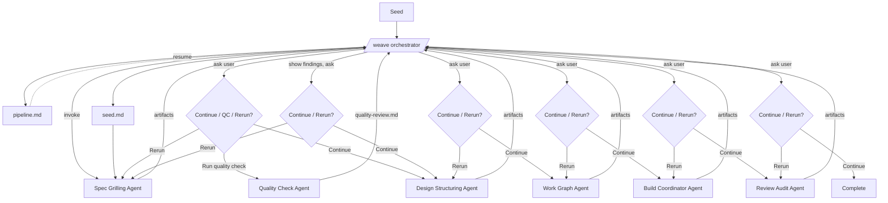

# Loom

Loom is a context and prompt orchestration framework for AI-agent-driven software development.

## Lifecycle

Primary command: `/weave`

Primary workspace: `.loom/<project>/`

Primary state file: `.loom/<project>/pipeline.md`

| Phase | Agent | Core Question | Input | Output | Ambiguity Removed |
| ----- | ----- | ------------- | ----- | ------ | ----------------- |
| Spec | Spec Grilling Agent | Why should this exist, and what must be true for it to be correct? | Opportunity/problem | Specified intent | Intent + behavior |
| Design | Design Structuring Agent | How should it work? | Specified intent | Solution structure | Structure |
| Plan | Work Graph Agent | How will it be executed? | Solution structure | Executable work graph | Execution |
| Build | Build Coordinator Agent | Can the solution be realized? | Work graph | Working system | Realization |
| Review | Review Audit Agent | Did the result satisfy intent? | Working system | Validation + feedback | Outcome uncertainty |

## Agent Model

| Agent | Defined In | Scope |
| ----- | ---------- | ----- |
| `/weave` orchestrator | [`orchestrator/weave/SKILL.md`](../orchestrator/weave/SKILL.md) | State, startup, phase invocation, rerun-or-continue decision, resume |
| Spec Grilling Agent | [`orchestrator/weave/phases/spec/agent.md`](../orchestrator/weave/phases/spec/agent.md) | Clarify seed into specified intent |
| Design Structuring Agent | [`orchestrator/weave/phases/design/agent.md`](../orchestrator/weave/phases/design/agent.md) | Convert specified intent into solution structure |
| Work Graph Agent | [`orchestrator/weave/phases/plan/agent.md`](../orchestrator/weave/phases/plan/agent.md) | Convert solution structure into executable work graph |
| Build Coordinator Agent | [`orchestrator/weave/phases/build/agent.md`](../orchestrator/weave/phases/build/agent.md) | Execute the work graph and verify realization |
| Review Audit Agent | [`orchestrator/weave/phases/review/agent.md`](../orchestrator/weave/phases/review/agent.md) | Validate outcome and capture feedback |
| Spec Validator | [`orchestrator/weave/phases/spec/validator.md`](../orchestrator/weave/phases/spec/validator.md) | Opt-in: analyse Spec-phase artifacts to inform a rerun decision |

## Other Skills

| Skill | Purpose | Usage |
| --- | --- | --- |
| `/tune` | Meta-layer: feedback, develop-log curation, transcript insights | `/tune [<text> \| review \| insights]` |

## Top-Level Flow

After every phase, the orchestrator returns control to the user with a rerun-or-continue decision. Quality Check is opt-in (available for Spec, Design, Plan, Build — Review is itself the project validator) and exists to inform the user's rerun choice — never to gate the lifecycle automatically.

## Documentation Map

| File | Scope |
| ---- | ----- |
| [`orchestrator/weave/SKILL.md`](../orchestrator/weave/SKILL.md) | `/weave` orchestration contract |
| [`orchestrator/weave/contract.md`](../orchestrator/weave/contract.md) | `/weave` I/O contract |
| [`orchestrator/weave/phases/spec/agent.md`](../orchestrator/weave/phases/spec/agent.md) | Spec phase agent |
| [`orchestrator/weave/phases/design/agent.md`](../orchestrator/weave/phases/design/agent.md) | Design phase agent |
| [`orchestrator/weave/phases/plan/agent.md`](../orchestrator/weave/phases/plan/agent.md) | Plan phase agent |
| [`orchestrator/weave/phases/build/agent.md`](../orchestrator/weave/phases/build/agent.md) | Build phase agent |
| [`orchestrator/weave/phases/review/agent.md`](../orchestrator/weave/phases/review/agent.md) | Review phase agent |
