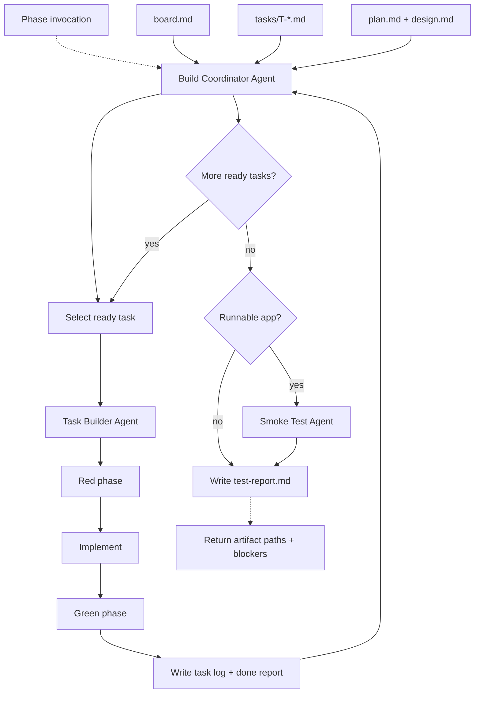

# Build

## Definition

| Field | Value |
| ----- | ----- |
| Phase | Build |
| Agent | Build Coordinator Agent |
| Core question | Can the solution be realized? |
| Input state | Executable work graph |
| Output state | Working system |
| Next consumer | Review |
| Ambiguity removed | Realization |

## Artifact Contract

| Artifact | Direction | Required | Mutability | Owner | Purpose |
| -------- | --------- | -------- | ---------- | ----- | ------- |
| `idea.md` | Input | Yes | Read-only | Idea Grilling Agent | Intent and acceptance boundaries |
| `design.md` | Input | Yes | Read-only | Design Structuring Agent | Solution structure |
| `plan.md` | Input | Yes | Read-only | Work Graph Agent | Execution plan |
| `board.md` | Input/output | Yes | Update in place | Build Coordinator Agent | Build task status |
| `tasks/T-*.md` | Input | Yes | Read-only | Work Graph Agent | Task contracts |
| Repository files | Output | Yes | Update in place | Task Builder Agent | Working implementation |
| `tasks/T-*.test-log.txt` | Output | Yes per task | Append-only | Task Builder Agent | Red/green and verification output |
| `tasks/T-*.done.md` | Output | Yes per task | Write once per attempt result | Task Builder Agent | Task completion report |
| `smoke-report.md` | Conditional output | Required for runnable apps | Update in place | Smoke Test Agent | Application-level smoke result |
| `test-report.md` | Output | Yes | Update in place | Build Coordinator Agent | Aggregate verification summary |

## Agent Contract

| Field | Contract |
| ----- | -------- |
| Reads | Plan artifacts, task files, design, intent, repository context |
| Writes | Repository files, task logs, done files, `board.md`, `smoke-report.md`, `test-report.md` |
| Returns | Artifact paths, changed files, verification summary, open blockers, status |
| Primary task | Execute the work graph without redefining intent, design, or task scope |
| Interaction | Calls `AskUserQuestion` only for HITL blockers or unsafe action approval |
| Handoff target | Review receives working system, diff, task reports, and verification artifacts |

## Build Agents

| Agent | Scope | Output |
| ----- | ----- | ------ |
| Build Coordinator Agent | Select ready work, enforce locks, sequence tasks, aggregate status | `board.md`, `test-report.md` |
| Task Builder Agent | Execute one task in a fresh context | Code changes, `T-*.test-log.txt`, `T-*.done.md` |
| Smoke Test Agent | Verify runnable application behavior read-only | `smoke-report.md` |
| Mutation Test Agent | Probe task test strength when enabled | Appended mutation section in task test log |

## Task Execution Contract

| Step | Requirement |
| ---- | ----------- |
| Lock | Acquire task lock before touching files |
| Red | Stub enough to compile, write behavior tests, verify assertion failure |
| Implement | Replace stubs with smallest task-scoped implementation |
| Green | Pass task-scope tests without weakening tests |
| Attempt cap | Stop after three failed implementation attempts |
| Done report | Write `tasks/T-*.done.md` with status, attempts, duration, changed files |
| Board update | Mark task status and release lock |
| Output discipline | Pipe verbose command output through tail-sized logs |

## Batch Rules

| Mode | Requirement |
| ---- | ----------- |
| Sequential | Default; one ready task at a time |
| Parallel | Explicit batch only; disjoint file scopes; max three concurrent tasks |
| Checkpoint | Batch status updates after all batch tasks return |
| Failed task | No automatic redispatch without new instruction or quality finding |

## `board.md` Transitions

The Build Coordinator owns every state change on `board.md`. Plan delivers the board with all tasks in `Backlog`; Build moves them through the columns as work progresses.

| Trigger | Source | Target | Card annotation |
| ------- | ------ | ------ | --------------- |
| Coordinator picks a ready task | `Backlog` | `In Progress` | (none) |
| Task Builder returns `status: green` | `In Progress` | `Review` | (none) |
| Smoke + mutation gates pass for the task | `Review` | `Done` | (none) |
| Task Builder returns `status: failed` after 3 attempts | `In Progress` | `In Progress` | `[failed]` after the ID |
| Task Builder returns `status: hitl-block` | `In Progress` | `Backlog` | `[HITL-blocked: <reason>]` after the ID |
| Blocker for a backlog task moves to `Done` | `Backlog` | `Backlog` | Remove `(blocked by ...)` segment |

All board mutations go through `loom/lib/atomic-write.sh` under the project-level build lock. Per-task locks gate the implementation work, not the board mutation. A Build rerun does NOT reset the board; the Coordinator simply picks the next eligible `Backlog` cards.

## Verification Modes

| Mode | Trigger | Rule |
| ---- | ------- | ---- |
| Task tests | Every task | Tests verify public behavior, not internals |
| Smoke | Runnable application | Build artifacts, app start, endpoints/commands, UI, state integrity |
| Mutation | Explicit mutation gate | One task at a time; survivors require new tests or documented reason |
| Aggregate | End of Build | `test-report.md` summarizes task, smoke, and mutation evidence |

## Safety Rules

| Rule | Requirement |
| ---- | ----------- |
| No commits | No commit, push, branch creation, or deploy without explicit approval |
| No destructive commands | No hard reset, forced delete, database drop, or production mutation |
| Do not weaken tests | Fix implementation; do not edit tests to pass |
| Public behavior | Tests assert behavior visible through public interfaces |
| Scope discipline | Changes trace to task acceptance criteria or explicit constraints |
| Existing patterns | Match local conventions and prior art |

## Completion Gate

| Item | Passing Condition |
| ---- | ----------------- |
| Tasks | Required tasks are green, blocked with reason, or failed with report |
| Implementation | Repository changes realize accepted task scope |
| Tests | Task test logs exist and pass where expected |
| Smoke | Runnable apps have PASS, FAIL, or SKIPPED with reason |
| Mutation | Required mutation testing completed or skipped by gate |
| Aggregate report | `test-report.md` summarizes verification and blockers |
| Handoff | Review can validate diff against intent, design, and plan |

## Flow

