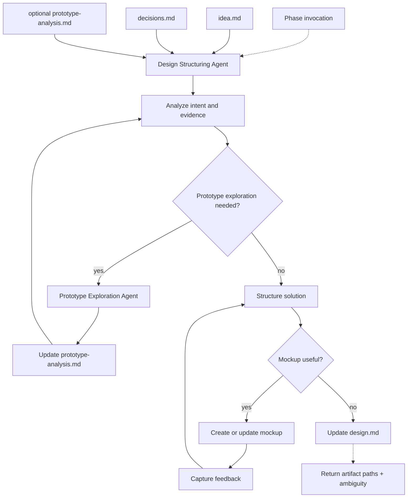

# Design

## Definition

| Field | Value |
| ----- | ----- |
| Phase | Design |
| Agent | Design Structuring Agent |
| Core question | How should it work? |
| Input state | Specified intent |
| Output state | Solution structure |
| Next consumer | Plan |
| Ambiguity removed | Structure |

## Artifact Contract

| Artifact | Direction | Required | Mutability | Owner | Purpose |
| -------- | --------- | -------- | ---------- | ----- | ------- |
| `idea.md` | Input | Yes | Read-only | Idea Grilling Agent | Specified intent |
| `decisions.md` | Input | Yes | Read-only | Idea Grilling Agent | Intent decision history |
| `prototype-analysis.md` | Optional input/output | No | Update in place | Prototype Exploration Agent | Evidence from throwaway prototype exploration |
| `prototype-screenshots/` | Optional input/output | No | Append-only | Prototype Exploration Agent | Visual evidence from prototype crawl |
| `design.md` | Output | Yes | Update in place | Design Structuring Agent | Current solution structure |
| `mockup/` | Optional output | No | Update in place | Design Structuring Agent | UI, API, or architecture artifact for feedback |

## Agent Contract

| Field | Contract |
| ----- | -------- |
| Reads | `idea.md`, `decisions.md`, optional prototype and mockup artifacts |
| Writes | `design.md`, optional `prototype-analysis.md`, optional `prototype-screenshots/`, optional `mockup/` |
| Returns | Artifact paths, summary, open structural ambiguity, status |
| Primary task | Convert specified intent into a solution structure without defining execution tasks |
| Interaction | Calls `AskUserQuestion` directly only for structure-critical ambiguity or prototype gaps |
| Handoff target | Plan receives `design.md` and optional evidence artifacts |

## Design Targets

| Target | Checks |
| ------ | ------ |
| System shape | Components, boundaries, responsibilities |
| User flow | Screens, states, paths, transitions |
| API surface | Endpoints, commands, events, request and response shapes |
| Data model | Entities, relationships, validation, persistence boundaries |
| Integration | External systems, dependencies, contracts |
| State and errors | Loading, empty, failure, retry, permission states |
| Constraints | Performance, security, compliance, compatibility |
| Evidence | Prototype screenshots, observed flows, mockup feedback |

## Prototype Exploration

| Rule | Requirement |
| ---- | ----------- |
| Visual-first | Explore behavior through screenshots and interaction before source reading |
| Same-origin crawl | Stay inside the prototype origin and cap navigation depth |
| Unique states | Capture pages, tabs, modals, and multi-step states |
| User follow-up | Ask for missed pages, hidden flows, roles, or credentials when needed |
| Surface source only | If source is provided, read routes, data shapes, config, and model signatures only |
| No code adoption | Prototype code is evidence for what to build, not implementation reference |
| Label inference | Code-derived findings are marked as throwaway-prototype inference |

## Mockup Contract

| Subject | Artifact |
| ------- | -------- |
| UI | `mockup/index.html` |
| API/backend | `mockup/spec.md` |
| Architecture | `mockup/architecture.md` |
| Feedback | `mockup/feedback.md` |

Mockup feedback questions follow the shared question quality rules and are answered through `AskUserQuestion`.

## Design Rules

| Change | Action |
| ------ | ------ |
| New structural decision | Update `design.md` in place |
| Rejected structure | Record alternative and rejection reason in `design.md` |
| Prototype contradiction | Update `prototype-analysis.md`; revise `design.md` if still within intent |
| Intent contradiction | Return open ambiguity; do not redefine `idea.md` |
| Mockup feedback changes structure | Update the mockup and `design.md` together |

No competing `design-v2.md`.

## Completion Gate

| Item | Passing Condition |
| ---- | ----------------- |
| Components | Major parts and responsibilities are explicit |
| Boundaries | Ownership and integration boundaries are explicit |
| Interfaces | UI/API/command/event surfaces are explicit where relevant |
| Data | Entities, shapes, and persistence expectations are explicit |
| States | Error, empty, loading, permission, and edge states are covered |
| Constraints | Known technical and product constraints are carried forward |
| Evidence | Prototype or mockup evidence is referenced when used |
| Open ambiguity | Remaining ambiguity is explicit or absent |

## Flow

