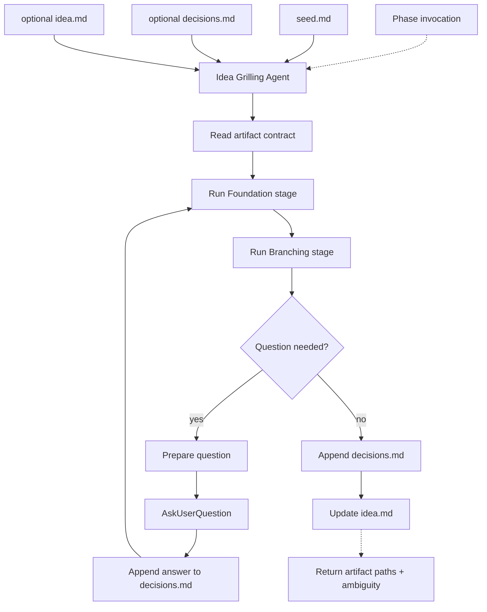

# Idea

## Definition

| Field | Value |
| ----- | ----- |
| Phase | Idea |
| Agent | Idea Grilling Agent |
| Core question | Why should this exist, and what must be true for it to be correct? |
| Input state | Opportunity or problem normalized as `seed.md` |
| Output state | Specified intent |
| Next consumer | Design |
| Ambiguity removed | Intent and behavior |

## Artifact Contract

| Artifact | Direction | Required | Mutability | Owner | Purpose |
| -------- | --------- | -------- | ---------- | ----- | ------- |
| `seed.md` | Input | Yes | Read-only | `/weave` | Normalized opportunity or problem |
| `decisions.md` | Iteration + output | Yes after first question | Append-only | Idea Grilling Agent | Parseable question, answer, and decision history |
| `idea.md` | Iteration + output | Yes before handoff | Update in place | Idea Grilling Agent | Current specified intent |

## Agent Contract

| Field | Contract |
| ----- | -------- |
| Reads | `seed.md`, optional `decisions.md`, optional `idea.md` |
| Writes | `decisions.md`, `idea.md` |
| Returns | Artifact paths, summary, open ambiguity, status |
| Primary task | Clarify intent until expected outcome is unambiguous |
| Interaction | Calls `AskUserQuestion` directly during grilling |
| Handoff target | Design receives `idea.md`; `decisions.md` remains supporting context |

## Iteration Stages

| Stage | Focus | Typical Question Categories | Exit Condition |
| ----- | ----- | --------------------------- | -------------- |
| Foundation | Problem space, value bar, constraints, existing context | Background, Open, Architecture | Budget reached or two consecutive answers add no new understanding |
| Branching | Scope, behavior, alternatives, acceptance boundaries | Y/N, Choice, Architecture | Budget reached, ambiguity stops surfacing, or user stops grilling |

Foundation precedes Branching. Branching may return to Foundation only when a later answer exposes missing problem context.

## Grilling Targets

| Target | Checks |
| ------ | ------ |
| Purpose | Reason for existence, problem fit |
| User value | Beneficiary, value delivered, success signal |
| Scope | Included behavior, excluded behavior, boundaries |
| Non-goals | Explicitly rejected outcomes |
| Expected behavior | Observable result, workflow, state changes |
| Constraints | Technical, product, policy, timeline, dependency limits |
| Edge cases | Failure paths, unusual inputs, conflicting states |
| Acceptance boundaries | Conditions required for Design to proceed |

## Question Contract

Questions use this shape:

| Field | Purpose |
| ----- | ------- |
| Target | Grilling target |
| Question category | Y/N, Choice, Architecture, Background, or Open |
| Question | User-facing clarification |
| Rationale | Why the answer changes the intent |
| Recommendation | Proposed answer when useful |
| Answer field | User answer captured through `AskUserQuestion` |

Question categories:

| Category | Use |
| -------- | --- |
| Y/N | Exactly two viable options |
| Choice | Three to five viable options |
| Architecture | Decision needs structural context or a small diagram |
| Background | User needs domain or codebase context before deciding |
| Open | Answer space is not enumerable; use sparingly |

Question quality:

| Rule | Requirement |
| ---- | ----------- |
| Decision-relevant | A wrong answer would cause rework |
| Self-contained | No dependency on chat memory |
| Briefed | Includes issue, current behavior/context, options, recommendation, trade-off |
| Opinionated | Includes a recommendation with rationale |
| Singular | Asks one thing |
| Decidable now | If the codebase can answer it, do not ask the user |

Grilling target order:

| Order | Target |
| ----- | ------ |
| 1 | Purpose |
| 2 | User value |
| 3 | Scope |
| 4 | Non-goals |
| 5 | Expected behavior |
| 6 | Constraints |
| 7 | Edge cases |
| 8 | Acceptance boundaries |

## Decision Persistence

`decisions.md` is the audit and recovery surface.

| Section | Requirement |
| ------- | ----------- |
| Question header | Stable ID, stage, progress, category, question text |
| Question metadata | Recommendation, rationale, dependencies, status |
| Answer slot | Machine-parseable answer region |
| Side requirements | Running list outside answer slots |
| Deferred clarifications | Explicit unresolved items |
| Superseded decisions | Prior decision retained and marked superseded |

Answer slots must support:

| Invariant | Requirement |
| --------- | ----------- |
| Stable ID | Start and end markers refer to the same question ID |
| Single answer body | Only the answer or awaiting-answer placeholder appears inside the slot |
| Parseable status | Status identifies awaiting, answered, active, obsolete, or superseded entries |
| Active set | Downstream phases read active answers and superseded leaves only |

## Decision Rules

| Change | `decisions.md` | `idea.md` |
| ------ | -------------- | --------- |
| New answer | Record question, answer, recommendation, final decision | Update affected intent section |
| Rejected option | Record rejected alternative and reason | Exclude from current intent |
| Superseded decision | Keep prior decision and mark superseded | Replace with current intent |
| Behavior change | Record cause and new decision | Update in place |

No competing `idea-v2.md`.

## Revisit Rules

| Trigger | Action |
| ------- | ------ |
| New answer flips a prior recommendation | Append a revisit question |
| Prior trade-off no longer applies | Mark prior rationale superseded or append revisit |
| Prior assumption is contradicted | Append revisit before normal questioning continues |
| Prior scope decision becomes obsolete | Mark obsolete; do not create a competing idea file |

Revisits are capped, count against the phase budget, and preserve the original decision chain.

## Stop Rules

| Trigger | Result |
| ------- | ------ |
| Budget reached and ambiguity is stable | Return artifacts for quality check |
| User indicates enough context | Return current artifacts and open ambiguity |
| Ambiguity still grows after budget | Return `needs_more_grilling` in open ambiguity |
| Repeated unanswered questions | Move unresolved items to deferred clarifications |

## Completion Gate

| Item | Passing Condition |
| ---- | ----------------- |
| Problem | Problem is explicit |
| Goal | Desired outcome is explicit |
| Scope | Included and excluded behavior are explicit |
| Expected behavior | Observable behavior is defined |
| Constraints | Known limits are captured |
| Acceptance boundaries | Design can proceed without redefining intent |
| Decision history | `decisions.md` is parseable and records active decisions |
| Open ambiguity | Remaining ambiguity is explicit or absent |

## Flow

