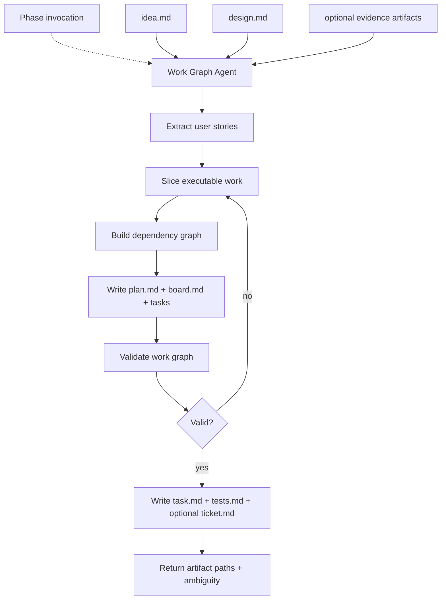

# Plan

## Definition

| Field | Value |
| ----- | ----- |
| Phase | Plan |
| Agent | Work Graph Agent |
| Core question | How will it be executed? |
| Input state | Solution structure |
| Output state | Executable work graph |
| Next consumer | Build |
| Ambiguity removed | Execution |

## Artifact Contract

| Artifact | Direction | Required | Mutability | Owner | Purpose |
| -------- | --------- | -------- | ---------- | ----- | ------- |
| `idea.md` | Input | Yes | Read-only | Idea Grilling Agent | Intent and acceptance boundaries |
| `decisions.md` | Input | Yes | Read-only | Idea Grilling Agent | Decision history |
| `design.md` | Input | Yes | Read-only | Design Structuring Agent | Solution structure |
| `mockup/` | Optional input | No | Read-only | Design Structuring Agent | Design evidence |
| `prototype-analysis.md` | Optional input | No | Read-only | Prototype Exploration Agent | Prototype-derived evidence |
| `plan.md` | Output | Yes | Update in place | Work Graph Agent | Execution plan and user stories |
| `board.md` | Output | Yes | Update in place | Work Graph Agent | Task dependency board |
| `tasks/T-*.md` | Output | Yes | Update in place | Work Graph Agent | Executable task slices |
| `task.md` | Output | Yes | Regenerated | Work Graph Agent | Flat task index |
| `tests.md` | Output | Yes | Update in place | Work Graph Agent | Verification plan |
| `ticket.md` | Optional output | No | Update in place | Work Graph Agent | External ticket suggestion |

## Agent Contract

| Field | Contract |
| ----- | -------- |
| Reads | Idea, Design, optional mockup/prototype evidence, type hints, constraints |
| Writes | `plan.md`, `board.md`, `tasks/T-*.md`, `task.md`, `tests.md`, optional `ticket.md` |
| Returns | Artifact paths, summary, open execution ambiguity, status |
| Primary task | Convert solution structure into ordered, validated work slices |
| Interaction | Calls `AskUserQuestion` directly only for execution-blocking ambiguity |
| Handoff target | Build receives `board.md`, `tasks/T-*.md`, `tests.md`, and supporting context |

## Planning Targets

| Target | Checks |
| ------ | ------ |
| User stories | User-visible outcomes derived from intent and design |
| Work slices | Small executable units with acceptance criteria |
| Dependency graph | `blocked-by` relationships form a DAG |
| AFK/HITL split | Autonomous tasks separated from human-required tasks |
| File scope | Likely touched files declared per task |
| Layer coverage | Tasks usually touch at least two meaningful layers |
| Verification | Tests, smoke needs, and mutation gate are explicit |
| Ticket packaging | External issue text is generated when a ticket ID exists |

## Task Slice Contract

| Field | Requirement |
| ----- | ----------- |
| `id` | Stable `T-NNN` task ID |
| `title` | User-visible behavior, not a layer-only noun |
| `type` | `AFK` or `HITL` |
| `status` | `ready` or `blocked` |
| `blocked-by` | Existing task IDs only |
| `covers` | User story IDs covered by this task |
| `touches-layers` | Two or more layers unless justified |
| `files-likely-touched` | Expected file scope |
| Test sketch | Behavior-level test outline |
| Acceptance | Observable task completion criteria |

## Validation Rules

| Check | Requirement |
| ----- | ----------- |
| Required files | `board.md`, `tasks/T-*.md`, `plan.md`, `tests.md`, `task.md` exist |
| Frontmatter | Every task has required fields |
| Title quality | Titles describe behavior, not only `layer`, `endpoints`, `schema`, or `models` |
| Dependency validity | `blocked-by` references existing task IDs |
| DAG | Dependency graph has no cycles |
| Story coverage | Every user story is covered by at least one task |
| Flat index | `task.md` reflects the task graph |

## Plan Rules

| Change | Action |
| ------ | ------ |
| Design changes before Build | Update `plan.md`, `board.md`, task files, and `tests.md` in place |
| Task invalidated | Mark stale task obsolete or rewrite it; keep IDs stable where possible |
| New dependency | Update `blocked-by` and board ordering |
| Single-layer task | Require explicit justification |
| Parallel work | Allowed only when declared file scopes are disjoint |

No competing `plan-v2.md` or `task-v2.md`.

## Completion Gate

| Item | Passing Condition |
| ---- | ----------------- |
| Work graph | Ordered tasks cover the solution structure |
| Task quality | Every task is self-contained and executable |
| Dependencies | Graph is valid and acyclic |
| Verification | Test strategy and smoke/mutation gates are explicit |
| Scope control | Tasks do not redefine intent or design |
| Build readiness | Build can start from the graph without replanning |
| Open ambiguity | Remaining ambiguity is explicit or absent |

## Flow

