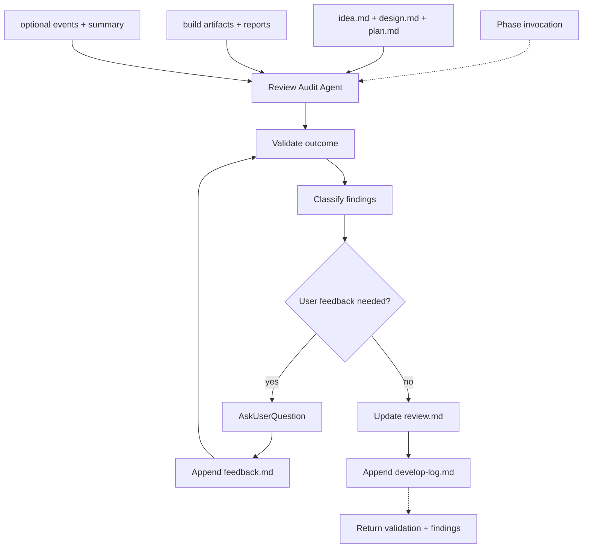

# Review

## Definition

| Field | Value |
| ----- | ----- |
| Phase | Review |
| Agent | Review Audit Agent |
| Core question | Did the result satisfy intent? |
| Input state | Working system |
| Output state | Validation and feedback |
| Next consumer | Lifecycle completion |
| Ambiguity removed | Outcome uncertainty |

## Artifact Contract

| Artifact | Direction | Required | Mutability | Owner | Purpose |
| -------- | --------- | -------- | ---------- | ----- | ------- |
| `idea.md` | Input | Yes | Read-only | Idea Grilling Agent | Intent and acceptance boundaries |
| `design.md` | Input | Yes | Read-only | Design Structuring Agent | Solution structure |
| `plan.md` | Input | Yes | Read-only | Work Graph Agent | Execution plan |
| `board.md` | Input | Yes | Read-only | Build Coordinator Agent | Build status |
| `tasks/T-*.done.md` | Input | Yes | Read-only | Task Builder Agent | Task completion evidence |
| `tasks/T-*.test-log.txt` | Input | Yes | Read-only | Task Builder Agent | Task verification evidence |
| `smoke-report.md` | Conditional input | Required for runnable apps | Read-only | Smoke Test Agent | Application smoke evidence |
| `test-report.md` | Input | Yes | Read-only | Build Coordinator Agent | Aggregate verification summary |
| `events.jsonl` | Optional input | No | Append-only | Runtime support | Lifecycle evidence stream |
| `summary.md` | Optional input | No | Regenerated | Runtime support | Lifecycle roll-up |
| `review.md` | Output | Yes | Update in place | Review Audit Agent | Validation result and findings |
| `feedback.md` | Output | Yes | Append-only | Review Audit Agent | User feedback and approval trail |
| `develop-log.md` | Output | Yes | Append-only | Review Audit Agent | Process observations for later curation |

## Agent Contract

| Field | Contract |
| ----- | -------- |
| Reads | Intent, design, plan, build reports, repository diff, runtime evidence |
| Writes | `review.md`, `feedback.md`, `develop-log.md` |
| Returns | Artifact paths, finding summary, approval status, open issues |
| Primary task | Validate the realized system against intent, design, plan, and verification evidence |
| Interaction | Calls `AskUserQuestion` for approval, user feedback, or risk acceptance |
| Handoff target | `/weave` completes the lifecycle or routes findings to an earlier phase |

## Review Targets

| Target | Checks |
| ------ | ------ |
| Intent satisfaction | Result meets `idea.md` goal, scope, and acceptance boundaries |
| Design conformance | Implementation matches `design.md` structure or documents justified deviations |
| Plan completion | Work graph is complete or unresolved work is explicit |
| Test evidence | Task logs, smoke, mutation, and aggregate reports support the outcome |
| Code quality | Diff follows local patterns, avoids speculation, and keeps scope tight |
| Safety | No unauthorized commits, deploys, destructive commands, or secret exposure |
| User feedback | User approval, rejection, or requested changes are captured |
| Process learning | Repeated friction and useful observations are recorded, not globally applied |

## Finding Contract

| Field | Requirement |
| ----- | ----------- |
| Severity | Blocker, major, minor, or note |
| Evidence | File path, artifact, command result, screenshot, or user quote |
| Expected | What the lifecycle intent or contract required |
| Actual | What the built system or artifact shows |
| Impact | Why it matters |
| Recommendation | Reroute, fix, accept risk, or complete |
| Owner phase | Idea, Design, Plan, Build, Review, or runtime support |

## Feedback Contract

| Entry | Requirement |
| ----- | ----------- |
| Approval | User accepts the result |
| Requested change | User asks for a specific correction |
| Risk acceptance | User accepts known unresolved issue |
| Rejection | User rejects outcome or requires reroute |
| Observation | Non-blocking process note |

## Learning Contract

| Source | Captured As |
| ------ | ----------- |
| User pushback | Feedback entry |
| Build failure pattern | Process observation |
| Handoff weakness | Process observation with owner phase |
| Repeated quality finding | Process observation |
| Transcript or runtime evidence | Audit note |

Review writes learning observations to two surfaces (dual-write):

| Stream | Path | Purpose |
| --- | --- | --- |
| Project-local | `.loom/<project>/develop-log.md` | Raw observations for this project |
| Global shard | `loom/log/{ideate,build,feedback,audit}.md` | Curation source for `/tune review` |

Every project-local learning entry must have a matching `## YYYY-MM-DD - <project> - <topic>` entry in the appropriate global shard (`ideate.md` for Idea / Design / Plan notes, `build.md` for Build notes, `audit.md` for cross-phase audit observations, `feedback.md` for user-pushback patterns). Review-cycle findings in `review.md` stay project-local.

Shared framework or preference updates (curating the shards into SKILL.md / type edits) are outside the `/weave` lifecycle — that work happens via `/tune review`.

## Completion Gate

| Item | Passing Condition |
| ---- | ----------------- |
| Validation | `review.md` states pass, fail, or accepted risk |
| Findings | Blockers and major issues are resolved or explicitly routed |
| Evidence | Review references build and verification artifacts |
| Feedback | User approval or requested changes are captured |
| Learning | Notable process observations are recorded |
| Lifecycle state | `/weave` can complete or resume from a routed finding |

## Flow

