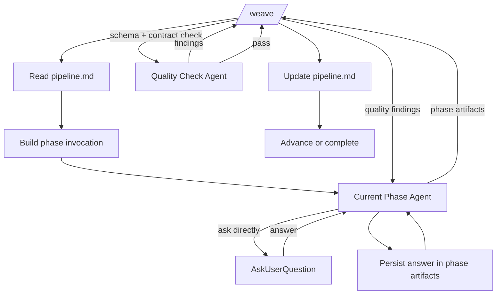

# Weave

`/weave` is the main development lifecycle orchestrator.

## Contract

| Field | Value |
| ----- | ----- |
| Command | `/weave` |
| Workspace | `.loom/<project>/` |
| State file | `.loom/<project>/pipeline.md` |
| Lifecycle | Idea -> Design -> Plan -> Build -> Review |
| Owns | State, startup, phase invocation, quality gates, phase transitions, resume |
| Does not own | Phase artifact content |

## State Files

| File | Writer | Readers | Purpose |
| ---- | ------ | ------- | ------- |
| `pipeline.md` | `/weave` | `/weave`, Quality Check Agent | Lifecycle state and resume point |
| `seed.md` | `/weave` | Idea Grilling Agent, Quality Check Agent | Normalized seed for Idea |
| Phase artifacts | Current Phase Agent | `/weave`, Quality Check Agent, downstream phases | Phase output and handoff material |

## Runtime Support Files

| File | Writer | Purpose |
| ---- | ------ | ------- |
| `artifacts.json` | Runtime support | Manifest of project artifacts and render hints |
| `events.jsonl` | Runtime support | Append-only lifecycle event stream |
| `summary.md` | Runtime support | User-facing lifecycle roll-up |
| `usage-<run-id>.jsonl` | Runtime support | Token, dispatch, and read telemetry |
| `.lock` | Runtime support | Project-level advisory lock |
| `.locks/` | Build Coordinator Agent | Task-level build locks |
| `.in-flight/` | Runtime support | Active dispatch bookkeeping |

## Pipeline Fields

| Field | Purpose |
| ----- | ------- |
| Project name | Workspace identity |
| Ticket ID | Optional external tracking reference |
| Type hint | Optional domain guidance for phase agents |
| Current phase | Active lifecycle phase |
| Phase status | Pending, blocked, failed, or complete |
| Produced artifacts | Accepted artifact references |
| Pending user input | Open user input required by active phase |
| Quality findings | Latest failed gate findings |
| Phase budget | Optional depth cap for the current phase |
| Next valid action | Resume-safe next step |
| Resume point | Invocation restart target |

## Startup

| Step | Action | Output |
| ---- | ------ | ------ |
| 1 | Resolve project | Project identity |
| 2 | Read existing `pipeline.md` | Prior lifecycle state |
| 3 | Initialize `.loom/<project>/` if missing | Workspace |
| 4 | Parse ticket ID and type hint | Pipeline metadata |
| 5 | Resolve seed source | Raw seed |
| 6 | Normalize raw seed | `seed.md` |
| 7 | Request minimum clarification if seed is unsafe | Pending user input |
| 8 | Derive phase hints and budget | Invocation context |
| 9 | Select next valid phase | Phase invocation |

Seed sources:

| Source | Example |
| ------ | ------- |
| Free text | User request |
| Issue | Ticket or issue body |
| File path | Existing local artifact |
| Existing state | Previous Loom workspace |

## Agents

| Agent | Spawned By | Reads | Writes | Returns |
| ----- | ---------- | ----- | ------ | ------- |
| Current Phase Agent | `/weave` | Phase input artifacts, prior iteration artifacts, invocation context | Owned phase artifacts | Artifact paths, summary, open ambiguity, status |
| Quality Check Agent | `/weave` | `pipeline.md`, phase contract, phase artifacts | Quality findings | Pass or fail decision |

Phase files name their agent. Example: Idea uses the Idea Grilling Agent.

## Agent Registry

| Phase | Current Phase Agent |
| ----- | ------------------- |
| Idea | Idea Grilling Agent |
| Design | Design Structuring Agent |
| Plan | Work Graph Agent |
| Build | Build Coordinator Agent |
| Review | Review Audit Agent |

## User Question Interface

| Field | Contract |
| ----- | -------- |
| Producer | Current Phase Agent |
| User surface | `AskUserQuestion` |
| Visibility | Questions surface in the user's main session/UI |
| Loop owner | Current Phase Agent |
| Answer capture | Current Phase Agent receives the answer during the phase invocation |
| Artifact persistence | Current Phase Agent records the answer in its artifact contract |
| Pending state | `pipeline.md` records blocked or interrupted user input only |
| Direct-mode precondition | Phase-agent `AskUserQuestion` calls must be visible in the user's main session/UI |
| Fallback | If the runtime cannot satisfy direct-mode visibility, `/weave` uses relay mode |

## Phase Cycle

| Step | Owner | Interface |
| ---- | ----- | --------- |
| 1 | `/weave` | Build phase invocation from `pipeline.md` and required artifacts |
| 2 | Current Phase Agent | Write owned artifacts directly to `.loom/<project>/` |
| 3 | Current Phase Agent | Run its interactive question loop through `AskUserQuestion` when needed |
| 4 | Current Phase Agent | Persist answers in owned artifacts |
| 5 | Current Phase Agent | Return artifact paths, summary, open ambiguity, and status |
| 6 | Quality Check Agent | Validate artifacts against the phase contract |
| 7 | `/weave` | Reinvoke the Current Phase Agent with quality findings on failure |
| 8 | `/weave` | Update `pipeline.md` and advance on pass |

## Phase-Agnostic Flow

## Quality Check Agent

| Check | Requirement |
| ----- | ----------- |
| Artifact presence | Required files exist |
| Completeness | Required content is present |
| Schema compliance | Artifact shape matches the expected schema |
| Contract compliance | Output satisfies the phase contract |
| Question validity | Asked questions are well formed and decision-relevant |
| Parseability | Machine-read sections, markers, and statuses can be parsed |
| Ambiguity | Open ambiguity is explicit and acceptable |
| Handoff readiness | Next phase can consume the output |

## Runtime Support

| Capability | Contract |
| ---------- | -------- |
| Atomic writes | Project state and generated artifacts are written without partial reads |
| Locking | Pipeline and build-task mutation serialize through advisory locks |
| Event capture | Task dispatches, file writes, and user questions append to `events.jsonl` |
| Artifact refresh | Artifact manifest updates after project file writes |
| Resume context | Active projects surface on fresh sessions |
| Auto-advance | Mechanical phases may continue only when one project is active and no user surface is pending |
| Return validation | Phase returns and declared artifacts are validated before state advance |
| Usage telemetry | Dispatch, read, and run summaries are captured without blocking lifecycle work |
