# Lifecycle Concepts Discussion Draft

Purpose: align on the new Loom lifecycle concepts, where they help, where they cost, and what to measure next.

Audience: architecture / agent lifecycle discussion.

Source: `lifecycle-concepts-toc.md` plus current phase specs.

---

## Meeting Goal

Decide which lifecycle concepts are worth keeping, tightening, or simplifying.

Focus:

- clarity of phase responsibility
- autonomy and human control
- token and runtime cost
- implementation quality
- reviewability and learning

---

## Decision Lens

For each concept:

- What problem does it solve?
- What extra ceremony does it add?
- Does it reduce downstream rework?
- Does it make failures easier to see?
- Can we measure the benefit?

---

## Lifecycle Overview

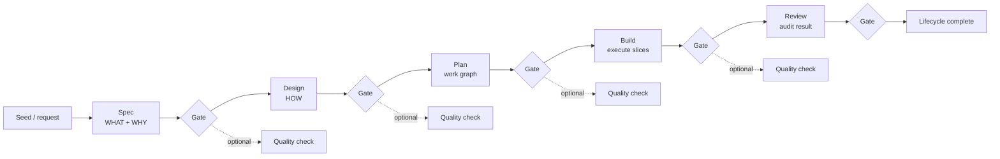

Main shift: Loom turns one broad `idea -> build` lifecycle into explicit contracts between phases.

---

## Abstract Concept Flow

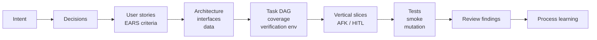

The key idea: every later artifact should point back to a prior contract.

---

## Phase Flow - Spec

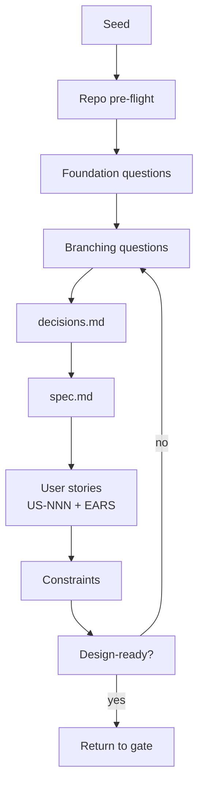

Output: user intent, scope, stories, constraints, open ambiguity.

Discussion hook: do we ask fewer but better questions, or just more structured questions?

---

## Phase Flow - Design

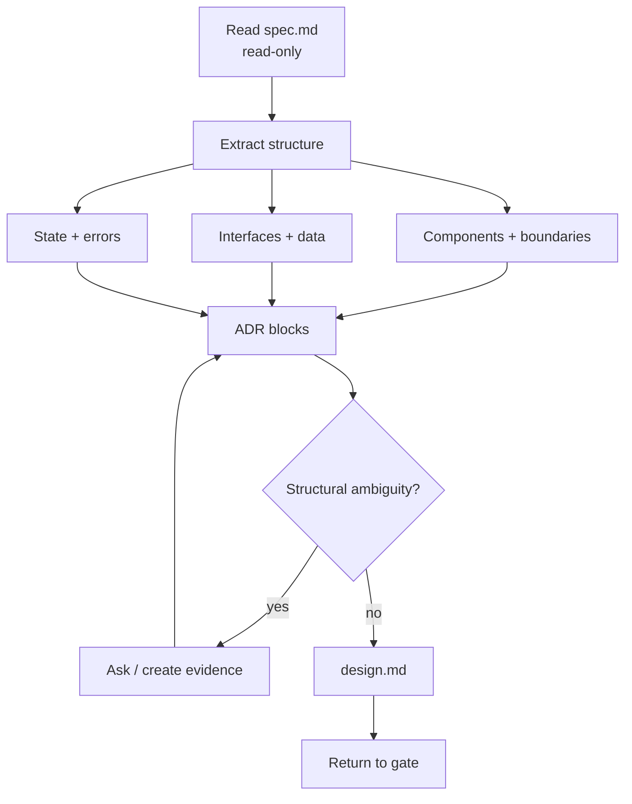

Output: technical shape, ADRs, alternatives, unresolved structural ambiguity.

Discussion hook: is the WHAT / HOW split strict enough, or too rigid?

---

## Phase Flow - Plan

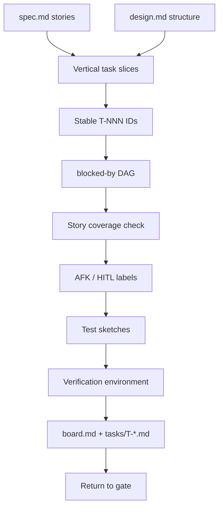

Output: executable work graph, task files, board, tests, verification contract.

Discussion hook: does the upfront planning cost pay back during Build?

---

## Phase Flow - Build

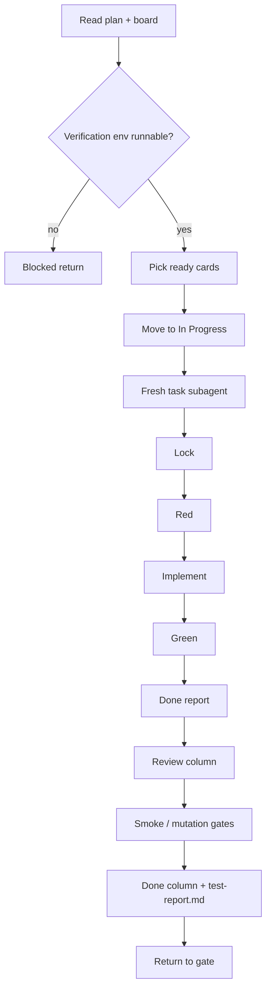

Output: implemented slices, test logs, test report, build logs, board state.

Discussion hook: should the coordinator stay unable to implement?

---

## Phase Flow - Review

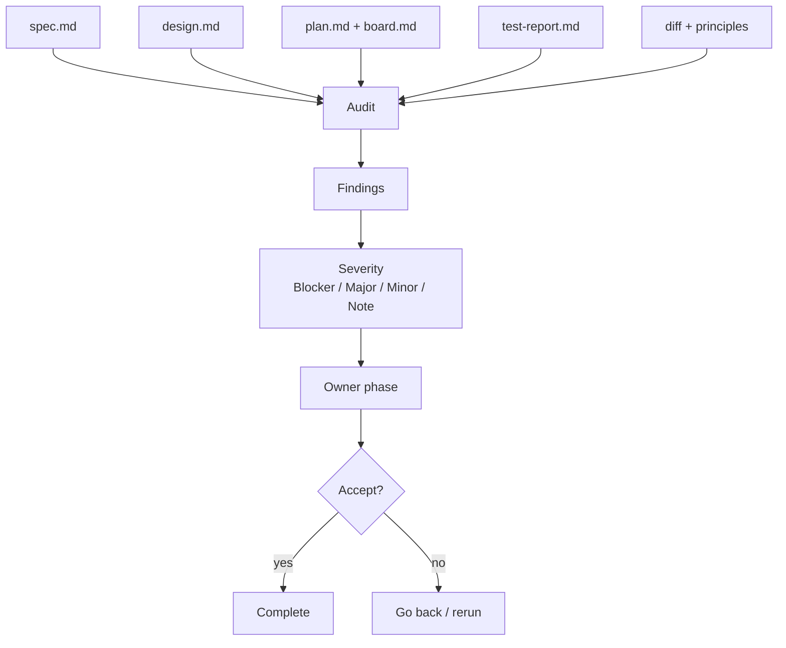

Output: structured findings, risk summary, process learning.

Discussion hook: is Review a real quality gate or just a nicer wrap-up?

---

## Selected Topic 1 - Dedicated Plan Phase

Concept: turn solution structure into an executable task graph before Build starts.

Pros:

- catches dependency cycles and missing story coverage early
- makes autonomy explicit with AFK / HITL labels
- gives Build a simple dispatch model
- creates traceability from `US-NNN` to `T-NNN`
- declares verification environment before work begins

Cons:

- adds one more phase and artifact family
- may over-plan small changes
- task DAG quality depends on good slicing
- upfront tokens increase before any code changes

Decision question: should Plan be mandatory for all work, or skippable for small safe changes?

---

## Plan Phase - Performance Bet

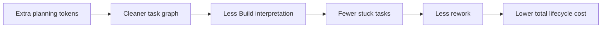

Hypothesis: Plan is more expensive upfront but cheaper over the full lifecycle when work has dependencies, parallelism, or acceptance risk.

Risk: for tiny tasks, Plan may be pure overhead.

---

## Selected Topic 2 - Split Spec From Design

Concept: separate WHAT / WHY from HOW.

Pros:

- separates value questions from architecture questions
- enables independent review of intent and structure
- reduces rerun cost when only design changes
- prevents quiet scope changes inside design
- gives stories a stable home before implementation planning

Cons:

- boundary disputes are likely at first
- some product and design choices influence each other
- users may feel more gates
- artifacts can duplicate language unless enforced

Decision question: what belongs in Spec only, Design only, or both by reference?

---

## Spec / Design Boundary

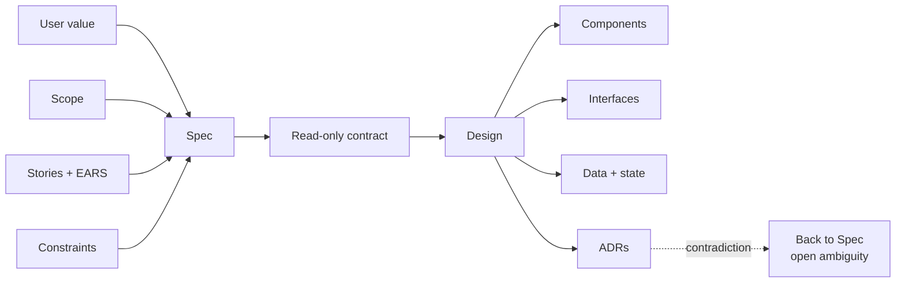

Rule of thumb: Design can interpret Spec, but cannot silently change it.

---

## Selected Topic 3 - Dedicated Review Phase

Concept: a fresh audit after Build, against all upstream contracts.

Pros:

- checks the body of work, not only test status
- separates author mindset from reviewer mindset
- produces severity-graded findings
- assigns issues to the right owner phase
- captures process learning while context is fresh

Cons:

- adds latency after Build
- can produce non-blocking noise
- needs clear severity calibration
- may overlap with code review and CI

Decision question: what findings should block completion versus become follow-up notes?

---

## Review Coverage

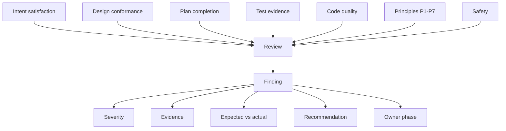

Review is valuable only if findings are specific, evidenced, and actionable.

---

## Selected Topic 4 - Vertical Slicing + Per-Task Subagents

Concept: each task is an end-to-end slice, built in a fresh context.

Pros:

- keeps task context small and focused
- isolates failure and debugger noise
- makes partial completion useful
- enables graph-based parallelism
- gives Review a story-to-diff audit path
- prevents coordinator scope drift

Cons:

- more handoff overhead
- cross-cutting refactors are harder to slice
- duplicate context may be reloaded per task
- parallel edits can still conflict if file scope is wrong

Decision question: how strict should the vertical-slice rule be for infrastructure-heavy work?

---

## Build Context Model

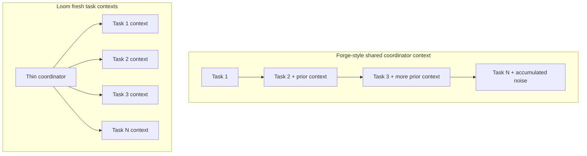

Expected effect: less cumulative context drag and cleaner failure isolation.

---

## Selected Topic 5 - Phase Gates + Quality Checks

Concept: after each phase, the user chooses continue, rerun, quality check, or go back.

Pros:

- keeps human control visible
- makes token spend an explicit decision
- supports targeted reruns
- preserves superseded history
- avoids silent phase drift

Cons:

- interrupts flow
- can feel heavy for routine work
- quality checks add another agent pass
- users need clear summaries to decide quickly

Decision question: which gates should be mandatory, and where can defaults safely help?

---

## KPI View

| KPI | Expected Loom movement | Why | Watch-out |
| --- | --- | --- | --- |
| Token usage per phase | Higher upfront | Spec / Design / Plan are explicit | small tasks may lose |
| Total token usage | Lower on complex work | fewer broad reruns, smaller task contexts | needs measurement |
| Wall-clock speed | Mixed | more phases, more parallel Build | gates add pauses |
| Build throughput | Higher when DAG is good | ready tasks can run concurrently | file conflicts hurt |
| First-pass quality | Higher | stories, tests, env, review are explicit | artifact quality matters |
| Rework rate | Lower | earlier failure detection | bad Plan shifts rework forward |
| Human interruptions | More visible, fewer surprise blocks | gates and HITL labels | may feel chatty |
| Auditability | Higher | stable IDs and owner phases | more files to maintain |

---

## Token Usage Hypothesis

Baseline: Forge uses fewer artifacts but lets Build inherit more accumulated context.

Loom trade:

- more tokens before Build
- fewer tokens in each Build task
- fewer full-phase reruns when only one axis is wrong
- lower chance of paying for implementation before discovering plan defects

Simple model:

```text
Forge build pressure ~= shared coordinator context + cumulative task history
Loom build pressure  ~= thin coordinator + sum(focused task contexts)
```

Measurement: record prompt + completion tokens by phase, task count, rerun count, and final Review severity.

---

## Speed Hypothesis

Where Loom should be faster:

- parallel-ready DAG tasks
- less Build interpretation
- fewer mid-build clarifications
- faster failure isolation

Where Loom may be slower:

- tiny changes
- heavy user gating
- low-quality task slicing
- optional quality checks on every phase

Measurement: wall time by phase, queue time at gates, task retry count, blocked time.

---

## Quality Hypothesis

Expected improvements:

- fewer missed acceptance criteria
- fewer hidden scope changes
- better test alignment with stories
- clearer owner phase for defects
- more reusable process learning

Quality risks:

- false confidence from well-formed artifacts
- fragmented ownership across phases
- Review fatigue if findings are low signal

Measurement: Review blocker / major rate, escaped defects, user correction count, follow-up issue count.

---

## Common KPI Dashboard

| Category | Metric | Target Direction |
| --- | --- | --- |
| Cost | total tokens per completed lifecycle | down on complex work |
| Cost | tokens per accepted story | down |
| Speed | lead time from seed to complete | down or neutral |
| Speed | build task cycle time | down |
| Reliability | reruns per phase | down over time |
| Reliability | failed / HITL-blocked task rate | down |
| Quality | Review blockers per lifecycle | down |
| Quality | acceptance criteria missed | down |
| Autonomy | AFK task completion rate | up |
| Auditability | stories with task coverage | 100 percent |

---

## Discussion Matrix

| Topic | Keep if... | Change if... |
| --- | --- | --- |
| Dedicated Plan | it reduces Build stalls and missed stories | it mostly restates Design |
| Spec / Design split | reruns become cheaper and clearer | teams fight the boundary |
| Review phase | findings prevent real follow-up work | it becomes generic commentary |
| Vertical slices | partial completion stays valuable | work is mostly cross-cutting |
| Phase gates | users make better continuation calls | gates become ceremony |

---

## Proposed Meeting Flow

1. Align on lifecycle map.
2. Discuss each selected topic: problem, pros, cons, decision.
3. Agree on KPI set.
4. Pick 1-2 pilot projects.
5. Measure Forge baseline vs Loom run.
6. Decide what to simplify.

---

## Open Questions

- Should Plan be optional for very small work?
- Should Review block completion by default, or only on Blocker findings?
- How strict should vertical slicing be for infra and refactor work?
- Which metrics are cheap enough to collect automatically?
- What is the minimum useful gate summary?

---

## Suggested Decisions To Capture

- Mandatory phases for standard work.
- Fast path criteria for small changes.
- Review severity policy.
- KPI dashboard fields.
- Pilot project selection.
- Owner for measurement instrumentation.

