# Loom Lifecycle — Concepts, Theory, and Evidence

**Why this document exists.** Loom is a five-phase agent-orchestration lifecycle — **Spec → Design → Plan → Build → Review** — with explicit human-in-the-loop gates between phases and a set of cross-cutting mechanisms (stable cross-phase identifiers, append-only state, typed phase signatures, capability-minimised coordination, a curated learning loop). This document defends each architectural choice with evidence from the 2023–2026 agent-orchestration literature.

**Framing.** The discussion is **framework-agnostic**: every concept is examined as *"with this concept versus without it"*, not as *"this framework versus that framework"*. The four big concept sections (a dedicated Plan phase, the Spec/Design split, a dedicated Review phase, vertical task slicing with per-task fresh-context sub-agents) each elaborate on the failure modes a system runs into when the concept is absent — independent of which specific framework happens to be missing it.

---

## TL;DR — what independent research says about each concept Loom adopts

> **Honest caveat first.** The numbers in this document come from public research where each concept was tested **against its own baseline** — a different planner, a different model, a different task. What the evidence shows is that **each concept Loom adopts has earned its place in independent research**. Where this document does project an aggregate per-project effect (in section 13), it is an explicit arithmetic thought experiment with stated assumptions, comparing *"a framework with these concepts"* against *"a framework without them"* — not a measurement of any specific competing system.

The four rows below summarise, in plain English, what the literature reports about each of Loom's four big architectural choices. Full citations are in the References section at the end of the document; here we cite only by reference number.

| Concept Loom adopts | What independent research reports, in plain English | References |
| --- | --- | --- |
| **A dedicated planning phase that produces an explicit dependency graph of tasks** | Recursive plan-decomposition adds between 27 and 33 score points (out of 100) on three different agent-task benchmarks. Replacing sequential reasoning with a parallel dependency graph cuts wall-clock latency by roughly 3.7-fold and dollar cost by roughly 6.7-fold on tool-calling tasks. Adding a verification step over the generated plan lifts scores another 4 to 8 points. | [10] [11] [12] |
| **Splitting "what we are building" (Spec) from "how we are building it" (Design), and writing user stories in a controlled grammar** | Industrial requirements teams at NASA, Airbus and Rolls-Royce report a substantial reduction across eight categories of ambiguity when stories follow a fixed grammar instead of free-form text. A defect caught while writing the specification costs roughly one one-hundredth of the same defect caught after release. | [58] [59] [75] [81] |
| **A dedicated Review phase, run by a fresh agent that did not see the build happen** | A reviewer in a fresh context lifts coding-benchmark first-attempt accuracy by about 11 score points. A three-role split (one agent writes code, another writes tests, a third executes) reaches 96.3 % on the HumanEval coding benchmark — about 6 points higher than the previous best — while using less than half the tokens. **The critical counter-finding**: when an agent is asked to self-correct in the same context, accuracy goes *down*, not up. | [6] [9] [16] |
| **Vertical task slicing with a fresh sub-agent context per task and a kanban-style shared state between them** | On the same task, three published multi-agent frameworks consume between fourteen thousand and 1.35 million tokens — a roughly one-hundred-fold spread — depending on how the agents coordinate (chat-broadcast at the expensive end, shared-state at the cheap end). Every frontier model tested at long context degrades steadily with length: a leading model falls from 99 % accuracy on short inputs to 70 % accuracy at 32 thousand tokens, on the same task. | [31] [32] [51] |

> **How to read this section.** Each row names a Loom concept on the left and summarises in plain English what *independent* research reports about that concept. The references on the right point to the full citation list. **None of the numbers above is a direct measurement of one framework against another** — they are measurements of the concept against the baseline used in the cited study. See section 10 for the full reading guide, section 11 for per-concept evidence in more detail, section 12 for the diminishing-returns curves these concepts are calibrated against, and section 13 for an explicit thought experiment projecting per-project cost.

---

## Lifecycle at a glance

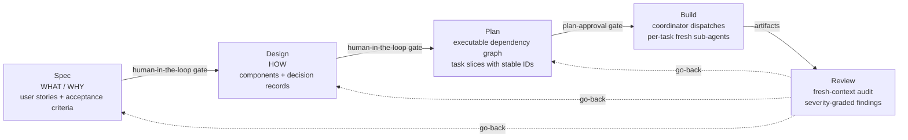

**Reading the diagram.** Loom has five phases, four human-in-the-loop gates between them, structured cross-phase identifiers (user-story IDs flowing into task IDs), and explicit go-back edges from Review back to any upstream phase. Go-backs *supersede* downstream artifacts rather than deleting them — old versions remain in the audit trail.

---

# Part 0 — The framework's central problem and unifying theory

## The three failure modes Loom is solving

LLM-driven software engineering at non-trivial scale collides with three coupled failure modes. They are not independent — each one amplifies the others, and none of them is solved by using a bigger model.

| Failure mode | Evidence | Surface symptom when the failure mode is unaddressed |
| --- | --- | --- |
| **Context degradation** | NoLiMa (ICML 2025): 11 of 13 long-context models drop below 50 % of their short-context baseline at 32 k tokens. *Lost in the Middle* (TACL 2024): >30 % accuracy drop on mid-context info. Chroma's "Context Rot" (2025): **every** frontier model degrades with length — GPT-4.1, Claude 4, Gemini 2.5, Qwen 3 alike, even far below stated window limits. | A long-running build agent gets worse at remembering its own spec the further it goes; "stop summarising what we already decided" loops appear. |
| **Specification drift** | Boehm cost-of-defect ratio **1 : 6.5 : 15 : 60–100** across design → impl → test → post-release. NIST RTI 2002: **$22 – 60 B/yr** US macro cost of late-stage defects. Maes et al. (2025): OpenHands failed trajectories are **31 – 82 % longer** than successful ones — *wrong order* is the dominant failure mode in production coding agents. | The artifact at hour 6 quietly answers a different question than the one posed at hour 0. The user notices only after release. |
| **Coordination collapse** | AImultiple multi-agent benchmark: same task — CrewAI **1.35 M tokens**, AutoGen **56.7 k**, LangGraph **13.6 k**. **~24× variance** from coordination overhead alone. Anthropic's multi-agent research system used **~15× the tokens** of single-agent chat — economic only when the task value is high. | Subagents broadcast irrelevant context to each other; the coordinator becomes a sink for every worker's debugger output; replanning costs more than the original plan. |

The literature is consistent: throwing more context at the problem makes it worse, not better. Throwing more agents at the problem makes it more expensive, not necessarily smarter. The mechanism that wins is **discipline about what each pass sees and what each pass produces.**

## The unifying theory

Every Loom architectural choice falls out of one or both of these principles.

### Principle A — Context economy

Each cognitive pass should see the **minimum sufficient context**: not the project's history, not a sibling task's debugger output, not yesterday's rejected design. Anthropic frames context as a "finite resource with diminishing marginal returns"; Loom takes that literally and treats every architectural lever as a way to **bound, isolate, or compress** per-pass context.

| Loom mechanism | What it bounds |
| --- | --- |
| Phase splits (Spec / Design / Plan) | Decision scope per pass — each phase sees only the slice it operates on |
| Fresh subagent per task | Task-local context, not project-cumulative — O(task), not O(project) |
| Read-only upstream artifacts | No re-derivation cost; prior decisions are cheap to cite |
| Stable cross-phase IDs (`Q-NNN`, `US-NNN`, `T-NNN`) | Reference compression — name once, cite forever |
| Severity-graded findings | Cap on rework triggered per finding |
| Three-attempt retry cap | Bounded exploration per task; sits on the elbow of the diminishing-returns curve |
| Summary-only phase handoff | Downstream phase reads the artifact, not the transcript |

### Principle B — Build-system semantics

Loom treats LLM execution like a **build graph** (Make, Bazel, Nix), not like a programmer. Each phase declares **typed inputs, typed outputs, and a deterministic transition contract**; the orchestrator is a scheduler, not an author. This is what makes resumption, supersession, and audit possible at all.

| Build-system concept | Loom equivalent |
| --- | --- |
| Build rule | Phase (Spec / Design / Plan / Build / Review) |
| Rule inputs / outputs | `phase.signature.md` — typed input artifacts + typed RETURN schema |
| Dependency graph | `blocked-by` DAG over `T-NNN` |
| Caching / no-rebuild | Phase HITL gate ("rerun worth the burn?") |
| Incremental rebuild | Supersede-not-delete; downstream artifacts retired with forward-pointers, not destroyed |
| Build script | Coordinator — schedules, never authors |
| Hermetic builds | Per-task fresh subagent context |
| Lockfile | `locks.sh` on shared state; atomic writes on every board mutation |

### The two principles compose

The build-system contracts are what make context economy **enforceable**. You cannot run a fresh context for Task `T-007` unless `T-007`'s inputs and outputs are typed and frozen. You cannot keep `spec.md` read-only during Design unless there is a typed contract for what Design can ask of Spec. Loom's phases are not just *named*; they are *typed*, and the typing is what unlocks bounded context.

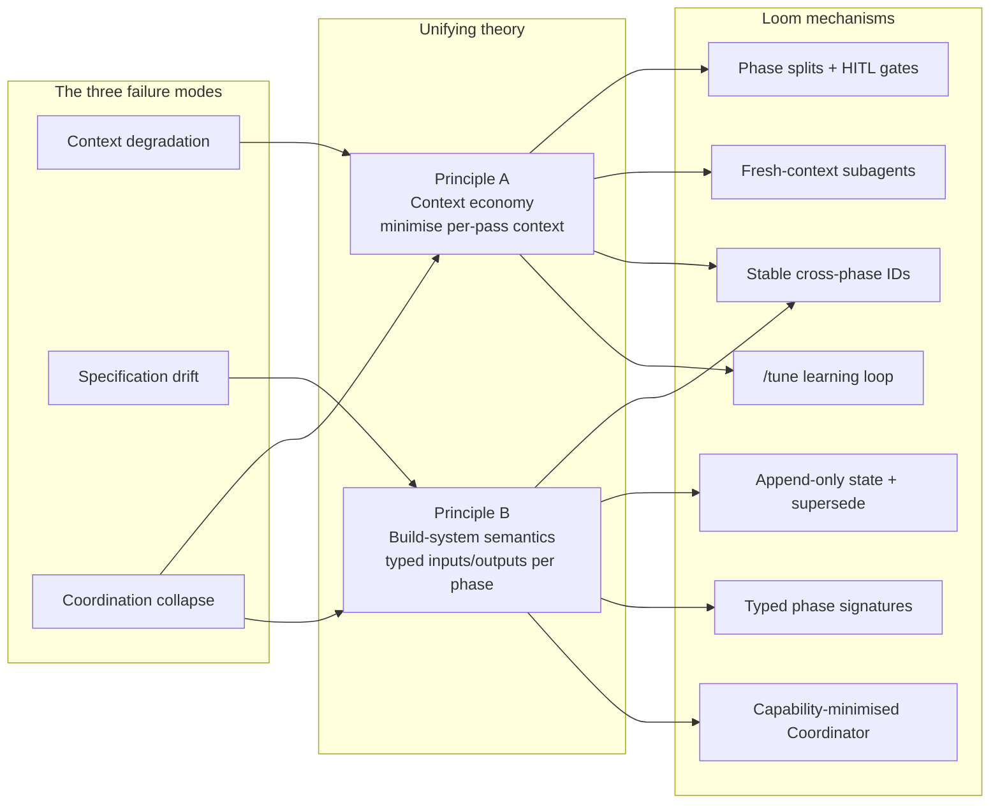

### How to read the rest of this document

- **Part I** explores the four phase-level decisions: dedicated Plan, Spec/Design split, dedicated Review, vertical slicing + per-task subagents. Each section closes with a *Theory linkage* paragraph showing which principle is at work.
- **Part II** covers the cross-cutting mechanisms that make the principles operational across all phases: the traceability spine, append-only state, typed phase signatures, capability minimization, and the `/tune` learning loop.
- **Part III** quantifies the expected impact: a unit-and-baseline reading guide, per-concept evidence in plain English, the diminishing-returns curves these concepts are calibrated against, and a directional cost projection for a representative project.

The TL;DR numbers at the top are the empirical price tag attached to violating these principles. Every percentage point is the cost of *not* doing what Loom does.

---

# Part I — The four big "Why"s, with evidence

Each section: **(a)** the concept, **(b)** what it buys, **(c)** how it links back to the two principles, **(d)** the evidence base from public research, **(e)** what failure modes appear when the concept is absent.

---

## 1. Why a dedicated Plan phase

### What it does

Plan converts solution structure into an **executable work graph**: vertical task slices with stable IDs (`T-NNN`), a `blocked-by` DAG, story-coverage check, test sketches derived from EARS, autonomy classification (`AFK` / `HITL`), and a declared verification-environment harness. Plan's output is what Build **executes**, not what Build **interprets**.

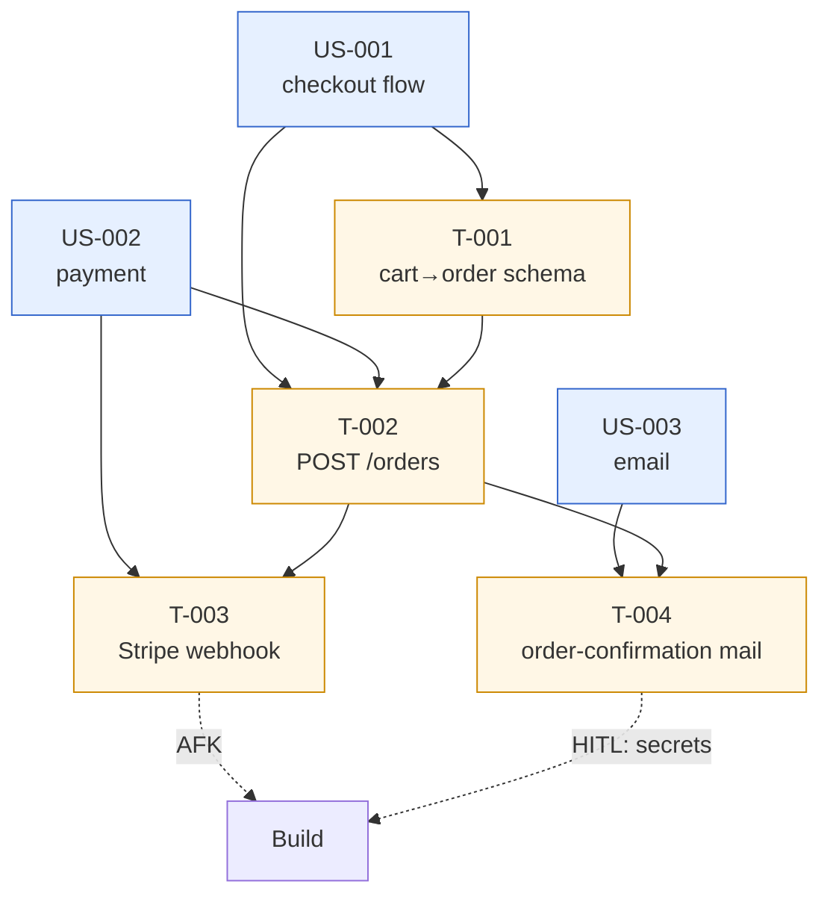

### What it buys

- **Pre-flight failure detection.** Cycles, missing story coverage, dangling `blocked-by` edges, and harness mismatches are caught before any code is written. Build refuses to start when the declared environment isn't runnable instead of silently substituting (the dominant failure mode on SWE-bench — see SWE-bench Harness docs and Maes et al. on "environment rot").
- **Autonomy budget made explicit.** Tasks tagged `AFK` / `HITL` make the autonomy contract visible at plan-time, not discovered mid-build when an agent stalls. Devin's 2025 review identifies the **Planning Checkpoint** as one of two non-negotiable HITL gates in production.
- **Coordinator stays dumb.** Because the graph is declared up front, Build's coordinator only picks ready cards, dispatches, and transitions columns. It doesn't decide *what* to build next — the DAG does. Magentic-One (Microsoft Research, Nov 2024) uses the same Task-Ledger / Progress-Ledger split.
- **Traceability spine.** Every `T-NNN` references the `US-NNN` it satisfies; Review walks story → tasks → diff structurally.

> **Theory linkage.** Plan is where the build-system contract is *constructed* (Principle B): it produces the typed DAG that every downstream phase depends on. It is simultaneously a context-economy gate (Principle A) — one up-front planning pass amortises across every subsequent Build pass, which then runs on **bounded per-task context** instead of project-cumulative. Without Plan, Build has to *infer* the work graph from prose at every step, paying the cost of inference every time.

### Evidence

| # | Source | Claim |
|---|--------|-------|
| P1 | **Plan-and-Solve Prompting** (Wang et al., ACL 2023) — [arxiv](https://aclanthology.org/2023.acl-long.147/) | Explicit plan-then-solve "consistently outperforms Zero-shot-CoT by a large margin" on 10 reasoning datasets. |
| P2 | **LLM Compiler** (Kim et al., ICML 2024) — [arxiv](https://arxiv.org/abs/2312.04511) | Planner emits DAG of tool calls executed in parallel: **3.7× latency, 6.7× cost, +9 pp accuracy** vs. ReAct. |
| P3 | **ADaPT** (Prasad et al., NAACL 2024) — [arxiv](https://arxiv.org/abs/2311.05772) | Recursive plan-decomposition: **+28.3 pp ALFWorld, +27 pp WebShop, +33 pp TextCraft**. |
| P4 | **PlanGEN** (Parmar et al., EMNLP 2025, Google) — [arxiv](https://arxiv.org/abs/2502.16111) | Constraint + Verification + Selection agents over the plan: **+8 % Natural-Plan, +7 % DocFinQA, +4 % OlympiadBench**. |
| P5 | **Magentic-One** (Fourney et al., MSR Nov 2024) — [arxiv](https://arxiv.org/html/2411.04468v1) | Orchestrator with Task Ledger (facts/plan) + Progress Ledger (assignments) — direct template for "plan = ledger w/ stable IDs". |
| P6 | **Devin SWE-bench technical report** (Cognition 2024) — [blog](https://cognition.ai/blog/swe-bench-technical-report) | **13.9 %** resolution vs. **4.8 %** prior best (Claude 2 assisted) — long-horizon plan + env loop is the differentiator. |
| P7 | **Devin Annual Performance Review 2025** (Cognition) — [blog](https://cognition.ai/blog/devin-annual-performance-review-2025) | PR merge rate **34 % → 67 %**, **4× faster, 2× more efficient**, driven by two HITL checkpoints: **Planning** and PR. |
| P8 | **SWE-agent** (Yang et al., NeurIPS 2024) — [arxiv](https://arxiv.org/pdf/2405.15793) | **51.7 %** of GPT-4-Turbo trajectories have ≥1 failed edits; recovery odds decline as failures accumulate. Argues for DAG-level replanning over blind retry. |
| P9 | **SWE-bench Harness** docs — [link](https://www.swebench.com/SWE-bench/reference/harness/) | "Environment rot" (configuration drift) is the dominant scalability bottleneck — direct evidence harness must be declared up-front. |
| P10 | **Understanding Code Agent Behaviour** (Maes et al., 2025) — [arxiv](https://arxiv.org/abs/2511.00197) | OpenHands failed trajectories are **31 % – 82.5 % longer** than successful ones; wrong order is the dominant failure mode. |
| P11 | **OAgents empirical study** (EMNLP 2025 Findings) — [pdf](https://aclanthology.org/2025.findings-emnlp.720.pdf) | On GAIA: Subtask Decomposition **+2.4 %**, Strategic Plan Review **+3.6 %**, Long-term Memory **+55.8 %** avg accuracy. |
| P12 | **Anthropic — Building Effective Agents** (Dec 2024) — [link](https://www.anthropic.com/research/building-effective-agents) | Names the orchestrator-worker pattern; "you can add human checks (gate) on any intermediate steps." |
| P13 | **HITL Software-Development Agents** (Pham et al., FSE 2025) — [arxiv](https://arxiv.org/abs/2411.12924) | HITL framework where engineers refine plans **before code generation** outperforms full-autonomy baseline on SWE-bench. |

### Without a dedicated plan phase

When a system has no up-front planning pass, three failure modes follow. First, the build agent has to **decide what to do next, step by step** — inferring task dependencies from prose rather than reading them off a graph. Second, **parallelism becomes a matter of convention rather than structure**: two tasks "look independent", so the agent runs them concurrently — until they collide on a shared file because the dependency was never declared. Third, **the verification environment is whatever the agent happens to find**: failures that look like bugs are sometimes just environment drift, which independent evidence flags as the dominant scalability bottleneck for coding agents [9, 22]. An explicit planning pass that emits a typed dependency graph, story-coverage check, and declared verification harness moves the system off all three failure modes at once.

**Concretely.** Compare what the build trace looks like in each case.

*Without* a planning phase, the build agent decides on the fly:

```text
> user:  add checkout flow with Stripe
> agent: I'll start with the order schema.       [edits orders/schema.ts]
> agent: Now the POST /orders endpoint.          [edits api/orders.ts]
> agent: Now the Stripe webhook.                 [edits webhooks/stripe.ts]
> agent: Tests fail — STRIPE_SECRET_KEY missing. Mock it? Skip? Add TODO?
> agent: I'll mock it and continue.              [silently changes contract]
> agent: Adding email confirmation… wait, the schema needs a `confirmed_at`
         column. Let me add it.                  [migrates schema mid-build,
                                                  breaks the in-flight endpoint]
```

*With* an up-front plan, the graph is declared once and dispatch is deterministic:

```yaml
# plan/tasks/ (produced once, validated before Build starts)
T-001: { satisfies: [US-001], blocked-by: [],      file-scope: [orders/schema.ts], autonomy: AFK }
T-002: { satisfies: [US-001], blocked-by: [T-001], file-scope: [api/orders.ts],     autonomy: AFK }
T-003: { satisfies: [US-002], blocked-by: [T-002], file-scope: [webhooks/stripe.ts],
         autonomy: HITL,   # surfaced up-front: needs STRIPE_SECRET_KEY
         harness: { env: [STRIPE_SECRET_KEY] } }
T-004: { satisfies: [US-003], blocked-by: [T-002], file-scope: [mail/*],           autonomy: AFK }
```

```text
# Coordinator loop — no prose decisions, just graph traversal
while board.has_pending():
    ready = tasks.filter(blocked_by ⊆ done, file_scope ∩ in_flight = ∅)
    for task in ready: dispatch_fresh_subagent(task)
```

The graph itself answers *"what's next?"* and *"can these run in parallel?"*. The schema-migration-mid-build failure is impossible: `T-001` owns `orders/schema.ts` and `T-002` is blocked on it, so the endpoint cannot start before the schema is final. The Stripe-key surprise is surfaced at plan-time as an HITL gate, not discovered mid-build.

---

## 2. Why split Spec from Design

### What changes

**Spec** owns *WHAT and WHY*: user intent, scope, user stories with EARS acceptance criteria, constraints. **Design** owns *HOW*: components, interfaces, data, state, ADRs about structure. Design treats `spec.md` as **read-only** — contradictions route back as Spec open-ambiguity, never patched in-place.

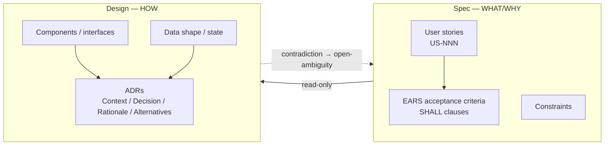

### What it buys

- **Different question shapes don't compete.** Spec asks value/scope (Y/N, Choice, Background); Design asks structural (Architecture, Diagram). Mixing them biases the agent toward whichever shape it asked first.
- **Independently auditable axes.** Review asks "right thing built?" (Spec) and "built right way?" (Design) as separate questions with separate evidence.
- **Bounded rerun cost.** A structural defect re-burns Design tokens **without** re-burning Spec. A monolithic combined-artifact approach instead forces every rework to reopen the whole surface.
- **Read-only contract prevents quiet scope creep.** A design choice that *requires* a user-facing-behaviour change must walk back through Spec — making the change explicit and gated.

> **Theory linkage.** Spec/Design is the WHAT/HOW separation expressed as a build-system input contract (Principle B): locking `spec.md` read-only during Design is the same move as freezing a Bazel rule's inputs — downstream rules cannot accidentally redefine what they consume. Principle A applies in parallel: a structural defect re-burns `design.md` only, *not* the spec tokens — a layered artifact is fundamentally cheaper to rework than a monolithic one. The split is what makes the cost-of-defect curve (1 : 6.5 : 15 : 60–100) actionable rather than aspirational.

### Evidence

| # | Source | Claim |
|---|--------|-------|
| S1 | **EARS — Mavin et al., IEEE RE'09** — [pdf](https://ccy05327.github.io/SDD/08-PDF/Easy%20Approach%20to%20Requirements%20Syntax%20(EARS).pdf) | Five canonical patterns ("While &lt;state&gt;, when &lt;trigger&gt;, the &lt;system&gt; shall &lt;response&gt;") — attacks 8 measured ambiguity classes. |
| S2 | **Big Ears** (Mavin & Wilkinson, IEEE RE'10) — [link](https://ieeexplore.ieee.org/document/5636542/) | Before/after rewrites show "substantial reduction" across ambiguity, duplication, vagueness, complexity, omission, wordiness, untestability, inappropriate-implementation. |
| S3 | **EARS adopters** — [link](https://alistairmavin.com/ears/) | NASA, Rolls-Royce, Airbus, Bosch, Honeywell, Intel, Siemens, Dyson. |
| S4 | **ISO/IEC/IEEE 29148:2018** — [link](https://www.iso.org/standard/72089.html) | International standard explicitly separates business/stakeholder/system requirements from architecture & design processes. |
| S5 | **Boehm 1981 / Boehm & Basili "Top 10 Defect List" 2001** — [pdf](https://www.cs.cmu.edu/afs/cs/academic/class/17654-f01/www/refs/BB.pdf) | Phase-relative defect cost: $1 / $10 / $100 / $1000 for requirements / design / coding / post-release. |
| S6 | **NIST-RTI 2002 — Economic Impacts of Inadequate Software Testing** — [pdf](https://www.nist.gov/document/report02-3pdf) | **$22.2 B – $59.5 B / yr** US macro cost; auto+aerospace $1.8 B; financial services $3.3 B. |
| S7 | **NASA JSC — Error Cost Escalation** (2010) — [pdf](https://ntrs.nasa.gov/api/citations/20100036670/downloads/20100036670.pdf) | NASA confirmation of phase-relative defect cost growth across internal program data. |
| S8 | **Nygard 2011 — Documenting Architecture Decisions** — [blog](https://www.cognitect.com/blog/2011/11/15/documenting-architecture-decisions) | Seminal ADR template (Status / Context / Decision / Consequences). Captures *why-decisions* separately from *how-implementation*. |
| S9 | **Thoughtworks Tech Radar — Lightweight ADRs (Adopt)** — [link](https://www.thoughtworks.com/radar/techniques/lightweight-architecture-decision-records) | Industry endorsement: "no reason why you wouldn't want to use this technique." |
| S10 | **Bogner et al. ECSA 2024 — ADRs in Practice** — [pdf](https://rebekkaa.github.io/files/2024_ECSA.pdf) | First rigorous empirical study; ADRs measurably improved knowledge-transfer and cross-team cooperation. |
| S11 | **Grove, "The New Code" — AI Engineer Fair 2025** — [video](https://www.youtube.com/watch?v=8rABwKRsec4) | "80–90 % of programming work is structured communication; specs are the best way to communicate intent." |
| S12 | **AWS Kiro — Spec-Driven Agentic IDE** — [link](https://kiro.dev/) | Three-stage workflow: **requirements → design → tasks** — mirrors Loom's Spec→Design→Plan split. Delta Airlines reports 94 % satisfaction. |
| S13 | **GitHub Spec Kit** — [link](https://github.com/github/spec-kit) | Four phases: Constitution → Specify → Plan → Tasks. Each phase is a separate artifact. |
| S14 | **Thoughtworks — Spec-Driven Development** (2025) — [link](https://www.thoughtworks.com/en-us/insights/blog/agile-engineering-practices/spec-driven-development-unpacking-2025-new-engineering-practices) | "The planning phase focuses on understanding requirements, designing constraints, and curating prompts for subsequent stages" — staged separation prevents vibe-code drift. |
| S15 | **Anthropic — Claude Code Best Practices** — [link](https://code.claude.com/docs/en/best-practices) | Anthropic's own guidance: "separate research and planning from implementation to avoid solving the wrong problem." |
| S16 | **Lucassen et al. — QUS Framework** (Springer) — [link](https://link.springer.com/article/10.1007/s00766-016-0250-x) | 13-criterion story-quality framework empirically tested on **1,023 user stories from 18 companies**. |
| S17 | **ATDD industrial case study** (Haugset & Stålhane) | **5 – 30 %** fault-slip reduction, **55 %** reduction in avoidable post-release fault cost; >1000 defect-tracking data points. |
| S18 | **Chroma Research — "Context Rot"** (2025) — [link](https://research.trychroma.com/context-rot) | All 18 frontier models degrade as input grows — a monolithic plan.md triggers rot; layered Spec/Design limits per-pass context. |
| S19 | **Augment Code — AI Agent Loop Token Costs** — [link](https://www.augmentcode.com/guides/ai-agent-loop-token-cost-context-constraints) | Naive loops compound O(N²) because APIs bill full history; re-planning budget + locked spec capture exactly the cost mitigation Loom uses. |

### Without a Spec/Design split

When *what the system should do* and *how it should do it* share a single artifact, three failure modes follow. First, **questions of different shapes compete in the same prompt**: yes/no value questions sit next to architecture-diagram questions, and the agent biases its answers toward whichever shape it engaged with first. Second, **structural rework forces redoing the entire combined artifact** — rewriting the design also rewrites the spec, paying the cost of every prior decision again (the rework loop pattern documented in [53]). Third, **a design choice can quietly change what the system is supposed to do**, with no gate forcing that change to be explicit. The split adds three contracts that close each failure mode in order: the specification is read-only during design; design changes that require user-facing-behaviour changes have to walk back through the specification; and each artifact is rerunnable independently of the others.

**Concretely.** Compare the two ways of organising the same information.

*Without* a split, a single artifact mixes WHAT and HOW. Below, the user stories, the design choices, and the open questions are interleaved — a tangle that has to be re-derived as a whole every time anything changes:

```markdown
# plan.md  (single artifact)
## Goal
Users place orders and receive confirmation emails.

## Approach
- Use Stripe Elements (Adyen and Stripe Checkout considered, rejected).
- Drizzle ORM + Postgres.
- Resend for emails.

## User stories
1. User places an order.
2. User gets a confirmation email.

## Open questions
- Retry policy on Stripe webhook failure?
- Synchronous or queued email send?
```

```text
# Later: payment provider needs to be swapped to Adyen
> agent:   rewriting Approach section…
> agent:   the user-stories section sits in the same file — re-emitting it too
> agent:   the Stripe-specific open questions are now stale, deleting them
> user:    did the user stories themselves change?
> agent:   …let me re-check; the diff touched lines 12-18 of that section
> [no structural guarantee that stories stayed the same; trust is by inspection]
```

*With* a split, the same information lives in two layered artifacts; only one of them changes when the design shifts:

```markdown
# spec.md  (read-only once Design begins)
## US-001 — place order
WHEN the user submits a complete order form,
the system SHALL persist the order and authorize payment
within 3 seconds.

## US-002 — order confirmation
WHEN an order is persisted and payment is authorized,
the system SHALL email the user a confirmation
within 60 seconds.
```

```markdown
# design.md  (consumes spec.md by reference; cannot mutate it)
## ADR-001 — Payment provider
Context:      US-001 requires payment authorization.
Decision:     Stripe Elements.
Alternatives: Adyen (rejected: …), Stripe Checkout (rejected: …).

## ADR-002 — Email delivery
Context:      US-002 requires email within 60 s.
Decision:     Resend, async via queue.
```

```text
# Later: swap Stripe for Adyen
> agent: edits design.md, ADR-001 only — Decision becomes Adyen,
         Stripe moves into the Alternatives list.
> spec.md untouched.  US-001 is, by construction, unchanged —
  no inspection required to know that.
```

The split turns *"did the user stories change?"* from a code-review question into a `git diff spec.md` answer.

---

## 3. Why a Review phase

### What it does

Review is a dedicated audit pass after Build, run in **a fresh agent context**. It walks intent satisfaction (Spec), design conformance (Design), plan completion (Plan), test evidence, code quality, principle compliance (P1–P7), and safety — emitting structured findings with `severity (Blocker / Major / Minor / Note), evidence, expected, actual, impact, recommendation, owner-phase`.

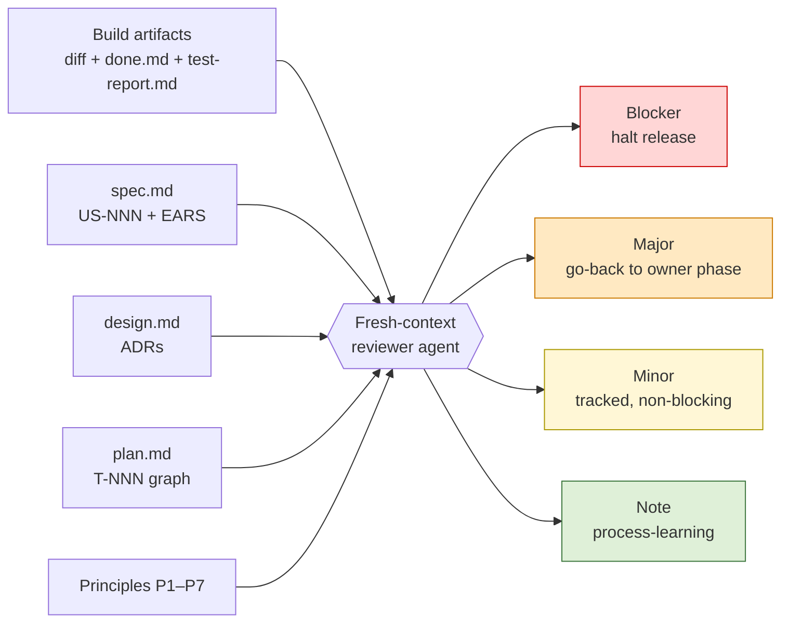

### What it buys

- **Closes the loop.** Smoke verifies the code runs; tests verify behaviour against assertions; **neither** verifies that the *body of work* matches the contracts (Spec stories, Design ADRs, Plan scope). Review is the only phase whose job is "do outputs match inputs?"
- **Severity calibration.** Build can return `green` / `failed` / `hitl-block` — it cannot say "this works but the abstraction violates P5." Review introduces Blocker / Major / Minor / Note so non-blocking concerns are captured without stalling the lifecycle.
- **Fresh context = independent reader.** Same reason code review is done by someone other than the author. Empirically: same-context self-correction *degrades* performance (Huang ICLR 2024); LLM-as-judge has measurable self-preference bias (Ye 2024).
- **Structured findings are reusable artifacts.** SARIF-style records (severity + evidence + expected + actual + impact + recommendation + owner) feed both go-back decisions and process learning. A prose wrap-up summary cannot.
- **Process-learning capture in-flow.** Review explicitly records what to feed back. Post-hoc transcript-mining alternatives are reactive; an in-flow Review pass is preventive.

> **Theory linkage.** Review is the *typed acceptance test* of the lifecycle's outputs against its frozen inputs — the build-system equivalent of `bazel test //...` against declared targets (Principle B). It runs in **fresh context** (Principle A) for two compounding reasons: (i) in-context self-review is *empirically biased* — Huang et al. (ICLR 2024) show intrinsic self-correction *degrades* performance on arithmetic, QA, code, plan generation, and graph coloring; (ii) the long Build transcript buries the very criteria Review must check (*Lost in the Middle*, >30 % accuracy drop on mid-context info). A reviewer who has not seen the work happen is, mechanically, the cheapest reliable critic.

### Evidence

| # | Source | Claim |
|---|--------|-------|
| R1 | **Self-Refine** (Madaan et al., NeurIPS 2023) — [arxiv](https://arxiv.org/abs/2303.17651) | Explicit critique-and-refine preferred ~20 pp absolute over one-shot; code-optimization 22.0 → 28.8 over three critique rounds. |
| R2 | **Reflexion** (Shinn et al., NeurIPS 2023) — [arxiv](https://arxiv.org/abs/2303.11366) | **91 % pass@1 HumanEval** vs GPT-4 **80 %**; +22 % AlfWorld; +20 % HotPotQA. |
| R3 | **CRITIC** (Gou et al., ICLR 2024) — [arxiv](https://arxiv.org/abs/2305.11738) | External tool-grounded critique outperforms intrinsic self-critique; intrinsic is insufficient. |
| R4 | **Constitutional AI** (Bai et al., Anthropic 2022) — [arxiv](https://arxiv.org/abs/2212.08073) | Anthropic's own pipeline runs a **separate** critique-and-revise step against a written constitution. Precedent for principle-conformance review as a distinct stage. |
| R5 | **Huang et al. — LLMs Cannot Self-Correct Reasoning Yet** (ICLR 2024) — [arxiv](https://arxiv.org/abs/2310.01798) | **Strongest single citation against in-context self-review.** Intrinsic self-correction *degrades* performance on arithmetic, QA, code, plan generation, graph coloring. |
| R6 | **AgentCoder** (Huang et al. 2024) — [arxiv](https://arxiv.org/abs/2312.13010) | 3-agent split (programmer / test-designer / test-executor): **96.3 % HumanEval, 91.8 % MBPP** at lower token cost (56.9 k vs 138.2 k). |
| R7 | **MetaGPT** (ICLR 2024 Oral) — [arxiv](https://arxiv.org/abs/2308.00352) | Role isolation incl. dedicated QA Engineer drives **85.9 % HumanEval, 87.7 % MBPP** (SOTA at publication). |
| R8 | **ChatDev** (Qian et al., ACL 2024) — [arxiv](https://arxiv.org/abs/2307.07924) | Pipeline ends in explicit *testing* phase (static review + dynamic system test) distinct from coding. |
| R9 | **LDB — LLM Debugger** (ACL 2024) — [arxiv](https://arxiv.org/abs/2402.16906) | Post-build debug pass: **+9.8 %** HumanEval/MBPP/TransCoder. |
| R10 | **Lost in the Middle** (Liu et al., TACL 2024) — [arxiv](https://arxiv.org/abs/2307.03172) | **>30 %** accuracy drop on multi-doc QA when key info is mid-context — a long build transcript *buries* correctness criteria. |
| R11 | **LLM-as-Judge bias quantification** (Ye et al., 2024) — [arxiv](https://arxiv.org/abs/2410.02736) | Eleven measurable bias categories in LLM judges (verbosity, position, self-preference, authority, CoT) — intrinsic to the judge, not the prompt. |
| R12 | **Capers Jones — Software Defect Removal Efficiency** — [pdf](https://www.ppi-int.com/wp-content/uploads/2021/01/Software-Defect-Removal-Efficiency.pdf) | Design + code inspections remove **60 – 90 %** of defects; testing alone cannot exceed ~90 %. Industry-avg DRE 92.5 % requires pre-test inspection. |
| R13 | **Fagan Inspection** (IBM) — [wiki](https://en.wikipedia.org/wiki/Fagan_inspection) | 80 – 93 % defect detection; **30× payback** per inspection hour vs late-phase fix. |
| R14 | **SmartBear / Cisco Largest-Ever Code Review Study** — [pdf](https://static0.smartbear.co/support/media/resources/cc/book/code-review-cisco-case-study.pdf) | 2 500 reviews / 3.2 M LOC: **~32 defects/kLOC** found; effective up to 200 – 400 LOC and 60 – 90 minutes per pass. |
| R15 | **IBM Systems Sciences Institute cost-of-defect curve** | Multipliers **1× design, 6.5× implementation, 15× test, 60–100× post-release**. |
| R16 | **SARIF v2.1.0 OASIS Standard** — [link](https://docs.oasis-open.org/sarif/sarif/v2.1.0/sarif-v2.1.0.html) | Industry interchange schema (rule id, level, location, message, fix) — used by CodeQL, Trivy, Checkov, Sonar. Precedent for machine-walkable structured findings. |
| R17 | **CodeQL severity levels (GitHub)** — [link](https://docs.github.com/en/code-security/code-scanning/managing-code-scanning-alerts/about-code-scanning-alerts) | Four-level Critical/High/Medium/Low scale auto-triaged from CVSS — calibrated severity, not free text. |
| R18 | **SonarQube Quality Gates** — [docs](https://docs.sonarsource.com/sonarqube-server/quality-standards-administration/managing-quality-gates/introduction-to-quality-gates) | "0 blockers, ≤N criticals, ≥coverage%" gates — direct analogue of Loom's Blocker/Major/Minor/Note schema. |
| R19 | **Anthropic — Building Effective Agents** (Dec 2024) — [link](https://www.anthropic.com/research/building-effective-agents) | Names the **Evaluator-Optimizer** pattern as a canonical workflow: separate model evaluates against criteria, loop until pass. |
| R20 | **Cognition — Managed Devins** (2026) — [blog](https://cognition.ai/blog/devin-for-terminal) | Cognition's revised production stance: each subtask in its own isolated VM with fresh context and summary-only handoff — fresh-context-reviewer in deployment. |

### Without a dedicated Review phase

When the build phase is the last automated step before delivery, the only checks on what was built are the tests the build agent itself wrote and ran. This has three consequences. First, **the body of work is never checked against the original intent** — tests verify behaviour against assertions, not the assertions against the user stories. Second, **anything the build agent can return is binary-shaped**: the tests pass or they do not. There is no place to record "this works but violates a principle" without stalling the lifecycle. Third, **the build agent's context is anchored on "I just made this work, the tests pass"**. Independent research [9] shows that asking the same agent to self-correct from that anchored state *degrades* accuracy across arithmetic, question-answering, code generation, plan generation, and graph colouring. A reviewer in fresh context, holding the specification and design but not the build transcript, is the only configuration the literature consistently shows improving on the build output [6, 9, 16]. Drift between what was specified and what was built — that escapes Build — is otherwise only ever caught by the user noticing later, at the most expensive end of the cost-of-defect curve.

**Concretely.** Compare what the closing step looks like in each case.

*Without* a Review phase, the build agent self-checks in the same context that built the code — the configuration [9] explicitly shows is worse than not self-correcting at all:

```text
> build:    T-001 done, T-002 done, T-003 done, T-004 done.
            all tests green, smoke test passed.
> build (self-check, same context):
            T-001 schema looks right.  T-002 endpoint returns 200.
            T-003 webhook fires on Stripe event.  T-004 email goes out.
            Looks great.
> [ships]
> user (a week later in production):
            US-002 says "email within 60 seconds". I'm seeing 4 minutes.
> [defect caught at the right-most bar of the cost-of-defect curve]
```

*With* a Review phase, a fresh-context reviewer that never saw the build happen audits the *outputs against the inputs*, and emits structured findings rather than a pass/fail bit:

```text
# reviewer-agent (fresh context, fresh system prompt)
# inputs (all read-only):
#   - spec.md         (the contract)
#   - design.md       (the chosen HOW)
#   - plan.md         (which T-NNN claim to satisfy which US-NNN)
#   - build/done.md   (what was actually changed, per task)
#   - diff            (the code itself)
#   - test-report.md  (what was actually verified)

> reviewer: walking US-002 → T-004 (claims satisfaction) → diff
            US-002 acceptance criterion:  "email within 60 seconds"
            design.md ADR-002:            "Resend, async via queue"
            T-004 implementation:         direct SMTP send, no queue,
                                          no retry, no SLO assertion in tests.
            test-report.md only asserts:  "email was sent".

> finding:
    severity:       Major
    owner-phase:    Plan         (T-004 had no harness step asserting the SLO)
    evidence:       diff @ mail/order-confirmation.ts:42
    expected:       end-to-end latency test asserting ≤ 60 s under load
    actual:         smoke test asserts only that send() returned non-error
    recommendation: re-open T-004 with extended harness; design.md ADR-002 stands
```

The reviewer cannot say "looks great" — its output is *structured* by construction. The same defect that escaped to production above is here caught at the Test bar of the cost-of-defect curve, roughly twenty to fifty times cheaper to fix.

---

## 4. Why vertical slicing + per-task fresh-context subagents in Build

### The concept

Plan slices work **vertically** — each task is a thin end-to-end slice of one or more stories' acceptance criteria, not a horizontal layer ("all migrations" then "all API" then "all UI"). Build dispatches each task to a **fresh subagent context**; the Coordinator only mutates the kanban board and aggregates.

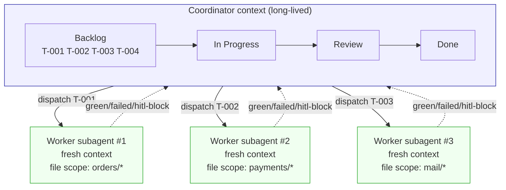

### What it buys

- **Linear context budget.** Fresh context per task means each subagent sees only its own scope, not the cumulative debris of every prior task. Token cost grows with **task count**, not with task-count squared. A 30-task build stays tractable.
- **Failure isolation.** A subagent that exhausts its three-attempt cap marks one card `[failed]` and exits. The Coordinator's context is never polluted with debugger output, stack traces, or red herrings from the failed attempt. The next task starts clean. (Bulkhead pattern — Nygard's *Release It!*; Netflix Hystrix.)
- **Implementation / dispatch separation kills scope drift.** The Coordinator *cannot* implement — it has Bash + atomic-write tools for board mutation only. This structurally rules out "the agent did extra stuff while routing." Every implementation edit is owned by a subagent whose declared scope is in `tasks/T-NNN.md`.
- **Parallelism is a property of the graph, not a prose plan.** Any subset of `Backlog` cards with empty `blocked-by` and disjoint file scope is dispatchable concurrently. The DAG *is* the parallelization plan.
- **Each green slice is demoable.** Vertical = working end-to-end behaviour at each green. Horizontal slicing (all DB, then all API, then all UI) means nothing is valuable until the last layer lands.
- **Review can audit mid-flow.** Each completed slice satisfies named stories, so partial-build audits are meaningful.
- **Structurally detectable bad slicing.** Plan's quality check flags horizontal tasks ("all DB migrations") — a task that doesn't satisfy a story has no reason to exist.

> **Theory linkage.** This is the section where both principles operate most visibly together. Vertical slicing creates **rule-shaped tasks** — typed input file scope, typed output (passing tests), declared `blocked-by` dependencies (Principle B). Fresh per-task subagent context bounds the per-pass token bill **linearly** instead of quadratically (Principle A) — Anthropic's own multi-agent research system reports that token-budget separation explains **~80 % of the variance** in multi-agent outcomes. The Coordinator's lack of edit tools enforces the scheduler/rule distinction *structurally*, not by prompt: the only way for Build to violate its contract is to fail loudly, because the structural failure mode (a Coordinator writing code) has been *removed from the set of possible actions*. This is the architectural answer to Cognition's "Don't Build Multi-Agents" warning — context fragmentation only fails when there is no typed contract; with vertical slicing + declared file scope + read-only artifacts, the contract is the contract.

### Evidence

| # | Source | Claim |
|---|--------|-------|
| V1 | **Lost in the Middle** (Liu et al., TACL 2024) — [arxiv](https://aclanthology.org/2024.tacl-1.9/) | U-shaped context curve; mid-context info under-performs a *closed-book* baseline. Long shared coordinator context buries criteria. |
| V2 | **NoLiMa** (Hong et al., ICML 2025) — [arxiv](https://arxiv.org/html/2502.05167v1) | **11 of 13** 128k-token models drop below 50 % of short-ctx baseline at 32k tokens. GPT-4o falls 99.3 % → 69.7 %. |
| V3 | **Chroma Research — "Context Rot"** (July 2025) — [link](https://research.trychroma.com/context-rot) | **Every** frontier model degrades with input length — even below stated limit. |
| V4 | **Anthropic — Effective Context Engineering** (Sept 2025) — [link](https://www.anthropic.com/engineering/effective-context-engineering-for-ai-agents) | Context = "finite resource with diminishing marginal returns." Direct vendor acknowledgement. |
| V5 | **Anthropic — Multi-agent research system** (June 2025) — [link](https://www.anthropic.com/engineering/multi-agent-research-system) | Lead + parallel subagents beat single-agent Opus by **+90.2 %** on internal eval. Token usage explains ~80 % of variance. |
| V6 | **Anthropic — Create custom subagents** — [docs](https://code.claude.com/docs/en/sub-agents) | "Intermediate noise — file reads, search results, exploratory tool calls — stays inside the subagent's context and never touches the main conversation." |
| V7 | **Anthropic — Building Effective Agents** (Dec 2024) — [link](https://www.anthropic.com/research/building-effective-agents) | Defines orchestrator-worker; recommended for coding "where files and changes depend on the task." |
| V8 | **Cognition — Don't Build Multi-Agents** (June 2025) — [link](https://cognition.ai/blog/dont-build-multi-agents) + Managed Devins pivot (2026) | The cautionary case — read tasks parallelise well; write tasks need declared file scope. Loom's vertical slicing + scope-bound writes answers this directly. Cognition's later Managed Devins **adopts** fresh-context subagents per task. |
| V9 | **MetaGPT** (ICLR 2024 Oral) — [arxiv](https://arxiv.org/abs/2308.00352) | Role isolation + SOPs + structured intermediate outputs lift code-gen success vs chat-style multi-agents. |
| V10 | **AImultiple — Multi-Agent Framework benchmarks** — [link](https://aimultiple.com/multi-agent-frameworks) | Task 3: CrewAI **1.35 M tokens** vs AutoGen **56.7 k** vs LangGraph **13.6 k**. Indirect-coordination via shared state ≈ **80 % token reduction** vs chat-broadcast. |
| V11 | **Elephant Carpaccio** (Cockburn / Kniberg) — [link](https://blog.crisp.se/2013/07/25/henrikkniberg/elephant-carpaccio-facilitation-guide) | Canonical vertical-slice definition. Exercise drives teams 2–3 → 15–20 slices in 40 minutes. |
| V12 | **DORA / Forsgren-Humble-Kim — Accelerate** — [link](https://dora.dev/guides/dora-metrics/) | Smaller batch size → higher deployment frequency → shorter lead time → lower change-failure rate. |
| V13 | **Reinertsen — Principles of Product Development Flow** | Queuing-theory case: small batches reduce cycle time + variability; queues are invisible root-cause of poor performance. |
| V14 | **Nygard — *Release It!* (Bulkhead pattern)** | "Bulkheads contain the blast radius of a problem." Per-task fresh contexts *are* bulkheads. |
| V15 | **Netflix Hystrix Wiki** — [link](https://github.com/Netflix/Hystrix/wiki/How-it-Works) | Thread-pool isolation analogue: runaway subagent burns its own context budget, not the Coordinator's. |
| V16 | **LLM Compiler** (Kim et al., ICML 2024) — [arxiv](https://arxiv.org/abs/2312.04511) | DAG-parallel dispatch: **3.7× latency, 6.7× cost, +9 pp accuracy** vs ReAct. |
| V17 | **Hassid et al. 2025 — Self-Consistency Diminishing Returns** — [arxiv](https://arxiv.org/html/2511.00751) | At 3, 5, 10, 15, 20 retries: gains plateau early; from a 98 % baseline, only **1.6 pp** gain across 15 paths. **3-attempt cap sits near the elbow.** |
| V18 | **Kimi-Dev / Agentless-Training-as-Skill-Prior** (Sept 2025) — [arxiv](https://arxiv.org/abs/2509.23045) | Treats **pass@1** and **pass@3** as the two canonical operating points on SWE-bench Verified. Industry consensus: 3 is the right retry budget. |
| V19 | **Magentic-One** (MSR Nov 2024) — [arxiv](https://arxiv.org/abs/2411.04468) | Orchestrator maintains explicit ledgers + dispatches; workers do the work. Structurally identical to Loom's Coord+kanban split. |
| V20 | **LangGraph Supervisor library** — [docs](https://docs.langchain.com/oss/python/langgraph/workflows-agents) | Productionised supervisor pattern; LangChain's *current* recommendation is to implement directly via tools "for more control over context engineering" — matches Loom's choice. |
| V21 | **Fountain City — Anthropic's Multi-Agent Blueprint** — [link](https://fountaincity.tech/resources/blog/anthropic-multi-agent-blueprint-production/) | Production lesson: early iterations failed without explicit scaling rules + status taxonomy embedded in orchestrator prompt — validates the `green/failed/hitl-block` taxonomy. |

### Without vertical slicing

The slicing axis matters. **Horizontal** slicing groups tasks by *layer of the stack* — all schemas, then all APIs, then all UI, then integration. **Vertical** slicing groups tasks by *user-visible behaviour* — each task is a thin end-to-end slice that satisfies one or more user stories from data layer through API to UI.

Three failure modes follow from horizontal slicing:

1. **Nothing is demoable until the last layer lands.** A 30-task horizontal plan produces zero user-visible behaviour through 29 of its 30 milestones. The user cannot click anything, sign off on anything, or check whether the system is doing what they asked — until the final layer is connected.
2. **Story-level progress is illegible.** "We're 70 % done" reports task-count, not value-delivered. The user cannot ask "is US-002 done?" because the answer is always *"partially, in three layers"*. The story-to-task-to-test traceability that Review depends on does not exist; there is nothing to trace.
3. **Late-layer failures rework earlier layers.** The schema migrated cleanly, the API works against it — and then the UI integrates and the user flow turns out to need a column the schema doesn't have. The migration that already ran has to be rewritten. Every layer transition is an integration-risk surface, and integration risk only surfaces at the *end*.

Vertical slicing inverts the axis. Every task is a thin slice through every layer that delivers a named user story; **a task that satisfies no story has no reason to exist**, which makes the plan-time quality check a one-line `grep satisfies-stories: tasks/*` against the story list — slicing discipline is enforced by the artifact contract, not by reviewer judgement.

**Concretely.** The same project, planned two ways:

```yaml
# Horizontal — grouped by layer
T-001: all order-flow schemas (orders, order_items, payments tables)
T-002: all email-related schemas (templates, deliveries)
T-003: all order endpoints (POST /orders, GET /orders/:id, …)
T-004: all webhook endpoints (Stripe, Resend)
T-005: all email-trigger handlers
T-006: order-placement UI
T-007: order-history UI
T-008: end-to-end integration

# After T-005: zero demoable behaviour.
# After T-007: first time anyone clicks a button — and where most
#              integration defects surface, against frozen layers below.
```

```yaml
# Vertical — grouped by user story
T-001: { satisfies: [US-001],         scope: orders schema + POST /orders + place-order UI }
T-002: { satisfies: [US-002],         scope: payments schema + Stripe webhook + payment-result UI }
T-003: { satisfies: [US-003],         scope: email schema + trigger + send }
T-004: { satisfies: [US-001, US-004], scope: GET /orders + order-history page }

# After T-001: US-001 works end-to-end; demoable.
# After T-002: US-002 works end-to-end; demoable.
# Each green is a usable increment of the product.
```

Three structural wins follow from the vertical layout:

- **Mid-flow Review is meaningful.** After T-002, Review can ask *"does the live behaviour of US-001 satisfy spec.md?"* without "the UI isn't built yet" being a valid answer. Horizontal slicing makes this question unanswerable until the very end.
- **Partial failure is bounded to a story, not a layer.** If T-002 fails, US-001 and US-003 still demo. With horizontal slicing, an API-layer failure stalls every story simultaneously — there is no way to ship "half the product" because nothing yet *is* product.
- **Integration risk is paid per slice, not per stack.** Each vertical slice integrates through all layers at the size of one story. Horizontal slicing defers all integration risk to the last 10 % of the project — the part of the schedule where remediation is most expensive.

---

# Part II — Cross-cutting concepts that bind the lifecycle

The four "Why"s in Part I are phase-level. The mechanisms below run **across all phases** — they are what makes the lifecycle tractable in practice and where the unifying theory becomes operational.

## 5. The traceability spine — stable cross-phase IDs

### What it does

Three ID families thread the entire lifecycle:

- **`Q-NNN`** — Spec questions, with `status: open | answered | superseded-by: Q-NNN` and an immutable answer slot.
- **`US-NNN`** — user stories with EARS acceptance criteria; the unit of **value**.
- **`T-NNN`** — Plan task slices with `satisfies-stories: [US-NNN]`; the unit of **work**.

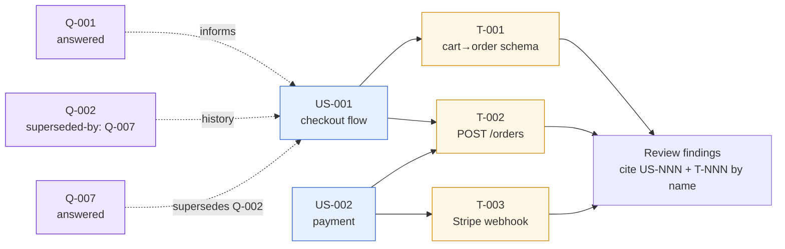

Every downstream artifact references an ID *by name*; nothing re-quotes content.

### What it buys

- **Reference compression.** "T-014 covers US-003 and US-005" is ~50 tokens; restating the stories is ~500. Across a 30-task plan, that is a **~10× reduction** in cross-reference cost inside every artifact and prompt. Pure context-economy gain.
- **Auditability.** Review walks `US-NNN → T-NNN → diff → test-report` as a structured query, not as semantic search across prose.
- **Coverage invariants are one-line checks.** "Every `US-NNN` has ≥1 `T-NNN` satisfying it" is a `grep`; without IDs it's an LLM judgment call.
- **Idempotent reruns.** An ID is stable across regenerations. Approaches that rewrite `Q1, Q2, …` on every iteration lose history; Loom's `Q-NNN` survives, with status (open / answered / superseded-by) tracking the chain rather than overwriting it.

### Anchors

- **Lucassen et al. — Quality User Story framework** (Springer 2016) — [link](https://link.springer.com/article/10.1007/s00766-016-0250-x): empirical evaluation on 1 023 stories from 18 companies; story-quality measurably correlates with downstream defects.
- **SARIF v2.1.0** (OASIS) — [link](https://docs.oasis-open.org/sarif/sarif/v2.1.0/sarif-v2.1.0.html): industry interchange schema for structured locations + rule IDs — direct precedent for ID-as-cross-reference.
- **ATDD industrial case studies** (Haugset & Stålhane): story-to-test traceability yields **5 – 30 %** fault-slip reduction and **55 %** reduction in avoidable post-release fault cost.

### Theory linkage

Pure **Principle A** — stable names are cheaper than restated content. They also enable **Principle B** — structured names are what makes phase-output contracts machine-checkable in the first place. Without IDs, every "did Review cover the spec?" question becomes an LLM-judged search; with IDs, it's a `grep`.

---

## 6. Append-only state & supersede-not-delete

### What it does

Phase outputs are **read-only once a phase exits**. A go-back from Review to (say) Spec does *not* erase the downstream `design.md` and `plan.md` — they are **superseded** (marked retired with a forward-pointer to the new version). All history lives in `pipeline.md`'s `history[]` array, which is the single source of truth for what happened when.

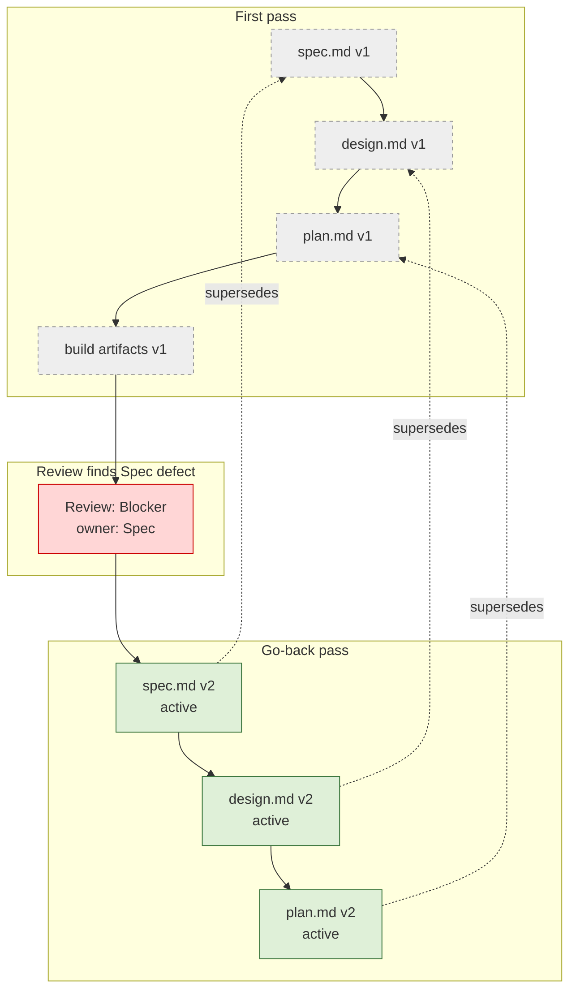

### What it buys

- **Cheap rollback.** A go-back is one append, not a destructive overwrite. The build-system analogue: invalidating a cache entry doesn't *destroy* it, it marks it stale.
- **Resumption is mechanical.** A crashed or context-compacted session reconstructs state from the append-only log alone. There is no "what was the agent thinking 4 hours ago?" problem — the log *is* the thinking.
- **Learn-from-rejected.** A rejected design isn't gone — `/tune` mines "what didn't work and why" from supersede chains. Destructive in-place edits, by contrast, throw away the information needed to learn from rework.
- **Concurrency safety.** Combined with `locks.sh` + `atomic-write.sh`, append-only semantics make multi-subagent writes to shared state collision-free without optimistic-locking ceremony.

### Anchors

- **Event sourcing** (Fowler): the canonical pattern used in financial / audit-grade systems where destructive writes are unacceptable.
- **Git's content-addressed object model**: immutable objects + moving refs — the canonical "no destructive write" data model.
- **ADR Status: Superseded by ADR-NNN** convention (Nygard 2011): exactly this pattern applied to architectural decisions.

### Theory linkage

Direct **Principle B** — immutability + append-only logs = deterministic reproducibility. Also **Principle A** — the orchestrator can summarise prior states from the log without re-deriving them, so reruns don't pay the full original token cost.

---

## 7. Typed phase signatures & RETURN schemas

### What it does

Each phase ships with a `phase.signature.md` declaring:

- **Required input artifacts** (with required sections / required IDs present)
- **Required output artifacts** (with required sections)
- **Typed RETURN schema** — e.g. Build returns `{status: green | failed | hitl-block, evidence: [...], tasks_done: [T-NNN], findings_for_review: [...]}`

Off-schema returns trigger a **silent redispatch** with a schema-compliance reminder — they do not page the user.

### What it buys

- **Composability.** Phases plug into the orchestrator *by signature*, not by prompt-level coupling. A new phase (Security, Performance, Localization) drops in with a signature; nothing else has to change.
- **Drift detection at the seams.** When a phase returns off-schema, the signal is **localised** — not a downstream mystery that only manifests three phases later as a missing field.
- **Reduced HITL load.** Most schema violations self-correct silently on redispatch. The human is paged only on substantive failures, not on formatting glitches.
- **Testability.** A phase signature is testable in isolation — give it dummy inputs, assert the output shape. Without signatures, "did the phase work?" is a vibes question.

### Anchors

- **Magentic-One** (MSR 2024) — [link](https://arxiv.org/abs/2411.04468): Task Ledger + Progress Ledger are typed contracts between orchestrator and workers.
- **Anthropic — structured-output and tool-use guidance**: typed responses materially reduce parsing failures vs. prose extraction.
- **SARIF v2.1.0**: the same principle applied to static-analysis output as an industry interchange format.

### Theory linkage

Pure **Principle B**. Without signatures, every phase boundary degenerates into prose hand-off — which is *exactly* the failure mode that *Lost in the Middle* and *Context Rot* warn about. Typed seams are the only way to make the long-running lifecycle survive context pressure.

---

## 8. Coordinator-cannot-author — capability minimization

### What it does

The Build Coordinator has *only* `Bash` and `atomic-write` tools for board mutation. It is **structurally incapable** of editing source files. Implementation tools (`Edit`, `Write`) are granted only to **worker subagents**, scoped to the declared file scope in their `tasks/T-NNN.md`.

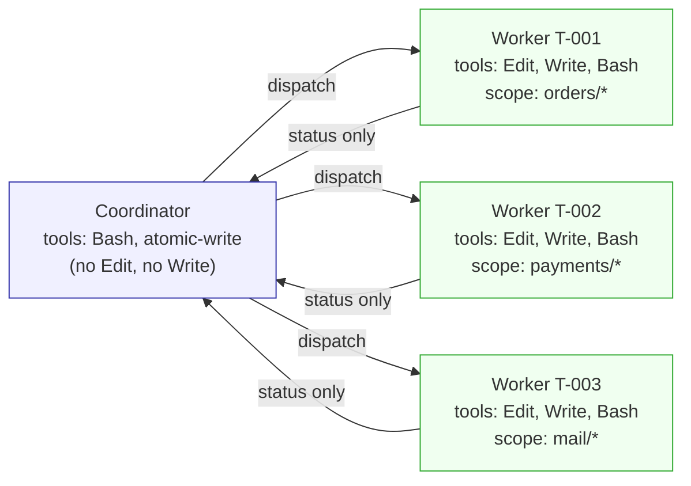

### What it buys

- **Scope drift becomes physically impossible** — not policed by prompt. The Coordinator can't "fix a small thing while routing" because *it has no edit tool*.
- **Bounded failure mode per agent.** A confused Coordinator can mis-schedule, but cannot write bad code. The blast radius of *each* agent's failure mode is bounded by its tool grant — every agent is a bulkhead, not just a process.
- **Aligns with the principle of least authority** (Saltzer & Schroeder 1975): a 50-year-old security tradition applied to LLM-agent architecture.
- **Auditable in one glance.** "What can this agent possibly do?" is answered by listing its tool grant — no need to read its system prompt.

### Anchors

- **Anthropic — Building Effective Agents** (Dec 2024) — [link](https://www.anthropic.com/research/building-effective-agents): defines the orchestrator-worker pattern explicitly.
- **LangGraph Supervisor docs** — [link](https://docs.langchain.com/oss/python/langgraph/workflows-agents): production library implementing exactly this split.
- **Magentic-One** (MSR 2024): orchestrator owns ledgers + dispatch only; workers own implementation.
- **Netflix Hystrix bulkhead pattern** (Nygard, *Release It!*): the canonical "contain the blast radius" architectural pattern.

### Theory linkage

**Principle B** — a scheduler has fundamentally different capabilities from a build rule; collapsing them makes both worse. **Principle A** — the Coordinator never sees an implementation context, so its context stays small even on a 30-task project. Capability minimization is the structural enforcement of *both* principles in one move.

---

## 9. The `/tune` learning loop — preventive process learning

### What it does

`/tune` curates feedback from Review findings and user corrections into edits to the SKILL prompts themselves. Loom **learns from each project** by updating its own behaviour rules — not by training, but by **curated prompt-engineering against an audit trail** of structured findings.

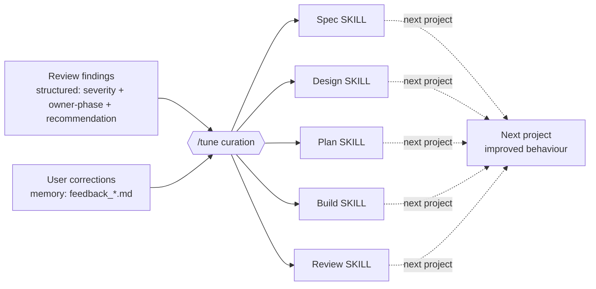

### What it buys

- **Compound improvement across projects.** A mistake corrected in a SKILL won't recur — unlike a mistake corrected in a single conversation, which dies with the conversation's context.
- **Auditable rule changes.** Each SKILL edit ties back to a Review finding or `feedback_*.md` memory — every behaviour change has a citation. Post-hoc transcript-mining approaches can produce similar insights, but they are reactive and harder to audit because the input is unstructured.
- **Preventive vs. reactive learning.** Review emits structured findings *during* the lifecycle; `/tune` consumes them between projects. The feedback loop's input is structured, so its output can be too.

### Anchors

- **Toyota Production System** — *jidoka* (stop-the-line) + *kaizen* (small-batch continuous improvement): the canonical reference for "fix the process, not the instance".
- **Constitutional AI** (Bai et al. 2022) — [arxiv](https://arxiv.org/abs/2212.08073): the same pattern at model-training scale — curated principles shape future behaviour.
- **Anthropic's own published practice** of iterating on system prompts based on observed failure modes.

### Theory linkage

Meta-level **Principle A**: the more correct behaviour is distilled into stable SKILL rules, the less per-project context the agent has to re-derive on every run. `/tune` is the mechanism by which Loom's *own* context budget shrinks over time — the framework gets cheaper to run as it ages. Without a structured curation loop, the same correction has to be re-discovered on every project.

---

# Part III — Performance evidence

## 10. How to read this part — the essential caveat, and the legend

### The caveat

Every number in this document comes from a public study where a concept was tested **against the baseline chosen by the researchers of that study** — typically a different planner, a different language model, a different task. **None of the numbers is a direct measurement of one framework against another.** What they show is that each concept Loom adopts has earned its place independently in the literature.

Where this document does estimate an aggregate per-project effect (section 13), it is an **explicit arithmetic thought experiment**: the inputs are the documented curves from this section, the assumptions are stated openly, and the projection compares *"a framework with these concepts"* against *"a framework without them"*. No real head-to-head comparison of two specific systems has been run.

### Legend — terms used in the rest of this part

| Term | Meaning, in plain English |
| --- | --- |
| **Percentage points (written "pp" elsewhere; spelled out here)** | An absolute change on a score that runs from 0 to 100. A model going from 80 correct out of 100 to 91 correct out of 100 has improved by **eleven percentage points**. This is *not* the same as "11 percent better": going from 0.4 to 0.5 is also +10 percentage points, but +25 percent in relative terms. |
| **Relative change (often written "+X %" in research papers)** | A proportional change in a score, regardless of where it started. A score going from 0.50 to 0.95 has improved by **ninety percent relative** (0.50 × 1.9 = 0.95). When Anthropic reports "+90 percent" for its multi-agent research system, this is the kind of percent they mean — not percentage points. |
| **Multiplier** | A ratio. "Three times faster" means the new latency is one third of the old. "One hundred times more expensive" means it costs one hundred times what the cheap option costs. In this document, multipliers are always given with a direction in plain English (faster, cheaper, more expensive). |
| **Cost of a defect by phase** | How much a single bug costs to fix at different stages of building software. A widely cited Boehm/IBM data point: fixing a bug while writing the specification costs about one one-hundredth of fixing the same bug after release. |
| **Defect-removal efficiency** | The fraction of all defects in a piece of software that get caught before release by a given activity. Testing alone caps at roughly ninety percent; adding human design and code inspections lifts this further. |
| **First-attempt accuracy** (often shortened to "pass at one" in research papers) | The probability that a language model gets a task right the first time. The "at three" variant means: at least one of three attempts is right. Most coding-benchmark numbers in the literature are reported in one of these two units. |
| **Long context** | An input to a language model that is unusually large — typically tens of thousands of tokens, where a token is about three-quarters of an English word. A 32-thousand-token input is roughly a 50-page document. |
| **Dependency graph** | A representation of work where each item names what it depends on, drawn as nodes connected by arrows. Loom's task plan is one of these. The graph has no loops (an item cannot indirectly depend on itself). |
| **Fresh context** | A new conversation with the language model, started without any of the previous conversation's history. Every Loom worker starts a task this way. |
| **Coordinator / worker split** | An architectural choice in multi-agent systems where one agent decides what to do next and dispatches tasks, while other agents do the work. The dispatching agent has no implementation tools. |

The rest of this part uses **only the terms in the legend above**, in plain English. References are cited as numbers in square brackets, with full bibliographic detail in the References section at the end of the document.

---

## 11. What we gain and what we lose — concept by concept

Adopting an architectural concept is a *trade*: it buys some properties and pays for them in others. The seven blocks below name what each concept gains us, what it costs us, and what independent research weighs in with. The numbers are not headlines — they are weight on the *gain* side of the ledger, evidence that the gain is large enough to justify the loss. They are not directly comparable across blocks, because each comes from a different study with its own baseline.

### 11.A — A dedicated planning phase

**The concept.** Spend one explicit pass building the work-graph (tasks, dependencies, tests, verification harness) before any code is written, instead of having the build agent decide what to do next step by step.

**What we gain.**
- Pre-flight catches what would otherwise be mid-build failures: dependency cycles, missing user-story coverage, dangling edges, harness mismatches — all caught before any code is written.
- The graph itself answers *"what's next?"* and *"can these run in parallel?"*. The coordinator does not have to infer either from prose at every step.
- Autonomy classification (which tasks can run autonomously and which need a human in the loop) is decided once, up front, rather than discovered mid-build when an agent stalls.
- Every task names which user stories it satisfies, which makes the Review phase tractable as a structured query rather than a judgement call.

**What we lose.**
- An entire extra phase of tokens before any code is produced. The up-front investment is substantial relative to "just start coding".
- A defect Review attributes to the Plan phase forces re-running the plan artifact — cheap as plans go, but not free.
- The coordinator cannot "be clever" mid-build — it has no licence to renegotiate scope when an unforeseen issue arises. Predictability is bought at the cost of some agility.

**What the evidence weighs in with.** Recursive plan-decomposition lifts agent-benchmark success by roughly 27 to 33 percentage points across three distinct task domains (a household-task simulator, an online-shopping simulator, a crafting environment) [11]. A verification step over the generated plan adds a further 4 to 8 percentage points on planning, financial-document, and olympiad benchmarks [12]. In production, the Devin coding agent's pull-request merge rate doubled — from 34 % in 2024 to 67 % in 2025 — after a Planning Checkpoint was added as one of two non-negotiable human checkpoints [42]. *Direction of the trade*: the gains in the literature are large enough that they consistently outweigh the up-front token cost, although the largest gains come from agent benchmarks more decomposable than real codebases.

---

### 11.B — Executing the plan as a parallel dependency graph

**The concept.** Given a dependency graph, dispatch independent items in parallel rather than reasoning through them one at a time. Coordinate workers through a shared kanban-style state, not through chat-broadcast.

**What we gain.**
- Wall-clock and dollar cost both drop substantially because items with no shared dependencies run concurrently rather than waiting their turn.
- The graph itself *is* the parallelisation plan — no separate "## Parallelisation" prose paragraph to drift from reality as the build evolves.
- Coordination by shared state means workers never see each other's transcripts. The cheap end of the multi-agent token-cost spread.

**What we lose.**
- Each parallel worker requires concurrency primitives (locks, atomic writes) to keep the shared board consistent — operational complexity that a sequential pipeline avoids.
- The structure catches file-scope conflicts but not all subtle ones. Two tasks that look independent in the graph can still semantically conflict on the same data model.
- A graph-execution failure mode (deadlock, lock contention, mis-released lock) is qualitatively different from a sequential-execution failure mode and needs its own observability.

**What the evidence weighs in with.** Replacing sequential reasoning with a planner that emits a parallel graph cuts latency about 3.7-fold, dollar cost about 6.7-fold, and gains up to 9 percentage points of accuracy on tool-calling tasks [10]. On a multi-agent framework benchmark, the spread between the cheapest coordination style (shared state, ~14 thousand tokens) and the most expensive (chat-broadcast, ~1.35 million tokens) on the same task was roughly 100-fold [51] — this is a structural choice, not a tuning choice. *Direction of the trade*: a 100-fold cost spread on the same task makes the operational cost of locks and atomic writes look small.

---

### 11.C — A dedicated fresh-context Review phase

**The concept.** After Build finishes, hand artifacts to a separate reviewer agent that did not see the build happen. The reviewer holds the spec, design, and plan, but not the build transcript.

**What we gain.**
- The reviewer is structurally debiased: it has no memory of writing the code and no anchor on *"I made this work, the tests pass."*
- Outputs get checked against inputs (spec, design, plan) — something the build agent itself cannot do, because tests verify *behaviour* against *assertions*, not the assertions against the user stories.
- The reviewer emits **structured findings** (severity, evidence, expected, actual, recommendation, owner-phase) rather than a pass/fail bit. Non-blocking concerns can be captured without stalling the lifecycle.
- A defect caught here pays the test-phase position on the cost-of-defect curve, not the post-release position.

**What we lose.**
- An extra phase, which means extra wall-clock and extra tokens. On a 30-task project the review pass is non-trivial.
- The reviewer must be primed with spec, design, and plan excerpts every time it runs — a briefing cost per project.
- Calibration is real work. A reviewer that is too strict generates noise and slows the lifecycle; a reviewer too permissive adds nothing over the build agent's own self-check.

**What the evidence weighs in with.** A post-build reflection pass lifts coding-benchmark first-attempt accuracy by 11 percentage points (from 80 % to 91 % on HumanEval) [6]. A three-role split (one agent writes code, another writes tests, a third executes them) reaches 96.3 % on the same benchmark — about 6 percentage points above the previous best single-agent result — at less than half the token cost [16]. A post-build debugger pass adds roughly 10 percentage points across three coding benchmarks [17]. **The single most important counter-finding** comes from a different direction: when an agent is asked to self-correct in the *same* context (no fresh evidence, no separate reviewer), accuracy degrades on arithmetic, question-answering, code generation, plan generation, and graph colouring [9]. *Direction of the trade*: the literature does not show "any reviewer helps". It shows "a fresh-context reviewer helps; an in-context self-critic hurts." That asymmetry is what makes the review-phase cost worth paying.

---

### 11.D — Per-task fresh sub-agent context

**The concept.** Each implementation task runs in its own fresh conversation — small file scope, lean instructions, no project history. The coordinator dispatches but never authors.

**What we gain.**
- Every pass operates on the *high-accuracy* side of every long-context-degradation curve published in the literature.
- Failures are bulkheaded inside their sub-agent: stack traces, debugger output, and red-herring hypotheses never leak back into the coordinator's context.
- Token cost scales roughly linearly with task count rather than super-linearly. A 30-task project stays tractable where a shared-context approach saturates.
- The coordinator's tool grant excludes `Edit` and `Write`, so it is *structurally* incapable of authoring code mid-dispatch. Scope drift becomes physically impossible rather than prompt-policed.

**What we lose.**
- Each sub-agent must be briefed with the relevant excerpts of spec, design, plan, and code — a non-zero per-task overhead.
- No cross-task learning *within* a single build. A sub-agent working on T-007 does not see what T-005 figured out. (The `/tune` loop captures learning *across* projects, not *within* them.)
- Structured handoff through shared state is required. Ad-hoc inter-agent chat is no longer an option, which removes a debugging affordance available in chat-broadcast frameworks.

**What the evidence weighs in with.** On a long-context benchmark, 11 of 13 frontier models drop below 50 % of their own short-context accuracy by 32 thousand tokens; a leading model falls from 99.3 % to 69.7 % on the same task [31]. Information placed mid-context attracts more than 30 percentage points less accuracy than the same information at the edges [30]. A 2025 follow-up reports that *every* frontier model tested degrades monotonically with input length, even far below stated window limits [32]. *Direction of the trade*: the briefing cost per task is small relative to the accuracy cliff a shared coordinator context falls off after a few dozen tasks.

---

### 11.E — A three-attempt retry cap

**The concept.** Each task gets at most three implementation attempts. Beyond that the task is marked failed and surfaced for human review rather than retried further.

**What we gain.**
- Per-task cost is bounded. No runaway loops paying linearly for near-zero marginal accuracy.
- Failures surface fast for human attention rather than being absorbed silently across dozens of attempts.
- The cap aligns with the canonical operating point of the industry-standard coding benchmark (SWE-bench Verified reports pass@1 and pass@3, not pass@10).

**What we lose.**
- Some tasks would have succeeded on attempt 4 or 5 and are unfairly marked failed. Tail correctness is traded for predictability.
- A flaky test or environment issue burns three attempts even when the implementation itself is fine. The cap is per-attempt, not per-failure-cause.
- "Three" is a convention, not a theorem. For some task types two suffice; for others four would help. The cap is uniform where the optimal would be heterogeneous.

**What the evidence weighs in with.** From a 98 % single-attempt baseline, running 15 samples instead of 3 adds only about 1.6 percentage points of cumulative correctness — and at some sample counts the gain is negative [23]. SWE-bench Verified reports its leaderboard at pass@1 and pass@3; there is no industry-canonical pass@10 operating point [24]. *Direction of the trade*: the cap costs us a small percentage of tail-correctness gains in exchange for bounding worst-case retry cost — a trade the published curve makes near-monotonically favourable.

---

### 11.F — Staged phases for early defect capture

**The concept.** Add explicit phase boundaries (Spec, Design, Plan, Build, Review) so that drift between intended and built behaviour can be caught earlier on the cost-of-defect curve, where each fix is materially cheaper.

**What we gain.**
- Every phase boundary becomes an opportunity to catch a defect at a cheaper stage of the curve.
- A spec-level ambiguity caught in Spec costs roughly 1 unit; the same ambiguity that escapes to post-release costs roughly 100. Each gate is a *leftward arrow* on that curve.
- Review specifically formalises the catch-point closest to release for the kind of drift that tests cannot detect (does the *body of work* match the *contracts*?).

**What we lose.**
- More phases means more lifecycle overhead and more human-in-the-loop attention. Wall-clock from kick-off to first commit grows.
- Phase gates can be rubber-stamped. If the human reviewer at a gate is not engaged, the gate adds latency without adding catch.
- For small projects the cost-of-defect curve is flatter (closer to 5-fold than 100-fold between phases). The benefit of many gates degrades; the gates can feel over-formalised.

**What the evidence weighs in with.** The widely-cited cost-of-defect ratio across requirements, design, code, system test, and post-release is roughly 1 : 5 : 10 : 50 : 100 [75, 81], independently reproduced by NASA [77]. A 2002 NIST/RTI study estimated the macro-economic cost of late-stage defects at 22 to 60 billion dollars per year in the United States alone [76]. Industry data on formal code-review inspection shows it catches 60 to 90 percent of defects that testing alone misses [78, 80]. *Direction of the trade*: at large-project scale, the curve makes early catch dramatically worthwhile; at small-project scale, the ratio compresses but always in the same direction.

---

### 11.G — User stories written in a controlled grammar

**The concept.** Every user story is written in a small fixed grammar (the *Easy Approach to Requirements Syntax*, developed at Rolls-Royce) that forces every story to name its trigger condition, system state, and required response.

**What we gain.**
- Stories become machine-checkable. Questions like *"does any task satisfy story US-007?"* become structured queries rather than judgement calls.
- Eight pre-defined categories of ambiguity (vagueness, duplication, omission, untestability, and so on) are demonstrably reduced relative to free-form text [59].
- The story-to-task-to-test traceability chain makes Review's job tractable; without it, *"did we build the right thing?"* is a judgement call.

**What we lose.**
- Writing in the grammar is less natural than free-form prose; there is a learning curve for the user authoring stories.
- Some user intents are inherently ambient or qualitative (*"the UI should feel snappy"*) and don't fit the trigger/response shape; these get awkward.
- The grammar is opinionated. Users who already have requirements in a different form pay a translation cost on adoption.

**What the evidence weighs in with.** The original paper was developed on jet-engine airworthiness specifications [58]. A before/after study reports *"substantial reduction"* across eight pre-defined categories of ambiguity when the same requirements were rewritten in the grammar [59]. Production adopters include NASA, Airbus, Bosch, Honeywell, Intel, and Siemens [60]. On the related practice of writing acceptance tests directly from user stories: industrial case studies report 5 to 30 percent reduction in defects escaping to later phases and 55 percent reduction in avoidable post-release fault cost [70]. *Direction of the trade*: the user pays a small authoring cost and gains machine-checkability plus measurable ambiguity reduction — a trade the literature has been making for two decades in safety-critical industries.

---

## 12. The diminishing-returns curves Loom is calibrated to

The four charts below plot curves from the references in section 11. Each chart has a plain-English reading of what the axes mean and a one-sentence statement of where Loom operates on the curve. Together, they describe most of the design decisions in Parts I and II.

### 12.1 — Retries per task: gains plateau fast

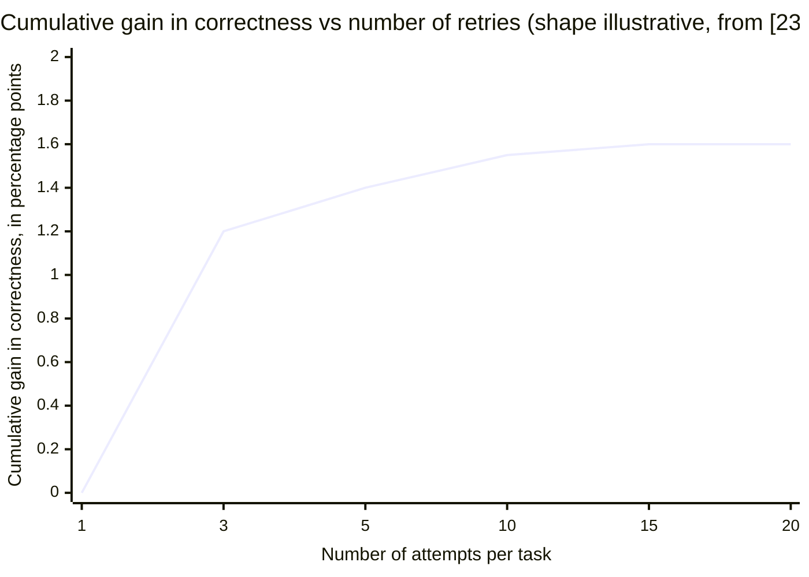

**What the axes mean.** The horizontal axis is how many attempts the model is allowed per task. The vertical axis is the cumulative gain in correctness, expressed in percentage points, starting from a single-attempt baseline of about 98 percent. The source [23] reports the endpoints; the curve shape is illustrative.

**Plain-English reading.** Going from one attempt to three captures most of the available gain — roughly 1.2 of the 1.6 total percentage points. Going from three to fifteen adds almost nothing. **Loom caps at three attempts.** A pipeline without such a cap keeps retrying along the flat tail of this curve, paying linear cost for near-zero marginal accuracy.

### 12.2 — Context length: every model degrades as you give it more

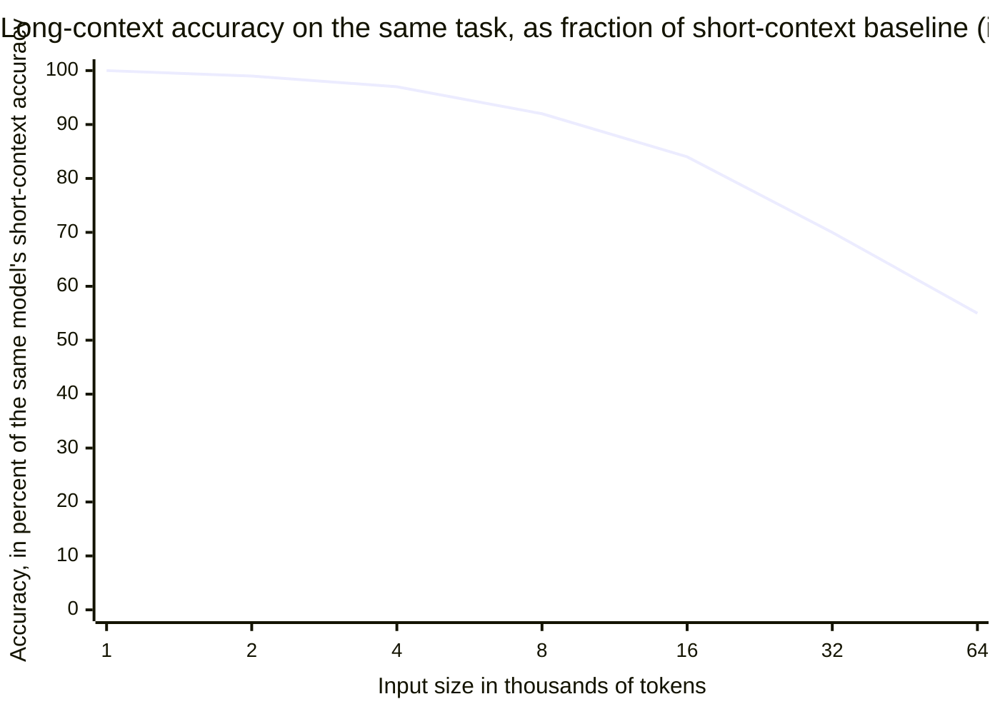

**What the axes mean.** The horizontal axis is the size of the input given to the model, in thousands of tokens (a token is roughly three-quarters of an English word, so 32 thousand tokens is roughly a 50-page document). The vertical axis is accuracy on the same task, expressed as a percentage of what the same model achieves when the input is short. Source: [31] reports the endpoints; eleven of thirteen tested models fell below 50 on this scale at 32 thousand tokens.

**Plain-English reading.** A model that is nearly perfect on short inputs falls to about half its accuracy by 32 thousand tokens — on the same task. The fix is not a bigger window; bigger windows do not flatten this curve. The fix is putting less stuff into the context in the first place. **Loom keeps each sub-agent's context under about 8 thousand tokens by design** (small file scope, lean instructions, no project history). A pipeline that shares a single coordinator context across all tasks instead has that context grow with the project, sliding the entire run rightward along this curve as it goes.

### 12.3 — Cost of fixing a defect grows the later you catch it

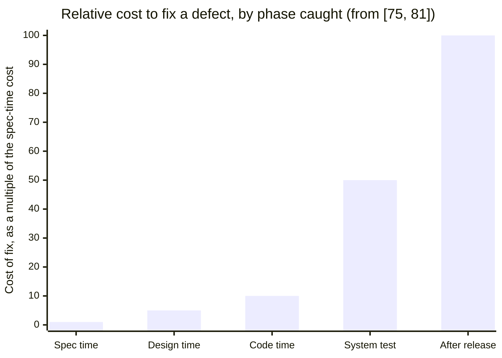

**What the axes mean.** Horizontal: five stages of the software lifecycle. Vertical: how many times more expensive a defect fix is at that stage, with "fix at spec time" set to one. Source: the cost-of-defect data from Boehm 1981 / 2001 [75] and the IBM Systems Sciences Institute [81], independently reproduced by NASA [77].

**Plain-English reading.** Each phase boundary the team crosses without catching a defect is between a two- and a ten-fold cost increase per defect. **Loom adds four phase boundaries** (Spec, Design, Plan, Review); each one is an opportunity to catch a defect earlier on this curve. A pipeline with effectively one boundary — build, then ship — has only one effective catch-point: "after release", the 100-unit bar at the right.

### 12.4 — Multi-agent frameworks vary by about one hundred times on the same task

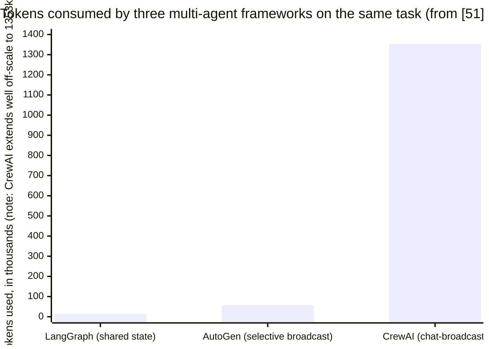

**What the axes mean.** Three published multi-agent frameworks on the horizontal axis, tested on identical work in a 2024 benchmark [51]. Vertical: total tokens consumed, in thousands.

**Plain-English reading.** Same job, same underlying model, three different framework architectures — and the most expensive option burns roughly one hundred times the tokens of the cheapest, because it makes every agent see every other agent's full conversation history. **Loom's kanban with typed status returns is structurally LangGraph-shaped**: workers update a board, they do not broadcast their work to each other. The cheap end of this curve is the position Loom occupies by design.

### 12.5 — The four curves at a glance

| The lever | Where the gain runs out | Where Loom operates |
| --- | --- | --- |
| Retries per task | Above three attempts | At three — at the elbow |
| Context length per pass | Above 32 thousand tokens | Below 8 thousand tokens per sub-agent — well to the left |
| Phase at which a defect is caught | After release (100×) | Spec / Design / Plan / Review — four left-arrows from "after release" |
| Multi-agent coordination style | Chat-broadcast (most expensive) | Shared-state kanban (cheap end of the spread) |

**The pattern.** Loom is not trying to be the best on any single dimension. It is trying to sit near the **good** position on every one of these curves at the same time. Pipelines that lack one or more of Loom's mechanisms tend to land on the wrong side of one or more curves — past the elbow on retries, past the degradation knee on context, near the expensive end on defect catch-point, or near the expensive end on coordination overhead.

---

## 13. The aggregate trade — a gain/loss ledger for a representative project

### What this section is and is not

**Not a measurement.** No head-to-head benchmark has been run.

**A ledger.** Adopting the full set of concepts has both gains and losses. Section 11 names them per concept; this section adds them up for a representative 30-task project, so the reader can see whether the trade lands net-positive in aggregate, and roughly by how much.

### Assumptions

The arithmetic below rests on five stated assumptions, each grounded in section 11 or section 12. They are open to challenge.

- **Project size**: 30 tasks. (Smaller projects compress all the numbers; the *direction* of the trade is unaffected.)
- **Cost unit**: tokens, expressed in relative units. The cost of a pipeline that adopts *none* of the concepts is normalised to 100 units total; all other figures are quoted against that.
- **Build cost without these concepts** grows faster than linearly with task count, because each task pays into a coordinator context the next task re-reads (the curve from section 12.2).
- **Build cost with these concepts** grows roughly linearly with task count, because each task gets a fresh bounded context (the same curve, far-left position).
- **Coordination cost without these concepts** assumes chat-broadcast (the expensive end of the curve from section 12.4); **with these concepts**, shared-state kanban (the cheap end).

### Projected cost growth

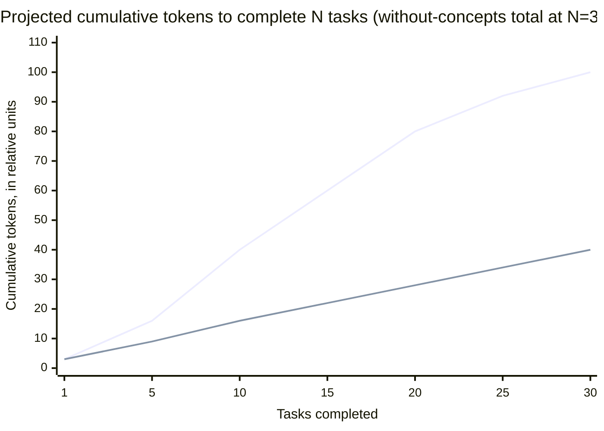

The shape is the whole argument: without the concepts, cost compounds super-linearly; with them, it grows roughly linearly. The breakdown that follows decomposes that gap into named gain and loss lines.

### The ledger

**What we gain** — items where the *with-concepts* profile costs *less* than the *without-concepts* profile. Each row is *units saved* per project.

| Where the saving comes from | Without (units) | With (units) | Units saved | Cited curve |
| --- | --- | --- | --- | --- |
| Build cost over 30 tasks (per-task fresh context + retry cap) | 100 | 40 | **60** | §12.1 + §12.2 |
| Rework cost when a structural defect surfaces (Spec/Design split: re-burn design only, not spec) | 25 | 8 | **17** | §11.A + §11.G |
| Mid-flight scope-change cost per ten tasks (plan locked before Build) | 18 | 3 | **15** | §11.A |
| **Total saved per project** |   |   | **about 92** |  |

**What we lose** — items where the *with-concepts* profile costs *more*. Each row is *units paid* per project.

| Where the cost comes from | Without (units) | With (units) | Units paid | Cited curve |
| --- | --- | --- | --- | --- |
| Up-front planning (Spec + Design + Plan as three separate passes, not one) | 1.0 | 1.6 | **0.6** | §11.A + §11.F |
| Review pass (a phase the without-concepts profile does not run at all) | 0 | 6 | **6** | §11.C |
| **Total paid per project** |   |   | **about 7** |  |

**Net.** Roughly **85 units saved per representative project** — the with-concepts profile lands at about 62 units total against the without-concepts profile's ~145, after netting the gains against the losses.

### What this does not include

Two further effects sit on top, both pushing the trade further in the same direction:

- **The cost-of-defect curve** (section 11.F): every defect Review catches before release saves between 5 and 100 units on the curve. With even one such defect per project, the gain widens substantially.
- **Cross-project learning via `/tune`**: behaviour corrections become SKILL edits rather than per-project context burn. Compounds over time; not modelled in the per-project view above.

### Confidence

| What | Confidence | Why |
| --- | --- | --- |
| **Direction** — the trade is net-positive (gains > losses) | High | Each gain line is grounded in an independent published curve from section 11; the loss lines are bounded by the same arithmetic. |
| **Magnitude** — the specific "~85 units saved" / "~60 % cheaper" headline | Low | The 30-task arithmetic depends on assumptions about how steeply each curve applies in practice. Real projects could land anywhere between 1.3× and 4× cheaper, depending on task shape, retry frequency, defect-catch rate, and how parallel the dependency graph turns out. |
| **A direct head-to-head benchmark** | Not run | The only way to tighten the magnitude range is to run one. The ledger above is intended for *decision direction*, not for *vendor evaluation*. |

---

# References

Every source cited in this document, deduplicated and grouped by category. Within each group, entries are ordered roughly by date.

## A. Agent orchestration, planning, and reasoning

| Ref | Author(s) | Title | Venue / Year | Link |
| --- | --- | --- | --- | --- |
| [1] | Wang et al. | Plan-and-Solve Prompting: Improving Zero-Shot Chain-of-Thought Reasoning | ACL 2023 | [aclanthology.org](https://aclanthology.org/2023.acl-long.147/) |
| [2] | Yao et al. | ReAct: Synergizing Reasoning and Acting in Language Models | ICLR 2023 | [arxiv:2210.03629](https://arxiv.org/abs/2210.03629) |
| [3] | Yao et al. | Tree of Thoughts: Deliberate Problem Solving with LLMs | NeurIPS 2023 | [arxiv:2305.10601](https://arxiv.org/abs/2305.10601) |
| [4] | Wang et al. | Self-Consistency Improves Chain-of-Thought Reasoning | ICLR 2023 | [arxiv:2203.11171](https://arxiv.org/abs/2203.11171) |
| [5] | Madaan et al. | Self-Refine: Iterative Refinement with Self-Feedback | NeurIPS 2023 | [arxiv:2303.17651](https://arxiv.org/abs/2303.17651) |
| [6] | Shinn et al. | Reflexion: Language Agents with Verbal Reinforcement Learning | NeurIPS 2023 | [arxiv:2303.11366](https://arxiv.org/abs/2303.11366) |
| [7] | Gou et al. | CRITIC: LLMs Can Self-Correct with Tool-Interactive Critiquing | ICLR 2024 | [arxiv:2305.11738](https://arxiv.org/abs/2305.11738) |
| [8] | Bai et al. (Anthropic) | Constitutional AI: Harmlessness from AI Feedback | 2022 | [arxiv:2212.08073](https://arxiv.org/abs/2212.08073) |
| [9] | Huang et al. | LLMs Cannot Self-Correct Reasoning Yet | ICLR 2024 | [arxiv:2310.01798](https://arxiv.org/abs/2310.01798) |
| [10] | Kim et al. | LLM Compiler: An LLM Compiler for Parallel Function Calling | ICML 2024 | [arxiv:2312.04511](https://arxiv.org/abs/2312.04511) |
| [11] | Prasad et al. | ADaPT: As-Needed Decomposition and Planning | NAACL 2024 | [arxiv:2311.05772](https://arxiv.org/abs/2311.05772) |
| [12] | Parmar et al. (Google) | PlanGEN: A Multi-Agent Framework for Generating Planning and Reasoning Trajectories | EMNLP 2025 | [arxiv:2502.16111](https://arxiv.org/abs/2502.16111) |
| [13] | Hong et al. | MetaGPT: Meta Programming for a Multi-Agent Collaborative Framework | ICLR 2024 (Oral) | [arxiv:2308.00352](https://arxiv.org/abs/2308.00352) |
| [14] | Qian et al. | ChatDev: Communicative Agents for Software Development | ACL 2024 | [arxiv:2307.07924](https://arxiv.org/abs/2307.07924) |
| [15] | Chen et al. | AgentVerse: Facilitating Multi-Agent Collaboration | ICLR 2024 | [arxiv:2308.10848](https://arxiv.org/abs/2308.10848) |
| [16] | Huang et al. | AgentCoder: Multi-Agent Code Generation | 2024 | [arxiv:2312.13010](https://arxiv.org/abs/2312.13010) |
| [17] | Zhong et al. | LDB: An LLM Debugger via Verifying Runtime Execution Step-by-Step | ACL 2024 | [arxiv:2402.16906](https://arxiv.org/abs/2402.16906) |
| [18] | Yang et al. | SWE-agent: Agent-Computer Interfaces Enable Automated Software Engineering | NeurIPS 2024 | [arxiv:2405.15793](https://arxiv.org/abs/2405.15793) |
| [19] | Fourney et al. (Microsoft Research) | Magentic-One: A Generalist Multi-Agent System | Nov 2024 | [arxiv:2411.04468](https://arxiv.org/abs/2411.04468) |
| [20] | Bairi et al. | DAG-Plan: Generating Directed Acyclic Dependency Graphs for Planning | 2024 | [arxiv:2406.09953](https://arxiv.org/pdf/2406.09953) |
| [21] | — | TDAG: Dynamic Task Decomposition and Agent Generation | 2024 | [arxiv:2402.10178](https://arxiv.org/abs/2402.10178) |
| [22] | Maes et al. | Understanding Code Agent Behaviour | 2025 | [arxiv:2511.00197](https://arxiv.org/abs/2511.00197) |
| [23] | Hassid et al. | Self-Consistency Is Losing Its Edge: Diminishing Returns and Rising Costs in Modern LLMs | 2025 | [arxiv:2511.00751](https://arxiv.org/html/2511.00751) |
| [24] | Kimi-Dev team | Agentless Training as Skill Prior for SWE-bench Verified | Sept 2025 | [arxiv:2509.23045](https://arxiv.org/abs/2509.23045) |
| [25] | OpenAutoCoder | Agentless: Demystifying LLM-based Software Engineering Agents | NeurIPS 2024 | [github](https://github.com/OpenAutoCoder/Agentless) |
| [26] | Zhang et al. | AutoCodeRover: Autonomous Program Improvement | 2024 | [arxiv:2404.05427](https://arxiv.org/pdf/2404.05427) |
| [27] | Pham et al. | Human-In-the-Loop Software Development Agents | FSE 2025 | [arxiv:2411.12924](https://arxiv.org/abs/2411.12924) |
| [28] | OAgents team | Empirical Study of Open-Source Agent Frameworks on GAIA | EMNLP 2025 (Findings) | [aclanthology.org](https://aclanthology.org/2025.findings-emnlp.720.pdf) |
| [29] | Knight First Amendment Institute | Levels of Autonomy for AI Agents | 2025 | [arxiv:2506.12469](https://arxiv.org/html/2506.12469v1) |

## B. Long-context, attention, and LLM-as-judge research

| Ref | Author(s) | Title | Venue / Year | Link |
| --- | --- | --- | --- | --- |
| [30] | Liu et al. | Lost in the Middle: How Language Models Use Long Contexts | TACL 2024 | [aclanthology.org](https://aclanthology.org/2024.tacl-1.9/) |
| [31] | Hong et al. | NoLiMa: Long-Context Evaluation Beyond Literal Matching | ICML 2025 | [arxiv:2502.05167](https://arxiv.org/html/2502.05167v1) |
| [32] | Hong & Shoham (Chroma Research) | Context Rot: How Increasing Input Tokens Impacts LLM Performance | July 2025 | [trychroma.com](https://research.trychroma.com/context-rot) |
| [33] | Ye et al. | Justice or Prejudice? Quantifying Biases in LLM-as-a-Judge | 2024 | [arxiv:2410.02736](https://arxiv.org/abs/2410.02736) |
| [34] | Wataoka et al. | Self-Preference Bias in LLM-as-a-Judge | 2024 | [arxiv:2410.21819](https://arxiv.org/abs/2410.21819) |

## C. Industry posts — Anthropic, Cognition, Microsoft, OpenAI

| Ref | Source | Title | Date | Link |
| --- | --- | --- | --- | --- |
| [35] | Anthropic | Building Effective AI Agents | Dec 2024 | [anthropic.com](https://www.anthropic.com/research/building-effective-agents) |
| [36] | Anthropic | How we built our multi-agent research system | June 2025 | [anthropic.com](https://www.anthropic.com/engineering/multi-agent-research-system) |
| [37] | Anthropic | Effective Context Engineering for AI Agents | Sept 2025 | [anthropic.com](https://www.anthropic.com/engineering/effective-context-engineering-for-ai-agents) |
| [38] | Anthropic | Effective Harnesses for Long-Running Agents | 2025 | [anthropic.com](https://www.anthropic.com/engineering/effective-harnesses-for-long-running-agents) |
| [39] | Anthropic | Claude Code Best Practices | — | [code.claude.com](https://code.claude.com/docs/en/best-practices) |
| [40] | Anthropic | Create Custom Subagents (Claude Code docs) | — | [code.claude.com](https://code.claude.com/docs/en/sub-agents) |
| [41] | Cognition | Devin SWE-bench Technical Report | 2024 | [cognition.ai](https://cognition.ai/blog/swe-bench-technical-report) |
| [42] | Cognition | Devin Annual Performance Review 2025 | 2025 | [cognition.ai](https://cognition.ai/blog/devin-annual-performance-review-2025) |
| [43] | Cognition | Don't Build Multi-Agents | June 2025 | [cognition.ai](https://cognition.ai/blog/dont-build-multi-agents) |
| [44] | Cognition | Managed Devins / Devin for Terminal | 2026 | [cognition.ai](https://cognition.ai/blog/devin-for-terminal) |
| [45] | Microsoft Research | Magentic-UI: Human-in-the-Loop Agentic Systems | July 2025 | [microsoft.com](https://www.microsoft.com/en-us/research/wp-content/uploads/2025/07/magentic-ui-report.pdf) |
| [46] | Grove (OpenAI) | The New Code | AI Engineer World's Fair 2025 | [youtube](https://www.youtube.com/watch?v=8rABwKRsec4) |
| [47] | LangChain / LangGraph | Plan-and-Execute Agents (tutorial) | — | [blog.langchain.com](https://blog.langchain.com/planning-agents/) |
| [48] | LangChain / LangGraph | Multi-Agent Supervisor library | — | [docs.langchain.com](https://docs.langchain.com/oss/python/langgraph/workflows-agents) |
| [49] | Fountain City | Anthropic's Multi-Agent Blueprint: What Production Adds | 2025 | [fountaincity.tech](https://fountaincity.tech/resources/blog/anthropic-multi-agent-blueprint-production/) |
| [50] | Richsnapp | Context Management with Subagents in Claude Code | Oct 2025 | [richsnapp.com](https://www.richsnapp.com/article/2025/10-05-context-management-with-subagents-in-claude-code) |
| [51] | AImultiple | Multi-Agent Frameworks: Challenges & Strengths (token-cost benchmarks) | — | [aimultiple.com](https://aimultiple.com/multi-agent-frameworks) |
| [52] | CrewAI | Hierarchical Process docs (+ critique on Towards Data Science) | — | [docs.crewai.com](https://docs.crewai.com/en/learn/hierarchical-process) |
| [53] | Augment Code | AI Agent Loop Token Costs: How to Constrain Context | — | [augmentcode.com](https://www.augmentcode.com/guides/ai-agent-loop-token-cost-context-constraints) |
| [54] | GitHub Engineering | Improving Token Efficiency in GitHub Agentic Workflows | — | [github.blog](https://github.blog/ai-and-ml/github-copilot/improving-token-efficiency-in-github-agentic-workflows/) |
| [55] | dev.to (Jamesli) | ReAct vs Plan-and-Execute: a Practical Comparison | 2024 | [dev.to](https://dev.to/jamesli/react-vs-plan-and-execute-a-practical-comparison-of-llm-agent-patterns-4gh9) |
| [56] | dasroot.net | Agent Architectures: ReAct vs Plan-Execute vs Graph | Apr 2026 | [dasroot.net](https://dasroot.net/posts/2026/04/agent-architectures-react-plan-execute-graph-agents/) |
| [57] | SWE-bench team | SWE-bench Harness Reference Documentation | — | [swebench.com](https://www.swebench.com/SWE-bench/reference/harness/) |

## D. Spec-driven development & requirements engineering

| Ref | Author(s) / Org | Title | Year | Link |
| --- | --- | --- | --- | --- |
| [58] | Mavin, Wilkinson, Harwood, Novak | Easy Approach to Requirements Syntax (EARS) | IEEE RE 2009 | [pdf](https://ccy05327.github.io/SDD/08-PDF/Easy%20Approach%20to%20Requirements%20Syntax%20(EARS).pdf) |
| [59] | Mavin & Wilkinson | Big Ears (The Return of EARS) | IEEE RE 2010 | [ieeexplore](https://ieeexplore.ieee.org/document/5636542/) |
| [60] | Mavin | EARS Official Guide | — | [alistairmavin.com](https://alistairmavin.com/ears/) |
| [61] | Terzakis (Intel) | EARS: The Easy Approach to Requirements Syntax v1.0 | IARIA 2013 | [pdf](https://www.iaria.org/conferences2013/filesICCGI13/ICCGI_2013_Tutorial_Terzakis.pdf) |
| [62] | Jama Software | Adopting EARS Notation for Requirements Engineering | — | [jamasoftware.com](https://www.jamasoftware.com/requirements-management-guide/writing-requirements/adopting-the-ears-notation-to-improve-requirements-engineering/) |
| [63] | ISO/IEC/IEEE | 29148:2018 — Systems and software engineering — Requirements engineering | 2018 | [iso.org](https://www.iso.org/standard/72089.html) |
| [64] | Lucassen et al. | Improving Agile Requirements: the Quality User Story (QUS) Framework | Springer 2016 | [link.springer.com](https://link.springer.com/article/10.1007/s00766-016-0250-x) |
| [65] | — (ECSA 2024) | Automated Quality Concerns Extraction from User Stories and Acceptance Criteria for Early Architectural Decisions | ECSA 2024 | [link.springer.com](https://link.springer.com/chapter/10.1007/978-3-031-70797-1_24) |
| [66] | AWS | Kiro — Spec-Driven Agentic IDE | 2025 | [kiro.dev](https://kiro.dev/) |
| [67] | GitHub | Spec Kit — Spec-Driven Development toolkit | 2025 | [github.com](https://github.com/github/spec-kit) |
| [68] | Beck | Augmented Coding: Beyond the Vibes | 2025 | [tidyfirst.substack.com](https://tidyfirst.substack.com/p/augmented-coding-beyond-the-vibes) |
| [69] | Thoughtworks | Spec-Driven Development: Unpacking 2025's Key New AI-Assisted Engineering Practice | 2025 | [thoughtworks.com](https://www.thoughtworks.com/en-us/insights/blog/agile-engineering-practices/spec-driven-development-unpacking-2025-new-engineering-practices) |
| [70] | Haugset & Stålhane | ATDD Industrial Case Studies (summarised) | — | [Wikipedia summary](https://en.wikipedia.org/wiki/Acceptance_test-driven_development) |

## E. Architecture decision records (ADRs)

| Ref | Author(s) | Title | Year | Link |
| --- | --- | --- | --- | --- |
| [71] | Nygard | Documenting Architecture Decisions | 2011 | [cognitect.com](https://www.cognitect.com/blog/2011/11/15/documenting-architecture-decisions) |
| [72] | Thoughtworks | Tech Radar — Lightweight Architecture Decision Records (Adopt) | 2017– | [thoughtworks.com](https://www.thoughtworks.com/radar/techniques/lightweight-architecture-decision-records) |
| [73] | Fowler | Architecture Decision Record (bliki) | — | [martinfowler.com](https://martinfowler.com/bliki/ArchitectureDecisionRecord.html) |
| [74] | Bogner et al. | Introducing Architecture Decision Records in Practice: An Action Research Study | ECSA 2024 | [pdf](https://rebekkaa.github.io/files/2024_ECSA.pdf) |

## F. Software-engineering economics — defect cost, DRE, inspection

| Ref | Author(s) / Org | Title | Year | Link |
| --- | --- | --- | --- | --- |
| [75] | Boehm / Boehm & Basili | Software Engineering Economics (1981) and "Software Defect Reduction Top 10 List" (IEEE Computer 2001) | 1981 / 2001 | [pdf summary](https://www.cs.cmu.edu/afs/cs/academic/class/17654-f01/www/refs/BB.pdf) |
| [76] | Tassey / NIST-RTI | The Economic Impacts of Inadequate Infrastructure for Software Testing (Planning Report 02-3) | 2002 | [nist.gov](https://www.nist.gov/document/report02-3pdf) |
| [77] | NASA Johnson Space Center | Error Cost Escalation Through the Project Life Cycle | 2010 | [ntrs.nasa.gov](https://ntrs.nasa.gov/api/citations/20100036670/downloads/20100036670.pdf) |
| [78] | Capers Jones | Software Defect Removal Efficiency | — | [pdf](https://www.ppi-int.com/wp-content/uploads/2021/01/Software-Defect-Removal-Efficiency.pdf) |
| [79] | IBM (Fagan et al.) | Fagan Inspection — process and empirical results | — | [Wikipedia summary](https://en.wikipedia.org/wiki/Fagan_inspection) |
| [80] | SmartBear / Cisco | Largest-Ever Code Review Study (2 500 reviews / 3.2 M LOC) | — | [pdf](https://static0.smartbear.co/support/media/resources/cc/book/code-review-cisco-case-study.pdf) |
| [81] | IBM Systems Sciences Institute | Relative Cost of Fixing Defects (cited via Boehm) | — | [ResearchGate figure](https://www.researchgate.net/figure/IBM-System-Science-Institute-Relative-Cost-of-Fixing-Defects_fig1_255965523) |

## G. Static analysis and structured-finding standards

| Ref | Source | Title | Year | Link |
| --- | --- | --- | --- | --- |
| [82] | OASIS | SARIF v2.1.0 — Static Analysis Results Interchange Format | 2020 | [oasis-open.org](https://docs.oasis-open.org/sarif/sarif/v2.1.0/sarif-v2.1.0.html) |
| [83] | GitHub | CodeQL Security-Severity Levels for Code-Scanning Alerts | 2021 | [github.blog](https://github.blog/changelog/2021-07-19-codeql-code-scanning-new-severity-levels-for-security-alerts/) |
| [84] | SonarSource | SonarQube Quality Gates documentation | — | [sonarsource.com](https://docs.sonarsource.com/sonarqube-server/quality-standards-administration/managing-quality-gates/introduction-to-quality-gates) |

## H. Lean / agile / process learning

| Ref | Author(s) | Title | Year | Link |
| --- | --- | --- | --- | --- |
| [85] | Cockburn / Kniberg | Elephant Carpaccio facilitation guide | 2013 | [blog.crisp.se](https://blog.crisp.se/2013/07/25/henrikkniberg/elephant-carpaccio-facilitation-guide) |
| [86] | Forsgren, Humble, Kim | Accelerate / DORA program — metrics and capabilities | 2018– | [dora.dev](https://dora.dev/guides/dora-metrics/) |
| [87] | Reinertsen | The Principles of Product Development Flow | 2009 | [book summary](https://joecotellese.com/posts/principles-of-product-development-flow-book-summary/) |
| [88] | Toyota / lean tradition | Toyota Production System — *jidoka* and *kaizen* | — | (canonical reference) |

## I. Failure isolation, security tradition

| Ref | Author(s) | Title | Year | Link |
| --- | --- | --- | --- | --- |
| [89] | Nygard | Release It! (Bulkhead pattern) | 2nd ed. | [overview](https://scalablehuman.com/2025/09/28/bulkhead-pattern-and-service-isolation-prevent-failures-from-sinking-your-system/) |
| [90] | Netflix OSS | Hystrix — "How it Works" wiki | — | [github](https://github.com/Netflix/Hystrix/wiki/How-it-Works) |
| [91] | Saltzer & Schroeder | The Protection of Information in Computer Systems (Principle of Least Authority) | 1975 | (foundational paper) |
