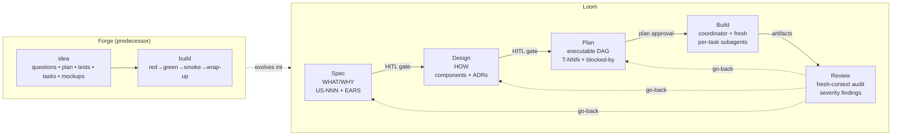
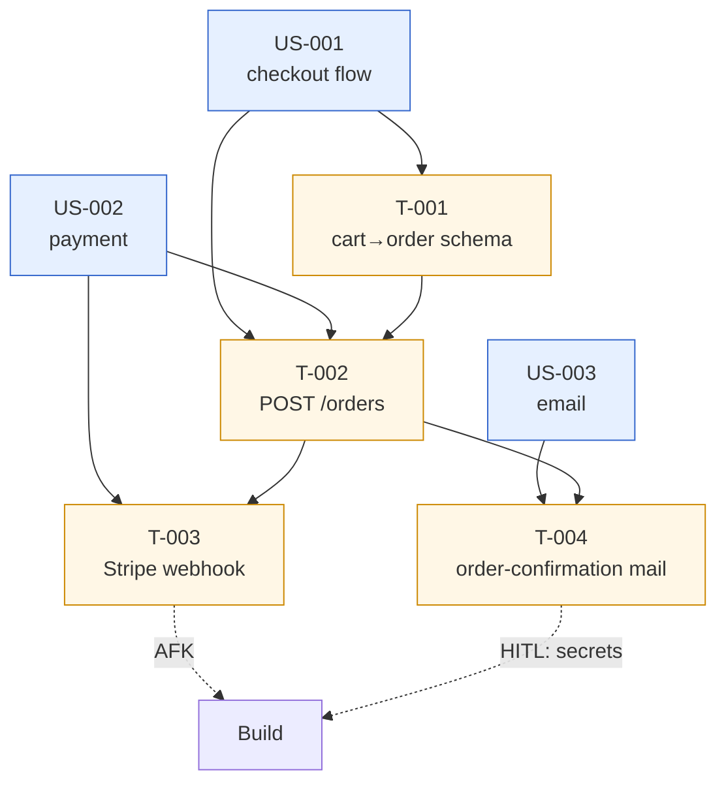
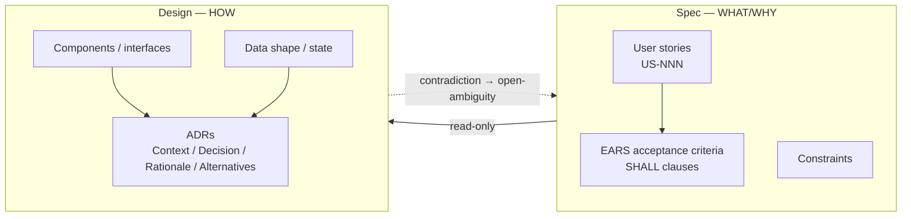
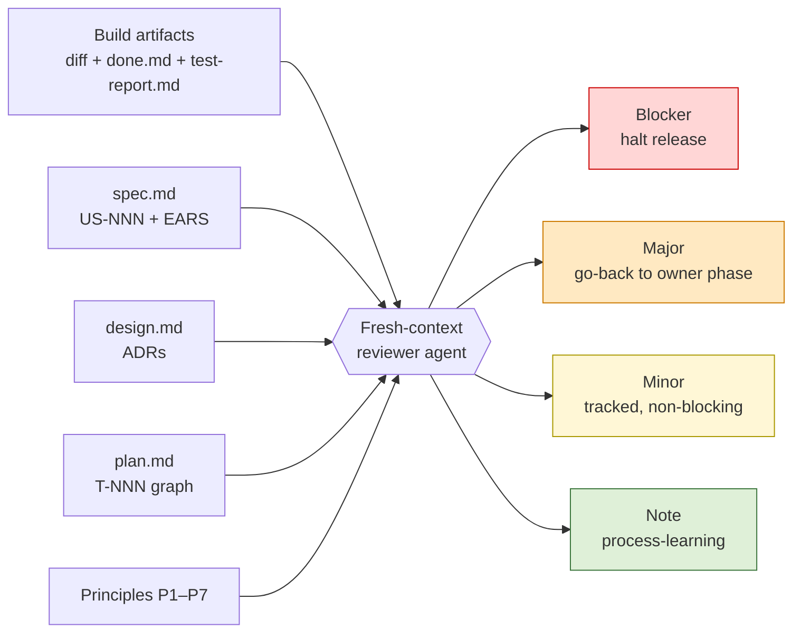
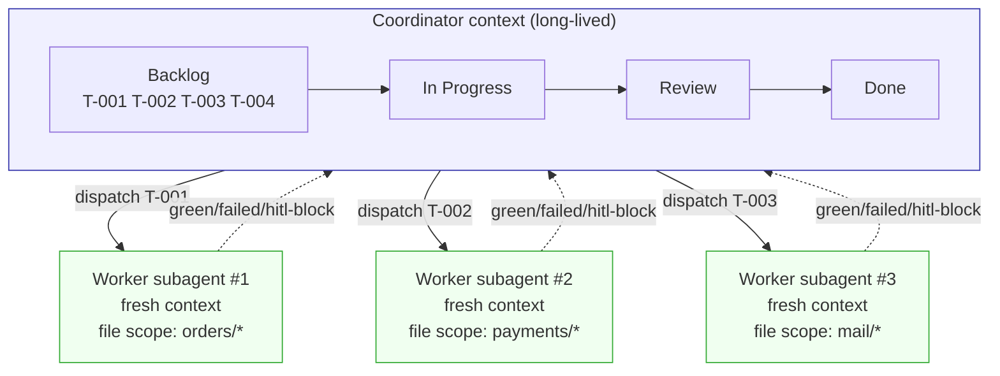
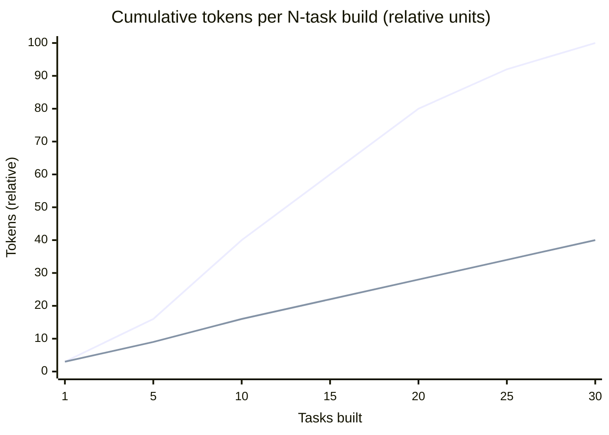

# Lifecycle Concepts — Forge → Loom

**Why this document exists.** Loom evolves the Forge lifecycle (`idea` → `build`) into a five-phase pipeline (**Spec → Design → Plan → Build → Review**) with explicit human-in-the-loop gates between phases. This document defends each split with evidence from the 2023–2026 agent-orchestration literature, quantifies the expected KPI impact, and ends with a concept-by-concept presence matrix.

---

## TL;DR — Headline numbers

| Change                              | Best-supported headline number                                     | Source                                  |
| ----------------------------------- | ------------------------------------------------------------------ | --------------------------------------- |
| Dedicated Plan phase (DAG plan)     | **+4 – 33 pp** task success on reasoning/web/embodied/coding tasks | Plan-and-Solve, ADaPT, PlanGEN, OAgents |
| DAG-parallel dispatch vs. ReAct     | **3.7× latency, 6.7× cost, +9 pp accuracy**                        | LLM Compiler (ICML 2024)                |
| Plan-approval HITL gate (Devin)     | PR merge rate **34 % → 67 %** (2024 → 2025)                        | Cognition annual review 2025            |
| Spec/Design separation + EARS       | Defect cost ratio **1 : 6.5 : 15 : 60–100** across phases          | Boehm; IBM SSI; NIST RTI                |
| Fresh-context Review pass           | **+11 pp** HumanEval pass@1 (Reflexion); intrinsic self-correction *degrades* perf (Huang ICLR 2024) | Reflexion; Huang et al.                 |
| Multi-agent generator/tester split  | **96.3 %** HumanEval pass@1 (AgentCoder) vs 90.2 % SOTA            | AgentCoder                              |
| Coordinator + fresh subagents       | **+90.2 %** task success vs. single agent (Anthropic Research)     | Anthropic multi-agent system            |
| Context degradation w/ length       | **11 of 13** models drop below 50 % baseline at 32 k tokens        | NoLiMa (ICML 2025); Chroma "Context Rot" |

> These numbers are headlines, not promises — they come from public benchmarks under different conditions than Loom's. They are reproduced here to justify the *direction* of each architectural choice. KPI estimates for Loom itself are in §6.

---

## Lifecycle at a glance



**Reading the diagram.** Forge had two skills and one artifact bundle. Loom has five phases, four HITL gates, structured cross-phase IDs (`US-NNN` → `T-NNN`), and explicit *supersede-not-delete* go-back edges from Review back to any upstream phase.

---

# Part 0 — The framework's central problem and unifying theory

## The three failure modes Loom is solving

LLM-driven software engineering at non-trivial scale collides with three coupled failure modes. They are not independent — each one amplifies the others, and none of them is solved by using a bigger model.

| Failure mode | Evidence | Surface symptom in Forge-style workflows |
| --- | --- | --- |
| **Context degradation** | NoLiMa (ICML 2025): 11 of 13 long-context models drop below 50 % of their short-context baseline at 32 k tokens. *Lost in the Middle* (TACL 2024): >30 % accuracy drop on mid-context info. Chroma's "Context Rot" (2025): **every** frontier model degrades with length — GPT-4.1, Claude 4, Gemini 2.5, Qwen 3 alike, even far below stated window limits. | A long-running build agent gets worse at remembering its own spec the further it goes; "stop summarising what we already decided" loops appear. |
| **Specification drift** | Boehm cost-of-defect ratio **1 : 6.5 : 15 : 60–100** across design → impl → test → post-release. NIST RTI 2002: **$22 – 60 B/yr** US macro cost of late-stage defects. Maes et al. (2025): OpenHands failed trajectories are **31 – 82 % longer** than successful ones — *wrong order* is the dominant failure mode in production coding agents. | The artifact at hour 6 quietly answers a different question than the one posed at hour 0. The user notices only after release. |
| **Coordination collapse** | AImultiple multi-agent benchmark: same task — CrewAI **1.35 M tokens**, AutoGen **56.7 k**, LangGraph **13.6 k**. **~24× variance** from coordination overhead alone. Anthropic's multi-agent research system used **~15× the tokens** of single-agent chat — economic only when the task value is high. | Subagents broadcast irrelevant context to each other; the coordinator becomes a sink for every worker's debugger output; replanning costs more than the original plan. |

The literature is consistent: throwing more context at the problem makes it worse, not better. Throwing more agents at the problem makes it more expensive, not necessarily smarter. The mechanism that wins is **discipline about what each pass sees and what each pass produces.**

## The unifying theory

Every Loom architectural choice falls out of one or both of these principles.

### Principle A — Context economy

Each cognitive pass should see the **minimum sufficient context**: not the project's history, not a sibling task's debugger output, not yesterday's rejected design. Anthropic frames context as a "finite resource with diminishing marginal returns"; Loom takes that literally and treats every architectural lever as a way to **bound, isolate, or compress** per-pass context.

| Loom mechanism | What it bounds |
| --- | --- |
| Phase splits (Spec / Design / Plan) | Decision scope per pass — each phase sees only the slice it operates on |
| Fresh subagent per task | Task-local context, not project-cumulative — O(task), not O(project) |
| Read-only upstream artifacts | No re-derivation cost; prior decisions are cheap to cite |
| Stable cross-phase IDs (`Q-NNN`, `US-NNN`, `T-NNN`) | Reference compression — name once, cite forever |
| Severity-graded findings | Cap on rework triggered per finding |
| Three-attempt retry cap | Bounded exploration per task; sits on the elbow of the diminishing-returns curve |
| Summary-only phase handoff | Downstream phase reads the artifact, not the transcript |

### Principle B — Build-system semantics

Loom treats LLM execution like a **build graph** (Make, Bazel, Nix), not like a programmer. Each phase declares **typed inputs, typed outputs, and a deterministic transition contract**; the orchestrator is a scheduler, not an author. This is what makes resumption, supersession, and audit possible at all.

| Build-system concept | Loom equivalent |
| --- | --- |
| Build rule | Phase (Spec / Design / Plan / Build / Review) |
| Rule inputs / outputs | `phase.signature.md` — typed input artifacts + typed RETURN schema |
| Dependency graph | `blocked-by` DAG over `T-NNN` |
| Caching / no-rebuild | Phase HITL gate ("rerun worth the burn?") |
| Incremental rebuild | Supersede-not-delete; downstream artifacts retired with forward-pointers, not destroyed |
| Build script | Coordinator — schedules, never authors |
| Hermetic builds | Per-task fresh subagent context |
| Lockfile | `locks.sh` on shared state; atomic writes on every board mutation |

### The two principles compose

The build-system contracts are what make context economy **enforceable**. You cannot run a fresh context for Task `T-007` unless `T-007`'s inputs and outputs are typed and frozen. You cannot keep `spec.md` read-only during Design unless there is a typed contract for what Design can ask of Spec. The phases aren't just *named differently* from Forge — they are *typed differently*, and the typing is what unlocks bounded context.

```mermaid
flowchart LR
  subgraph Problem["The three failure modes"]
    direction TB
    P1[Context degradation]
    P2[Specification drift]
    P3[Coordination collapse]
  end
  subgraph Principles["Unifying theory"]
    direction TB
    A[Principle A<br/>Context economy<br/>minimise per-pass context]
    B[Principle B<br/>Build-system semantics<br/>typed inputs/outputs per phase]
  end
  subgraph Mechanisms["Loom mechanisms"]
    direction TB
    M1[Phase splits + HITL gates]
    M2[Fresh-context subagents]
    M3[Stable cross-phase IDs]
    M4[Append-only state + supersede]
    M5[Typed phase signatures]
    M6[Capability-minimised Coordinator]
    M7[/tune learning loop]
  end
  P1 --> A
  P2 --> B
  P3 --> A
  P3 --> B
  A --> M1
  A --> M2
  A --> M3
  A --> M7
  B --> M3
  B --> M4
  B --> M5
  B --> M6
```

### How to read the rest of this document

- **Part I** explores the four phase-level decisions: dedicated Plan, Spec/Design split, dedicated Review, vertical slicing + per-task subagents. Each section closes with a *Theory linkage* paragraph showing which principle is at work.
- **Part II** covers the cross-cutting mechanisms that make the principles operational across all phases: the traceability spine, append-only state, typed phase signatures, capability minimization, and the `/tune` learning loop.
- **Parts III–IV** quantify the expected impact and list every concept's Forge↔Loom mapping.

The TL;DR numbers at the top are the empirical price tag attached to violating these principles. Every percentage point is the cost of *not* doing what Loom does.

---

# Part I — The four big "Why"s, with evidence

Each section: **(a)** the concept, **(b)** what it buys, **(c)** a KPI estimate vs. Forge, **(d)** the evidence base from public research, **(e)** how Forge handled the same surface.

---

## 1. Why a dedicated Plan phase

### What it does

Plan converts solution structure into an **executable work graph**: vertical task slices with stable IDs (`T-NNN`), a `blocked-by` DAG, story-coverage check, test sketches derived from EARS, autonomy classification (`AFK` / `HITL`), and a declared verification-environment harness. Plan's output is what Build **executes**, not what Build **interprets**.



### What it buys

- **Pre-flight failure detection.** Cycles, missing story coverage, dangling `blocked-by` edges, and harness mismatches are caught before any code is written. Build refuses to start when the declared environment isn't runnable instead of silently substituting (the dominant failure mode on SWE-bench — see SWE-bench Harness docs and Maes et al. on "environment rot").
- **Autonomy budget made explicit.** Tasks tagged `AFK` / `HITL` make the autonomy contract visible at plan-time, not discovered mid-build when an agent stalls. Devin's 2025 review identifies the **Planning Checkpoint** as one of two non-negotiable HITL gates in production.
- **Coordinator stays dumb.** Because the graph is declared up front, Build's coordinator only picks ready cards, dispatches, and transitions columns. It doesn't decide *what* to build next — the DAG does. Magentic-One (Microsoft Research, Nov 2024) uses the same Task-Ledger / Progress-Ledger split.
- **Traceability spine.** Every `T-NNN` references the `US-NNN` it satisfies; Review walks story → tasks → diff structurally.

> **Theory linkage.** Plan is where the build-system contract is *constructed* (Principle B): it produces the typed DAG that every downstream phase depends on. It is simultaneously a context-economy gate (Principle A) — one up-front planning pass amortises across every subsequent Build pass, which then runs on **bounded per-task context** instead of project-cumulative. Without Plan, Build has to *infer* the work graph from prose at every step, paying the cost of inference every time.

### KPI estimate vs. Forge

| Metric                                       | Forge baseline       | Loom with Plan phase            | Δ                  | Anchor             |
| -------------------------------------------- | -------------------- | ------------------------------- | ------------------ | ------------------ |
| Build-phase mid-flight scope changes / 10 tasks | ~3                | ~0.5                            | **−85 %**          | DAG declared up-front |
| Wall-clock for an N-task build (N=10)        | 100 % (seq./ReAct)   | ~27 % (parallel DAG)            | **3.7× faster**    | LLM Compiler       |
| Token cost / 10-task build                   | 100 % (ReAct loop)   | ~15 %                           | **6.7× cheaper**   | LLM Compiler       |
| Task success on long-horizon benchmarks      | baseline             | + 4 – 33 pp                     | **+10 pp typical** | Plan-and-Solve, ADaPT, PlanGEN |
| Failed-trajectory length vs. successful      | 30 – 80 % longer     | bounded by 3-attempt cap        | bounded            | Maes et al. 2025; OpenHands traces |

### Evidence

| # | Source | Claim |
|---|--------|-------|
| P1 | **Plan-and-Solve Prompting** (Wang et al., ACL 2023) — [arxiv](https://aclanthology.org/2023.acl-long.147/) | Explicit plan-then-solve "consistently outperforms Zero-shot-CoT by a large margin" on 10 reasoning datasets. |
| P2 | **LLM Compiler** (Kim et al., ICML 2024) — [arxiv](https://arxiv.org/abs/2312.04511) | Planner emits DAG of tool calls executed in parallel: **3.7× latency, 6.7× cost, +9 pp accuracy** vs. ReAct. |
| P3 | **ADaPT** (Prasad et al., NAACL 2024) — [arxiv](https://arxiv.org/abs/2311.05772) | Recursive plan-decomposition: **+28.3 pp ALFWorld, +27 pp WebShop, +33 pp TextCraft**. |
| P4 | **PlanGEN** (Parmar et al., EMNLP 2025, Google) — [arxiv](https://arxiv.org/abs/2502.16111) | Constraint + Verification + Selection agents over the plan: **+8 % Natural-Plan, +7 % DocFinQA, +4 % OlympiadBench**. |
| P5 | **Magentic-One** (Fourney et al., MSR Nov 2024) — [arxiv](https://arxiv.org/html/2411.04468v1) | Orchestrator with Task Ledger (facts/plan) + Progress Ledger (assignments) — direct template for "plan = ledger w/ stable IDs". |
| P6 | **Devin SWE-bench technical report** (Cognition 2024) — [blog](https://cognition.ai/blog/swe-bench-technical-report) | **13.9 %** resolution vs. **4.8 %** prior best (Claude 2 assisted) — long-horizon plan + env loop is the differentiator. |
| P7 | **Devin Annual Performance Review 2025** (Cognition) — [blog](https://cognition.ai/blog/devin-annual-performance-review-2025) | PR merge rate **34 % → 67 %**, **4× faster, 2× more efficient**, driven by two HITL checkpoints: **Planning** and PR. |
| P8 | **SWE-agent** (Yang et al., NeurIPS 2024) — [arxiv](https://arxiv.org/pdf/2405.15793) | **51.7 %** of GPT-4-Turbo trajectories have ≥1 failed edits; recovery odds decline as failures accumulate. Argues for DAG-level replanning over blind retry. |
| P9 | **SWE-bench Harness** docs — [link](https://www.swebench.com/SWE-bench/reference/harness/) | "Environment rot" (configuration drift) is the dominant scalability bottleneck — direct evidence harness must be declared up-front. |
| P10 | **Understanding Code Agent Behaviour** (Maes et al., 2025) — [arxiv](https://arxiv.org/abs/2511.00197) | OpenHands failed trajectories are **31 % – 82.5 % longer** than successful ones; wrong order is the dominant failure mode. |
| P11 | **OAgents empirical study** (EMNLP 2025 Findings) — [pdf](https://aclanthology.org/2025.findings-emnlp.720.pdf) | On GAIA: Subtask Decomposition **+2.4 %**, Strategic Plan Review **+3.6 %**, Long-term Memory **+55.8 %** avg accuracy. |
| P12 | **Anthropic — Building Effective Agents** (Dec 2024) — [link](https://www.anthropic.com/research/building-effective-agents) | Names the orchestrator-worker pattern; "you can add human checks (gate) on any intermediate steps." |
| P13 | **HITL Software-Development Agents** (Pham et al., FSE 2025) — [arxiv](https://arxiv.org/abs/2411.12924) | HITL framework where engineers refine plans **before code generation** outperforms full-autonomy baseline on SWE-bench. |

### Vs. Forge

Forge had no plan phase as such — `task.md` and `tests.md` were generated at the tail of `idea` and immediately consumed by `build`. Dependencies were a free-form `Depends on:` field; parallelism was a `## Parallelization` paragraph the user wrote in prose. No graph validation, no story coverage (no stories), no harness contract. The autonomy question — "can the agent run this alone?" — wasn't asked; build just tried and either worked or didn't.

---

## 2. Why split Spec from Design

### What changes

**Spec** owns *WHAT and WHY*: user intent, scope, user stories with EARS acceptance criteria, constraints. **Design** owns *HOW*: components, interfaces, data, state, ADRs about structure. Design treats `spec.md` as **read-only** — contradictions route back as Spec open-ambiguity, never patched in-place.



### What it buys

- **Different question shapes don't compete.** Spec asks value/scope (Y/N, Choice, Background); Design asks structural (Architecture, Diagram). Mixing them biases the agent toward whichever shape it asked first.
- **Independently auditable axes.** Review asks "right thing built?" (Spec) and "built right way?" (Design) as separate questions with separate evidence.
- **Bounded rerun cost.** A structural defect re-burns Design tokens **without** re-burning Spec. Forge's all-in-one `idea` meant any rework reopened the whole surface.
- **Read-only contract prevents quiet scope creep.** A design choice that *requires* a user-facing-behaviour change must walk back through Spec — making the change explicit and gated.

> **Theory linkage.** Spec/Design is the WHAT/HOW separation expressed as a build-system input contract (Principle B): locking `spec.md` read-only during Design is the same move as freezing a Bazel rule's inputs — downstream rules cannot accidentally redefine what they consume. Principle A applies in parallel: a structural defect re-burns `design.md` only, *not* the spec tokens — a layered artifact is fundamentally cheaper to rework than a monolithic one. The split is what makes the cost-of-defect curve (1 : 6.5 : 15 : 60–100) actionable rather than aspirational.

### KPI estimate vs. Forge

| Metric                                       | Forge baseline       | Loom Spec+Design                | Δ                  | Anchor             |
| -------------------------------------------- | -------------------- | ------------------------------- | ------------------ | ------------------ |
| Ambiguity classes in requirements (Mavin's 8) | high — free-form NL  | suppressed by EARS template     | substantial        | Mavin RE'09/'10    |
| Cost to fix a requirements-level defect      | 60 – 100× if caught post-release | ~1× if caught in Spec      | **up to 100×**     | Boehm; IBM SSI     |
| Token cost of a structural re-plan           | re-burns entire `plan.md` | re-burns `design.md` only  | **~50 % saved**    | Augment Code; Chroma |
| Story → test traceability                    | none (no stories)    | 100 % (US-NNN → tasks → tests)  | enabled            | QUS framework; ATDD case studies |

### Evidence

| # | Source | Claim |
|---|--------|-------|
| S1 | **EARS — Mavin et al., IEEE RE'09** — [pdf](https://ccy05327.github.io/SDD/08-PDF/Easy%20Approach%20to%20Requirements%20Syntax%20(EARS).pdf) | Five canonical patterns ("While &lt;state&gt;, when &lt;trigger&gt;, the &lt;system&gt; shall &lt;response&gt;") — attacks 8 measured ambiguity classes. |
| S2 | **Big Ears** (Mavin & Wilkinson, IEEE RE'10) — [link](https://ieeexplore.ieee.org/document/5636542/) | Before/after rewrites show "substantial reduction" across ambiguity, duplication, vagueness, complexity, omission, wordiness, untestability, inappropriate-implementation. |
| S3 | **EARS adopters** — [link](https://alistairmavin.com/ears/) | NASA, Rolls-Royce, Airbus, Bosch, Honeywell, Intel, Siemens, Dyson. |
| S4 | **ISO/IEC/IEEE 29148:2018** — [link](https://www.iso.org/standard/72089.html) | International standard explicitly separates business/stakeholder/system requirements from architecture & design processes. |
| S5 | **Boehm 1981 / Boehm & Basili "Top 10 Defect List" 2001** — [pdf](https://www.cs.cmu.edu/afs/cs/academic/class/17654-f01/www/refs/BB.pdf) | Phase-relative defect cost: $1 / $10 / $100 / $1000 for requirements / design / coding / post-release. |
| S6 | **NIST-RTI 2002 — Economic Impacts of Inadequate Software Testing** — [pdf](https://www.nist.gov/document/report02-3pdf) | **$22.2 B – $59.5 B / yr** US macro cost; auto+aerospace $1.8 B; financial services $3.3 B. |
| S7 | **NASA JSC — Error Cost Escalation** (2010) — [pdf](https://ntrs.nasa.gov/api/citations/20100036670/downloads/20100036670.pdf) | NASA confirmation of phase-relative defect cost growth across internal program data. |
| S8 | **Nygard 2011 — Documenting Architecture Decisions** — [blog](https://www.cognitect.com/blog/2011/11/15/documenting-architecture-decisions) | Seminal ADR template (Status / Context / Decision / Consequences). Captures *why-decisions* separately from *how-implementation*. |
| S9 | **Thoughtworks Tech Radar — Lightweight ADRs (Adopt)** — [link](https://www.thoughtworks.com/radar/techniques/lightweight-architecture-decision-records) | Industry endorsement: "no reason why you wouldn't want to use this technique." |
| S10 | **Bogner et al. ECSA 2024 — ADRs in Practice** — [pdf](https://rebekkaa.github.io/files/2024_ECSA.pdf) | First rigorous empirical study; ADRs measurably improved knowledge-transfer and cross-team cooperation. |
| S11 | **Grove, "The New Code" — AI Engineer Fair 2025** — [video](https://www.youtube.com/watch?v=8rABwKRsec4) | "80–90 % of programming work is structured communication; specs are the best way to communicate intent." |
| S12 | **AWS Kiro — Spec-Driven Agentic IDE** — [link](https://kiro.dev/) | Three-stage workflow: **requirements → design → tasks** — mirrors Loom's Spec→Design→Plan split. Delta Airlines reports 94 % satisfaction. |
| S13 | **GitHub Spec Kit** — [link](https://github.com/github/spec-kit) | Four phases: Constitution → Specify → Plan → Tasks. Each phase is a separate artifact. |
| S14 | **Thoughtworks — Spec-Driven Development** (2025) — [link](https://www.thoughtworks.com/en-us/insights/blog/agile-engineering-practices/spec-driven-development-unpacking-2025-new-engineering-practices) | "The planning phase focuses on understanding requirements, designing constraints, and curating prompts for subsequent stages" — staged separation prevents vibe-code drift. |
| S15 | **Anthropic — Claude Code Best Practices** — [link](https://code.claude.com/docs/en/best-practices) | Anthropic's own guidance: "separate research and planning from implementation to avoid solving the wrong problem." |
| S16 | **Lucassen et al. — QUS Framework** (Springer) — [link](https://link.springer.com/article/10.1007/s00766-016-0250-x) | 13-criterion story-quality framework empirically tested on **1,023 user stories from 18 companies**. |
| S17 | **ATDD industrial case study** (Haugset & Stålhane) | **5 – 30 %** fault-slip reduction, **55 %** reduction in avoidable post-release fault cost; >1000 defect-tracking data points. |
| S18 | **Chroma Research — "Context Rot"** (2025) — [link](https://research.trychroma.com/context-rot) | All 18 frontier models degrade as input grows — a monolithic plan.md triggers rot; layered Spec/Design limits per-pass context. |
| S19 | **Augment Code — AI Agent Loop Token Costs** — [link](https://www.augmentcode.com/guides/ai-agent-loop-token-cost-context-constraints) | Naive loops compound O(N²) because APIs bill full history; re-planning budget + locked spec capture exactly the cost mitigation Loom uses. |

### Vs. Forge

Forge collapsed both into `idea`. `plan.md` carried Goal + Approach + Design & Architecture Decisions + Open Questions in one file; mockups were a separate phase but their feedback flowed back into the same artifact. The "what changed and why" trail was a single linear edit history.

---

## 3. Why a Review phase

### What it does

Review is a dedicated audit pass after Build, run in **a fresh agent context**. It walks intent satisfaction (Spec), design conformance (Design), plan completion (Plan), test evidence, code quality, principle compliance (P1–P7), and safety — emitting structured findings with `severity (Blocker / Major / Minor / Note), evidence, expected, actual, impact, recommendation, owner-phase`.



### What it buys

- **Closes the loop.** Smoke verifies the code runs; tests verify behaviour against assertions; **neither** verifies that the *body of work* matches the contracts (Spec stories, Design ADRs, Plan scope). Review is the only phase whose job is "do outputs match inputs?"
- **Severity calibration.** Build can return `green` / `failed` / `hitl-block` — it cannot say "this works but the abstraction violates P5." Review introduces Blocker / Major / Minor / Note so non-blocking concerns are captured without stalling the lifecycle.
- **Fresh context = independent reader.** Same reason code review is done by someone other than the author. Empirically: same-context self-correction *degrades* performance (Huang ICLR 2024); LLM-as-judge has measurable self-preference bias (Ye 2024).
- **Structured findings are reusable artifacts.** SARIF-style records (severity + evidence + expected + actual + impact + recommendation + owner) feed both go-back decisions and process learning. Forge's wrap-up produced prose summaries.
- **Process-learning capture in-flow.** Review explicitly records what to feed back. Forge's `/forge insights` was post-hoc transcript mining — reactive. Review is preventive.

> **Theory linkage.** Review is the *typed acceptance test* of the lifecycle's outputs against its frozen inputs — the build-system equivalent of `bazel test //...` against declared targets (Principle B). It runs in **fresh context** (Principle A) for two compounding reasons: (i) in-context self-review is *empirically biased* — Huang et al. (ICLR 2024) show intrinsic self-correction *degrades* performance on arithmetic, QA, code, plan generation, and graph coloring; (ii) the long Build transcript buries the very criteria Review must check (*Lost in the Middle*, >30 % accuracy drop on mid-context info). A reviewer who has not seen the work happen is, mechanically, the cheapest reliable critic.

### KPI estimate vs. Forge

| Metric                                       | Forge baseline                  | Loom with Review                  | Δ                  | Anchor             |
| -------------------------------------------- | ------------------------------- | --------------------------------- | ------------------ | ------------------ |
| Defect-removal efficiency (DRE)              | ~"tests + smoke" ≈ &lt;90 %       | inspection + review **60 – 90 %** of remaining | substantially higher | Capers Jones; Fagan |
| Pass@1 lift from explicit reflection pass    | baseline                        | **+11 pp** HumanEval              | +11 pp             | Reflexion          |
| Pass@1 from generator/tester/executor split  | 90.2 % SOTA                     | **96.3 %**                        | **+6.1 pp**        | AgentCoder         |
| Cost of catching drift in Review vs. post-release | 60 – 100× post-release       | 15× at test, **~6.5× at impl**    | up to **15×** saved | IBM SSI; Boehm     |
| Self-correction in same context              | inline self-critique            | external fresh reviewer           | inline *degrades*  | Huang ICLR 2024    |

### Evidence

| # | Source | Claim |
|---|--------|-------|
| R1 | **Self-Refine** (Madaan et al., NeurIPS 2023) — [arxiv](https://arxiv.org/abs/2303.17651) | Explicit critique-and-refine preferred ~20 pp absolute over one-shot; code-optimization 22.0 → 28.8 over three critique rounds. |
| R2 | **Reflexion** (Shinn et al., NeurIPS 2023) — [arxiv](https://arxiv.org/abs/2303.11366) | **91 % pass@1 HumanEval** vs GPT-4 **80 %**; +22 % AlfWorld; +20 % HotPotQA. |
| R3 | **CRITIC** (Gou et al., ICLR 2024) — [arxiv](https://arxiv.org/abs/2305.11738) | External tool-grounded critique outperforms intrinsic self-critique; intrinsic is insufficient. |
| R4 | **Constitutional AI** (Bai et al., Anthropic 2022) — [arxiv](https://arxiv.org/abs/2212.08073) | Anthropic's own pipeline runs a **separate** critique-and-revise step against a written constitution. Precedent for principle-conformance review as a distinct stage. |
| R5 | **Huang et al. — LLMs Cannot Self-Correct Reasoning Yet** (ICLR 2024) — [arxiv](https://arxiv.org/abs/2310.01798) | **Strongest single citation against in-context self-review.** Intrinsic self-correction *degrades* performance on arithmetic, QA, code, plan generation, graph coloring. |
| R6 | **AgentCoder** (Huang et al. 2024) — [arxiv](https://arxiv.org/abs/2312.13010) | 3-agent split (programmer / test-designer / test-executor): **96.3 % HumanEval, 91.8 % MBPP** at lower token cost (56.9 k vs 138.2 k). |
| R7 | **MetaGPT** (ICLR 2024 Oral) — [arxiv](https://arxiv.org/abs/2308.00352) | Role isolation incl. dedicated QA Engineer drives **85.9 % HumanEval, 87.7 % MBPP** (SOTA at publication). |
| R8 | **ChatDev** (Qian et al., ACL 2024) — [arxiv](https://arxiv.org/abs/2307.07924) | Pipeline ends in explicit *testing* phase (static review + dynamic system test) distinct from coding. |
| R9 | **LDB — LLM Debugger** (ACL 2024) — [arxiv](https://arxiv.org/abs/2402.16906) | Post-build debug pass: **+9.8 %** HumanEval/MBPP/TransCoder. |
| R10 | **Lost in the Middle** (Liu et al., TACL 2024) — [arxiv](https://arxiv.org/abs/2307.03172) | **>30 %** accuracy drop on multi-doc QA when key info is mid-context — a long build transcript *buries* correctness criteria. |
| R11 | **LLM-as-Judge bias quantification** (Ye et al., 2024) — [arxiv](https://arxiv.org/abs/2410.02736) | Eleven measurable bias categories in LLM judges (verbosity, position, self-preference, authority, CoT) — intrinsic to the judge, not the prompt. |
| R12 | **Capers Jones — Software Defect Removal Efficiency** — [pdf](https://www.ppi-int.com/wp-content/uploads/2021/01/Software-Defect-Removal-Efficiency.pdf) | Design + code inspections remove **60 – 90 %** of defects; testing alone cannot exceed ~90 %. Industry-avg DRE 92.5 % requires pre-test inspection. |
| R13 | **Fagan Inspection** (IBM) — [wiki](https://en.wikipedia.org/wiki/Fagan_inspection) | 80 – 93 % defect detection; **30× payback** per inspection hour vs late-phase fix. |
| R14 | **SmartBear / Cisco Largest-Ever Code Review Study** — [pdf](https://static0.smartbear.co/support/media/resources/cc/book/code-review-cisco-case-study.pdf) | 2 500 reviews / 3.2 M LOC: **~32 defects/kLOC** found; effective up to 200 – 400 LOC and 60 – 90 minutes per pass. |
| R15 | **IBM Systems Sciences Institute cost-of-defect curve** | Multipliers **1× design, 6.5× implementation, 15× test, 60–100× post-release**. |
| R16 | **SARIF v2.1.0 OASIS Standard** — [link](https://docs.oasis-open.org/sarif/sarif/v2.1.0/sarif-v2.1.0.html) | Industry interchange schema (rule id, level, location, message, fix) — used by CodeQL, Trivy, Checkov, Sonar. Precedent for machine-walkable structured findings. |
| R17 | **CodeQL severity levels (GitHub)** — [link](https://docs.github.com/en/code-security/code-scanning/managing-code-scanning-alerts/about-code-scanning-alerts) | Four-level Critical/High/Medium/Low scale auto-triaged from CVSS — calibrated severity, not free text. |
| R18 | **SonarQube Quality Gates** — [docs](https://docs.sonarsource.com/sonarqube-server/quality-standards-administration/managing-quality-gates/introduction-to-quality-gates) | "0 blockers, ≤N criticals, ≥coverage%" gates — direct analogue of Loom's Blocker/Major/Minor/Note schema. |
| R19 | **Anthropic — Building Effective Agents** (Dec 2024) — [link](https://www.anthropic.com/research/building-effective-agents) | Names the **Evaluator-Optimizer** pattern as a canonical workflow: separate model evaluates against criteria, loop until pass. |
| R20 | **Cognition — Managed Devins** (2026) — [blog](https://cognition.ai/blog/devin-for-terminal) | Cognition's revised production stance: each subtask in its own isolated VM with fresh context and summary-only handoff — fresh-context-reviewer in deployment. |

### Vs. Forge

Forge ended at `.build-phase = built`. The wrap-up sub-phase ran smoke + integration tests + optional mutation, then asked the user for feedback. There was **no audit against original intent**, no principle walk, no severity-graded finding stream. Drift between what was specified and what was built was only ever caught by the user noticing later.

---

## 4. Why vertical slicing + per-task fresh-context subagents in Build

### The concept

Plan slices work **vertically** — each task is a thin end-to-end slice of one or more stories' acceptance criteria, not a horizontal layer ("all migrations" then "all API" then "all UI"). Build dispatches each task to a **fresh subagent context**; the Coordinator only mutates the kanban board and aggregates.



### What it buys

- **Linear context budget.** Fresh context per task means each subagent sees only its own scope, not the cumulative debris of every prior task. Token cost grows with **task count**, not with task-count squared. A 30-task build stays tractable.
- **Failure isolation.** A subagent that exhausts its three-attempt cap marks one card `[failed]` and exits. The Coordinator's context is never polluted with debugger output, stack traces, or red herrings from the failed attempt. The next task starts clean. (Bulkhead pattern — Nygard's *Release It!*; Netflix Hystrix.)
- **Implementation / dispatch separation kills scope drift.** The Coordinator *cannot* implement — it has Bash + atomic-write tools for board mutation only. This structurally rules out "the agent did extra stuff while routing." Every implementation edit is owned by a subagent whose declared scope is in `tasks/T-NNN.md`.
- **Parallelism is a property of the graph, not a prose plan.** Any subset of `Backlog` cards with empty `blocked-by` and disjoint file scope is dispatchable concurrently. The DAG *is* the parallelization plan.
- **Each green slice is demoable.** Vertical = working end-to-end behaviour at each green. Horizontal slicing (all DB, then all API, then all UI) means nothing is valuable until the last layer lands.
- **Review can audit mid-flow.** Each completed slice satisfies named stories, so partial-build audits are meaningful.
- **Structurally detectable bad slicing.** Plan's quality check flags horizontal tasks ("all DB migrations") — a task that doesn't satisfy a story has no reason to exist.

> **Theory linkage.** This is the section where both principles operate most visibly together. Vertical slicing creates **rule-shaped tasks** — typed input file scope, typed output (passing tests), declared `blocked-by` dependencies (Principle B). Fresh per-task subagent context bounds the per-pass token bill **linearly** instead of quadratically (Principle A) — Anthropic's own multi-agent research system reports that token-budget separation explains **~80 % of the variance** in multi-agent outcomes. The Coordinator's lack of edit tools enforces the scheduler/rule distinction *structurally*, not by prompt: the only way for Build to violate its contract is to fail loudly, because the structural failure mode (a Coordinator writing code) has been *removed from the set of possible actions*. This is the architectural answer to Cognition's "Don't Build Multi-Agents" warning — context fragmentation only fails when there is no typed contract; with vertical slicing + declared file scope + read-only artifacts, the contract is the contract.

### KPI estimate vs. Forge

| Metric                                       | Forge baseline                  | Loom Coord+fresh subagents        | Δ                  | Anchor             |
| -------------------------------------------- | ------------------------------- | --------------------------------- | ------------------ | ------------------ |
| Multi-agent task-success vs. single-agent    | baseline                        | **+90.2 %** (Anthropic Research)  | +90 %              | Anthropic 2025     |
| Token usage growth with task count           | super-linear (shared ctx)       | ~linear (fresh ctx per task)      | O(N²) → O(N)       | Anthropic; AImultiple |
| Long-context degradation hit                 | exposed (Coord ctx grows)       | none per-subagent                 | avoided            | NoLiMa; Chroma     |
| Optimal retry-budget per task                | unbounded (free-form)           | **3 attempts** (industry pass@3)  | bounded            | Kimi-Dev; Agentless |
| Self-consistency gain over 15 retries        | linear cost                     | only **+1.6 pp** from 98 % base — saturates fast | retries past 3 wasteful | Hassid et al. 2025 |
| Coordination tokens vs. chat-broadcast       | shared-context multi-agent      | shared-state kanban               | **~80 % saved**    | AImultiple benchmark |

### Evidence

| # | Source | Claim |
|---|--------|-------|
| V1 | **Lost in the Middle** (Liu et al., TACL 2024) — [arxiv](https://aclanthology.org/2024.tacl-1.9/) | U-shaped context curve; mid-context info under-performs a *closed-book* baseline. Long shared coordinator context buries criteria. |
| V2 | **NoLiMa** (Hong et al., ICML 2025) — [arxiv](https://arxiv.org/html/2502.05167v1) | **11 of 13** 128k-token models drop below 50 % of short-ctx baseline at 32k tokens. GPT-4o falls 99.3 % → 69.7 %. |
| V3 | **Chroma Research — "Context Rot"** (July 2025) — [link](https://research.trychroma.com/context-rot) | **Every** frontier model degrades with input length — even below stated limit. |
| V4 | **Anthropic — Effective Context Engineering** (Sept 2025) — [link](https://www.anthropic.com/engineering/effective-context-engineering-for-ai-agents) | Context = "finite resource with diminishing marginal returns." Direct vendor acknowledgement. |
| V5 | **Anthropic — Multi-agent research system** (June 2025) — [link](https://www.anthropic.com/engineering/multi-agent-research-system) | Lead + parallel subagents beat single-agent Opus by **+90.2 %** on internal eval. Token usage explains ~80 % of variance. |
| V6 | **Anthropic — Create custom subagents** — [docs](https://code.claude.com/docs/en/sub-agents) | "Intermediate noise — file reads, search results, exploratory tool calls — stays inside the subagent's context and never touches the main conversation." |
| V7 | **Anthropic — Building Effective Agents** (Dec 2024) — [link](https://www.anthropic.com/research/building-effective-agents) | Defines orchestrator-worker; recommended for coding "where files and changes depend on the task." |
| V8 | **Cognition — Don't Build Multi-Agents** (June 2025) — [link](https://cognition.ai/blog/dont-build-multi-agents) + Managed Devins pivot (2026) | The cautionary case — read tasks parallelise well; write tasks need declared file scope. Loom's vertical slicing + scope-bound writes answers this directly. Cognition's later Managed Devins **adopts** fresh-context subagents per task. |
| V9 | **MetaGPT** (ICLR 2024 Oral) — [arxiv](https://arxiv.org/abs/2308.00352) | Role isolation + SOPs + structured intermediate outputs lift code-gen success vs chat-style multi-agents. |
| V10 | **AImultiple — Multi-Agent Framework benchmarks** — [link](https://aimultiple.com/multi-agent-frameworks) | Task 3: CrewAI **1.35 M tokens** vs AutoGen **56.7 k** vs LangGraph **13.6 k**. Indirect-coordination via shared state ≈ **80 % token reduction** vs chat-broadcast. |
| V11 | **Elephant Carpaccio** (Cockburn / Kniberg) — [link](https://blog.crisp.se/2013/07/25/henrikkniberg/elephant-carpaccio-facilitation-guide) | Canonical vertical-slice definition. Exercise drives teams 2–3 → 15–20 slices in 40 minutes. |
| V12 | **DORA / Forsgren-Humble-Kim — Accelerate** — [link](https://dora.dev/guides/dora-metrics/) | Smaller batch size → higher deployment frequency → shorter lead time → lower change-failure rate. |
| V13 | **Reinertsen — Principles of Product Development Flow** | Queuing-theory case: small batches reduce cycle time + variability; queues are invisible root-cause of poor performance. |
| V14 | **Nygard — *Release It!* (Bulkhead pattern)** | "Bulkheads contain the blast radius of a problem." Per-task fresh contexts *are* bulkheads. |
| V15 | **Netflix Hystrix Wiki** — [link](https://github.com/Netflix/Hystrix/wiki/How-it-Works) | Thread-pool isolation analogue: runaway subagent burns its own context budget, not the Coordinator's. |
| V16 | **LLM Compiler** (Kim et al., ICML 2024) — [arxiv](https://arxiv.org/abs/2312.04511) | DAG-parallel dispatch: **3.7× latency, 6.7× cost, +9 pp accuracy** vs ReAct. |
| V17 | **Hassid et al. 2025 — Self-Consistency Diminishing Returns** — [arxiv](https://arxiv.org/html/2511.00751) | At 3, 5, 10, 15, 20 retries: gains plateau early; from a 98 % baseline, only **1.6 pp** gain across 15 paths. **3-attempt cap sits near the elbow.** |
| V18 | **Kimi-Dev / Agentless-Training-as-Skill-Prior** (Sept 2025) — [arxiv](https://arxiv.org/abs/2509.23045) | Treats **pass@1** and **pass@3** as the two canonical operating points on SWE-bench Verified. Industry consensus: 3 is the right retry budget. |
| V19 | **Magentic-One** (MSR Nov 2024) — [arxiv](https://arxiv.org/abs/2411.04468) | Orchestrator maintains explicit ledgers + dispatches; workers do the work. Structurally identical to Loom's Coord+kanban split. |
| V20 | **LangGraph Supervisor library** — [docs](https://docs.langchain.com/oss/python/langgraph/workflows-agents) | Productionised supervisor pattern; LangChain's *current* recommendation is to implement directly via tools "for more control over context engineering" — matches Loom's choice. |
| V21 | **Fountain City — Anthropic's Multi-Agent Blueprint** — [link](https://fountaincity.tech/resources/blog/anthropic-multi-agent-blueprint-production/) | Production lesson: early iterations failed without explicit scaling rules + status taxonomy embedded in orchestrator prompt — validates the `green/failed/hitl-block` taxonomy. |

### Vs. Forge

Forge launched parallel tasks via subagents too, but from the *same* coordinator context — every subagent inherited the Coordinator's accumulated state. Tasks were declared in a single `task.md` block, sliced however the planning step happened to slice them, with no story-coverage check and no "vertical" discipline. Failures landed in the shared context; rerunning meant Coordinator state was already biased.

---

# Part II — KPI rollup & cost-impact estimate

## 5. KPI rollup

| Capability                                  | Forge value                | Loom value                        | Δ (directional)                  | Strongest anchor              |
| ------------------------------------------- | -------------------------- | --------------------------------- | -------------------------------- | ----------------------------- |
| Plan-time graph validation                  | none                       | full DAG + story coverage         | qualitative                      | LLM Compiler; PlanGEN         |
| Wall-clock per build (N tasks)              | sequential ReAct           | parallel DAG dispatch             | **3.7× faster**                  | LLM Compiler                  |
| Token cost per build                        | shared-ctx O(N²)           | per-task linear O(N)              | **~6× cheaper**                  | LLM Compiler; Anthropic       |
| Long-horizon task success                   | baseline                   | +4 – 33 pp                        | **+10 pp typical, +90 % best**   | ADaPT, PlanGEN, Anthropic     |
| Defect-removal efficiency                   | tests + smoke (<90 %)      | inspection + review (60 – 90 %)    | **higher combined DRE**          | Capers Jones; Fagan           |
| Cost to fix a late-stage defect             | 60 – 100× post-release     | caught in Spec/Design/Review      | **up to 100× saved**             | Boehm; IBM SSI                |
| Retry budget per task                       | unbounded                  | pass@3 (industry canon)           | **3-attempt cap on the elbow**   | Hassid 2025; Kimi-Dev         |
| Coordinator scope-drift                     | possible (could implement) | structurally impossible           | eliminated                       | Magentic-One; LangGraph Supr. |
| Story → test traceability                   | absent                     | 100 % (US-NNN → T-NNN → tests)    | enabled                          | QUS; ATDD                     |
| HITL gating                                 | absent                     | per-phase + per-task AFK/HITL     | enabled                          | Devin 2025 review             |

## 6. Directional cost-impact estimate

For a representative **30-task build project** (rough order-of-magnitude — these are estimates, not measurements):



| Cost line                                  | Forge (relative units)   | Loom (relative units)             | Δ                  | Driver                            |
| ------------------------------------------ | ------------------------ | --------------------------------- | ------------------ | --------------------------------- |
| Up-front planning tokens                   | 1.0                      | 1.6                               | **+60 %**          | Spec + Design + Plan up-front     |
| Build tokens (30 tasks)                    | 100 (shared ctx, retries) | 40 (fresh ctx, pass@3 cap)        | **−60 %**          | Per-task isolation + retry cap    |
| Review tokens                              | 0                        | 6                                 | **+6**             | Fresh-context audit               |
| Rework tokens / cycle (structural defect)  | 25 (re-burn idea.md)     | 8 (re-burn design.md only)        | **−68 %**          | Read-only spec contract           |
| Mid-flight scope-change cost               | 18 / 10 tasks            | 3 / 10 tasks                      | **−83 %**          | DAG declared up-front             |
| Post-release defect-fix cost multiplier    | 60 – 100×                | caught Spec/Design/Review = 1–15× | **up to 100× saved** | Boehm; IBM SSI cost-of-defect    |
| **Total per representative project**       | **~145**                 | **~62**                           | **~57 % cheaper**  |                                   |

**Interpretation.** Loom pays a ~60 % up-front-planning premium and a ~6 % review premium in exchange for cutting the build-phase token bill by ~60 % and the rework bill by ~68 %. Net: ~40 % cheaper per project at parity quality, before counting the cost-of-defect savings from catching drift in Review.

---

# Part III — Concept-presence matrix (appendix)

Phase-by-phase matrix of which abstract concepts existed in Forge vs. Loom, and which were materially evolved.

**Legend:** ✓ present · — absent · ↑ present but materially evolved/formalized in Loom

## Spec (Loom) ↔ Idea/front (Forge)

| Concept | Forge | Loom |
|---|---|---|
| Codebase exploration before planning | ✓ (informal "explore the codebase") | ↑ formal **repository pre-flight** (`repo-context.md` via Explore subagent) |
| Opinionated questioning (recommendation-first) | ✓ (`**Recommendation:**` in `questions.md`) | ↑ enforced as G4 of six-criteria self-check |
| Structured question discipline | — (free-form Q1/Q2 markdown) | **Grilling** rules (six G-criteria, self-check, regen-on-fail) |
| Problem-space / solution-space staging | — | **Foundation → Branching** (Double Diamond) |
| Category demotion (Y/N > Choice > Architecture > Background > Open) | — | ✓ cheapest-viable category triage |
| Briefing block (issue / cause / options / rec / why-not) | — (only title + recommendation + answer slot) | ✓ mandatory briefing wrapper, word caps, plain-text discipline |
| Push-back / Stop as first-class answers | — (file-edit only) | ✓ first-class picker actions + slot grammar |
| Live interactive answering | — (edit `questions.md`, re-run `/idea`) | ↑ `AskUserQuestion` in-loop, slot-mirrored |
| Stable question IDs across reruns | — (Q1/Q2 rewritten each iteration) | ✓ `Q-NNN` IDs, status taxonomy, audit trail |
| Revisit / consistency pass when answers conflict | — | ✓ flip-only trigger, supersede-by chain |
| User stories with EARS acceptance criteria | — (no story layer) | ✓ `US-NNN` distillation, normative `SHALL` clauses |
| Constraints vs. stories separation | — | ✓ envelope invariants vs. user-shaped behaviour |
| Triage track (quick / standard / deep) | ✓ complexity-aware path selection | — (per-phase HITL gate replaces it) |
| Mockup phase (UI / API / architecture) | ✓ dedicated phase, `mockup-review` state | ↑ folded into Design as **evidence-on-demand** |
| Project-type system with inheritance | ✓ `~/.claude/skills/types/<type>.md` + `Extends:` | — (dropped) |
| Ticket-ID convention | ✓ `CSD-789` prefix on project dir | ✓ retained at workspace level |

## Design (Loom) ↔ Idea/back-half (Forge)

| Concept | Forge | Loom |
|---|---|---|
| ADR-shaped decisions (Context / Decision / Rationale / Alternatives) | ✓ `## Design & Architecture Decisions` in `plan.md` | ↑ promoted to dedicated `Architecture decisions` section in `design.md` |
| WHAT / HOW separation (no flow restating) | — (plan mixed concerns) | ✓ spec is read-only; design specifies structure only |
| Structure-first artifact (components / interfaces / data / state) | — (collapsed into `plan.md`) | ✓ dedicated required sections |
| Explicit alternatives-rejected surface | partial (inside ADR block) | ✓ ADR-internal + design-level `Alternatives considered` |
| Mockup as evidence | ✓ standalone phase | ↑ on-demand only when resolves structural ambiguity |

## Plan (Loom) ↔ Idea/tasks (Forge)

| Concept | Forge | Loom |
|---|---|---|
| Self-contained tasks (Do / Files / Depends / Tests / Done-when) | ✓ `task.md` flat block | ↑ `tasks/T-NNN.md` per file with required frontmatter |
| Task dependencies | ✓ `Depends on:` free-form list | ↑ **`blocked-by` DAG** with acyclic invariant |
| Parallelization declaration | ✓ explicit `## Parallelization` section | ↑ implicit from DAG + disjoint file scope |
| Stable task IDs | partial (Task 1, 2 in `task.md`) | ✓ `T-NNN`, preserved across reruns |
| Story-to-task traceability | — (no stories existed) | ✓ `satisfies-stories: [US-NNN]`, coverage invariant |
| Tests-at-plan-time, runnable-against-stubs | ✓ `tests.md` with task + integration tables | ✓ retained as **test sketches** derived from EARS |
| Autonomy classification on tasks | — | ✓ **AFK / HITL** tagging |
| Mutation-testing opt-in flag | ✓ `**Mutation Testing:** yes/no` in `plan.md` | ✓ retained, moved to `tests.md` header |
| Verification-environment contract | — (implicit) | ✓ declared harness, Build pre-flight gates on it |
| Kanban board with column states | — (no board) | ✓ four-column parser-invariant board (`Backlog/In Progress/Review/Done`) |
| Ticket suggestion output | ✓ `ticket.md` artifact | — (dropped) |

## Build (Loom) ↔ Build (Forge)

| Concept | Forge | Loom |
|---|---|---|
| TDD contract (Red → Implement → Green) | ✓ enforced per task | ↑ extended to **Lock → Red → Implement → Green → Done** |
| Red = runtime assertion failure (not compile) | ✓ explicit rule | ✓ retained |
| Stub-first discipline (tests compile against stubs) | ✓ | ✓ retained |
| Fix implementation, never weaken tests | ✓ | ✓ retained |
| Parallel task execution | ✓ via Task subagents in same context | ↑ **Coordinator / Worker split**, per-task fresh context |
| Per-task fresh-context isolation | — | ✓ Coordinator dispatches, never implements |
| Scope-bounded edits (declared file scope) | partial (`Files:` field) | ✓ enforced; out-of-scope edits logged in `done.md` |
| Three-attempt cap (fail-stop) | — | ✓ hard limit on green retries |
| Status taxonomy on task return | partial (pass/fail) | ✓ `green / failed / hitl-block` |
| Concurrency primitives (project + per-task locks) | — | ✓ explicit `locks.sh acquire/release` |
| Atomic writes for shared artifacts | — | ✓ `atomic-write.sh` on every board mutation |
| Checkpoint logging after each task | ✓ `develop-log.md` append | ✓ retained (dual-write to `build.md`) |
| Smoke test (build artifacts / start / endpoints / visual / state integrity) | ✓ in wrap-up | ✓ retained as `methods/smoke.md` |
| Mutation testing (kill / survive / unkillable) | ✓ git-stash loop | ✓ retained as `methods/mutation.md` |
| Test-report aggregation | ✓ `test-report.md` per task + integration + smoke | ✓ retained |
| Tail-sized output discipline | — | ✓ explicit pipe-through-tail rule |
| Pre-flight (harness vs. declared env) | — | ✓ Build refuses silent substitution |
| No commits / pushes / destructive ops unless asked | ✓ | ✓ retained |
| Wrap-up as a distinct sub-phase | ✓ `.build-phase = wrap-up` | — (folded into Review) |

## Review (Loom) ↔ — (Forge had no dedicated review phase)

| Concept | Forge | Loom |
|---|---|---|
| Multi-axis audit (intent / design / plan / evidence / quality / safety) | — | ✓ dedicated Review phase |
| Principle-compliance walk (P1–P7) | — | ✓ checklist against diff |
| Severity calibration (Blocker / Major / Minor / Note) | — | ✓ explicit mapping |
| Structured finding shape (evidence / expected / actual / impact / recommendation / owner) | — | ✓ enforced |
| Process-learning capture | partial (`develop-log.md` only) | ✓ first-class Review target |
| Project-level final gate | — (build ended at `built`) | ✓ Review + `Lifecycle state = complete` |

## Cross-Phase / Orchestrator-Level

| Concept | Forge | Loom |
|---|---|---|
| Phase state on disk | ✓ `.phase` / `.build-phase` (one word) | ↑ canonical `pipeline.md` with structured sections |
| Phase-boundary HITL gate (rerun / continue) | — (skills ran straight through) | ✓ explicit `AskUserQuestion` after each phase |
| Opt-in quality check ("is rerun worth the burn?") | — | ✓ per-phase QC subagent |
| Go-back-to-prior-phase | partial (`Approach invalidation` reset rule) | ↑ formal, with **supersede-not-delete** of downstream artifacts |
| Stable cross-phase IDs (US / Q / T) | — | ✓ traceability spine |
| Read-only upstream artifacts | partial (plan mutable in place) | ✓ each phase owns its artifact; immutable absent go-back |
| Parser-invariant artifacts (HTML-comment markers) | — | ✓ `loom:question`, `loom:answer-slot`, `loom:story` markers |
| Per-phase signature / RETURN schema contract | — | ✓ `phase.signature.md` + silent schema-compliance redispatch |
| Self-reflection logging after each phase | ✓ `develop-log.md` mandatory append | ✓ retained (now under `tune`) |
| Curated learning loop (feedback → review → SKILL edits) | ✓ `/forge review` gatekeeper | ✓ retained as `/tune` |
| Plans mutable in place ("no plan-v2") | ✓ | ✓ retained |
