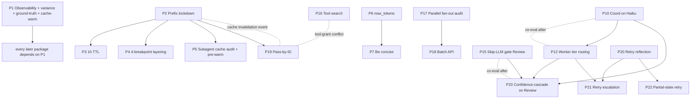

# Loom — Optimization Rollout Plan

**Purpose.** Slice the techniques catalogued in `lifecycle-optimizations-research.md` into **atomic, independently-shippable packages**, each evaluable in isolation and cleanly reversible. Goal: gate every package through the eval harness; keep what wins; drop what doesn't.

**Companion doc.** `lifecycle-optimizations-research.md` is the technique catalogue (what + why). This doc is the rollout plan (how + when).

**Version note.** This is the v2.1 plan. v1 was refactored after a critical integrity review into v2; v2 was reviewed again and 7 follow-on issues (P27 mis-tagged rollback class, P11/P17 audit-class wording, mermaid graph selectivity, rule-9 propagation to P14/P20/P21, missing D8 model-switch detector, changelog v1-numbering ambiguity, dotted-edge convention) were patched into v2.1. See the v1→v2 changelog at the bottom for full traceability.

---

## Slicing principles

The catalogue lists ~45 techniques. Naïve "ship them all" loses the ability to attribute wins. Naïve "one technique = one package" produces 45 micro-rollouts, most too small to register in the eval. The rules below are the compromise.

1. **One hypothesis per package.** Each package must be one sentence: "this should move metric X by ≥Y%, without regressing quality bar Z." If it needs two sentences, split it.
2. **One layer per package.** Don't mix Prompt-layer (SKILL wording) changes with Connection-layer (dispatcher) changes in one package — if it wins, you won't know which dimension paid.
3. **Co-ship only when *neither* item registers alone.** If item A's effect is invisible without item B, bundle. Otherwise split. Every bundle declares its empirical justification (why neither alone would register).
4. **Observability before optimization.** Telemetry ships first as Package P1. Nothing else can be evaluated without it. P1 is also where the eval-harness's *noise floor* gets measured — without that number, all sub-15% thresholds are coin-flips.
5. **Foundational maturity first, experimental last.** Order packages by maturity tag (F → D → E) within each category. Stop the F/D wave before touching E.
6. **Single-commit rollback where honest; explicit teardown where not.** Every package declares a **Rollback class**: `none` (audit-only package, no behavioural change to revert), `commit` (revert one commit), `config` (flip a flag), or `teardown` (revert commit + cleanup checklist — caches, Redis instances, sandboxes, running services, etc.). Don't claim `commit` rollback for a package that creates persistent state.
7. **Each package names which prior package(s) it depends on.** Dependencies are explicit; eval order respects them.
8. **Each package names its co-eval set.** Some packages change the *baseline* that an earlier package was measured against (per-model caches, shifted worker mix, additive tool grants that invalidate the cache prefix). Each package's **Co-eval set** lists prior packages whose deltas must be re-measured once this one lands. A "Keep" verdict for an earlier package is provisional until co-evaluation confirms it still wins against the new baseline.
9. **Noise-floor discipline.** Any threshold below 15% must be stated as "≥3σ of measured baseline variance" — where σ is computed in P1's deliverable D4. Sub-noise thresholds get N≥5 paired-run evaluation, not single-run.
10. **Audit packages are first-class.** Some packages exist to *verify a property is already true*, not to change anything. They carry an expected delta of zero and a quality bar of "no observed behavioural change". P11, P17, and pre-investigation gates on P5 are this class.

---

## How to use this doc — the eval loop

### The six-number metric stack

Every eval run reports these six numbers, per phase and per total:

| Metric | What it captures |
|---|---|
| **Total tokens** (input + output) | Headline cost |
| **Cache-hit ratio** | `cache_read / (cache_read + cache_write + input)` |
| **Output tokens** | The 3-10× expensive half of the bill |
| **Wall-clock** | User-facing latency |
| **Task success rate** | Quality bar 1 — does the baseline project still complete? |
| **Review finding delta** vs ground truth | Quality bar 2 — does Review still catch what it used to catch? |

### The per-package workflow

```
┌──────────────────────────────────────────────────────────────┐
│  1. Capture baseline snapshot (six-number stack)             │
│     — using the cache-warming protocol declared by Pn        │
│                                                              │
│  2. Implement Pn (single commit on a branch)                 │
│                                                              │
│  3. Re-run eval harness N times (N from Pn.eval_protocol)    │
│     on the same baseline project                             │
│                                                              │
│  4. Compute deltas:                                          │
│     • target metric: must move ≥ Pn.threshold                │
│     • quality metrics: must hold within Pn.quality_bar       │
│     • if Pn has co-eval set: also re-measure prior packages  │
│       to confirm their wins survived this change             │
│                                                              │
│  5. Decide: Keep / Refine / Drop                             │
│     • Keep    = target moved AND quality held AND co-eval ok │
│     • Refine  = target moved but quality regressed —         │
│                 investigate; don't move on                   │
│     • Drop    = target didn't move OR quality regressed      │
│                 without recovery path → revert per           │
│                 Pn.rollback_procedure                        │
│                                                              │
│  6. If Keep → Pn joins the baseline; freeze commit; move on. │
│     If Drop → revert; baseline unchanged; move on.           │
└──────────────────────────────────────────────────────────────┘
```

### Cache-warming protocol

A package's measured delta depends on whether the cache was cold or warm at eval time. Without a consistent protocol, cache-related packages (P2–P5, P19) will produce un-attributable wins.

Three named modes. Each package declares which it uses:

- **Cold** — flush the KV cache (or wait past TTL), restart subagent processes, fresh API session. First measurement.
- **Warm** — run 3 priming evals against the baseline before the measurement run. Subsequent N=5 measurement runs all share a warmed cache.
- **Steady-state** — run 5 priming evals; throw away the first 2; average the last 3. For packages whose delta depends on the cache being in long-term equilibrium.

Default mode per category:
- P1 (observability): no mode — instrumentation only.
- P2–P5 (cache hygiene): both Cold *and* Warm, reported separately.
- All others: Warm.

### P1's six deliverables

P1 is more than a dashboard. It is the entire evaluability foundation. **No other package can be evaluated until all six deliverables are in place.**

| ID | Deliverable | Why it matters |
|---|---|---|
| D1 | Cache-hit-rate KPI per subagent (research 3.1) | Per-subagent attribution of cache wins |
| D2 | Per-phase / per-subagent token attribution (research 3.2) | Where the cost is |
| D3 | Cost-distribution healthcheck alarm (research 3.3) | Augment's 9.8% / 70.6% coord/worker ratio as a regression alarm |
| D4 | **Eval-harness variance measurement** | N≥5 reruns on unchanged baseline; compute σ for each metric in the stack; publish as `baseline-variance.json`. Every threshold under 15% in this doc must be re-stated as "≥3σ" once D4 is published. |
| D5 | **Ground-truth Review-findings file** | A fully-non-gated Review pass on the baseline project, with every Blocker/Major/Minor/Note serialised. Persisted as `baseline-review-findings.json`. Used as the diff target for any package whose quality bar is "no Blockers escape" (P15, P23). |
| D6 | **Cache-warming protocol implementation** | Three modes (Cold / Warm / Steady-state) selectable per eval run; per-mode results reported separately. |
| D7 | OpenTelemetry GenAI semantic conventions (research 3.4) | Standard span attrs so dashboards work with Datadog/Honeycomb/Langfuse without custom adapters |
| D8 | **Intra-session model-switch detector** | Per-session alarm that fires when a single subagent thread switches between model tiers (Sonnet ↔ Opus ↔ Haiku) between calls. Per-model caches mean a mid-session switch throws away the prefix; without this detector, the invariant from research 1.8 is asserted but unenforced. Implements as a dashboard counter + alarm threshold (>0 mid-session switches in 24h). |

---

## Recommended ship sequence (first 19 packages)

Top-to-bottom in suggested ship order. Beyond P19 the gains thin out and the work gets heavier; revisit after the wave lands.

| # | Package | Category | Cost | Target metric | Mat. | Rollback class |
|---|---|---|---|---|---|---|
| P1  | Observability foundation (six deliverables D1–D7) | Telemetry | Med | (prereq — no eval) | F | config |
| P2  | Cache prefix lockdown | Cache hygiene | Low | cache-hit ↑ | F | commit |
| P3  | 1-hour TTL on static prefix | Cache hygiene | Low | cache-create ↓ | F | config |
| P4  | Four-breakpoint layering + tail-safety breakpoint | Cache hygiene | Low | cache-create ↓ further | F | config |
| P5  | Subagent cache audit + boot-block pre-warming | Cache hygiene | Low-Med | per-subagent cache-create ↓ | D | config |
| P6  | `max_tokens` discipline | Output | Low | output tokens ↓ | F | config |
| P7  | "Be concise" SKILL pass | Output | Low | output tokens ↓ further | F | commit |
| P8  | Constrained JSON decoding | Output | Low | parse-retries ↓ | F | config |
| P9  | Return-by-reference enforcement | Output | Low | coord inbox ↓ | F | commit |
| P10 | Coordinator demoted to Haiku | Routing | Low | coord cost ↓ | F | config |
| P11 | Coordinator transcript-content audit *(zero-delta verification)* | Routing | Low | (audit — no delta) | F | none |
| P12 | Worker tier routing (Sonnet/Opus) | Routing | Med | total cost ↓ | F | config |
| P13 | Selective extended thinking | Routing | Low | thinking-output ↓ | F | config |
| P14 | Pre-agent shell prefetch | Gating | Low | per-subagent input ↓ | D | commit |
| P15 | Skip-LLM relevance gate (Review) | Gating | Low | Review call count ↓ | D | commit |
| P16 | Tool-search deferred loading | Gating | Low | tool-context tokens ↓ | D | config |
| P17 | Parallel fan-out audit *(zero-delta verification)* | Dispatch | Low | (audit — no delta) | F | none |
| P18 | Batch API for AFK tasks | Dispatch | Low-Med | AFK-task cost ↓50% | F | config |
| P19 | Progressive disclosure / pass-by-ID | Compression | Low | subagent input ↓ | D | teardown |

After P19 the doc lists the remaining main-wave packages (P20–P32) plus the experimental "park" set (Z1–Z9).

---

## Dependency & co-eval graph

**Selective graph — not exhaustive.** The graph below shows core ship-order edges and the co-eval / invalidation edges most likely to surprise the eval engineer. Every package's *full* dependency, co-eval, and invalidation set is in its per-package **Depends on** and **Co-eval set** fields. If a package's text references a relationship not shown in the graph, treat the text as authoritative.



**Reading the edges.** Three edge types, each with an unambiguous reading rule — read the label, not the arrow direction:

- **Solid arrow `A --> B`** — hard dependency. B cannot ship until A has shipped and passed eval.
- **Dotted edge labelled `co-eval after`** between A and B — when the *later-shipped* of A/B lands, the *earlier-shipped* package's previously-measured win must be re-confirmed against the new baseline. Read symmetrically; ship order determines which package gets re-measured.
- **Dotted edge labelled `tool-grant conflict` / `cache invalidation event`** between A and B — whichever package ships second perturbs a cache or tool list the first one's measurement relied on. The second package's eval must include a re-warming pass and re-measurement of the first's metric.

All dotted edges are *symmetric* under ship-order swap — the convention does not depend on arrow direction in the source.

---

# Package catalogue

Each entry uses the same ten-line form:

> **Pn — Name** *(category, Cost / Improvement / Maturity / Layer)*
> **Hypothesis.** One sentence with target metric + threshold.
> **Touches.** Concrete files / surfaces.
> **Eval signal.** Specific metric and threshold (≥3σ if sub-15%); cache-warming mode; N runs.
> **Quality bar.** What must not regress, measured *how*.
> **Depends on.** Hard dependencies (prior packages).
> **Co-eval set.** Prior packages whose deltas must be re-measured after this one lands.
> **Rollback class.** `commit` / `config` / `teardown`.
> **Rollback procedure.** Concrete steps.
> **Keep if / Drop if.** Decision criteria.

---

## Phase A — Telemetry foundation

### P1 — Observability foundation
*(Telemetry, Med / Indirect-large / F / I)*
**Hypothesis.** None — this is a prereq. Six deliverables (D1–D7 above) define done.
**Touches.** API-call wrapper (tag every call with `phase`, `subagent`, `task_id`, `model`); dashboard for cache-hit / token attribution / coord-worker ratio; OpenTelemetry GenAI span emitter; variance-measurement harness (5-run baseline against unchanged code); ground-truth Review-findings extractor (one-shot full-Review pass, persist `baseline-review-findings.json`); cache-warming runner (Cold / Warm / Steady-state modes).
**Eval signal.** Six deliverables present and producing data. No cost change expected; instrumentation overhead must be <2% wall-clock.
**Quality bar.** Instrumentation does not change model behaviour (verify by comparing 5 pre-instrumentation runs against 5 post-instrumentation runs — Review findings identical).
**Depends on.** Nothing.
**Co-eval set.** None — it has no upstream wins to invalidate.
**Rollback class.** `config` — disable wrapper tagging; dashboards stop receiving data but model behaviour is unaffected.
**Rollback procedure.** Toggle telemetry-on/off flag in dispatcher config; revert OpenTelemetry tracer registration if added.
**Keep if.** All six deliverables produce data; variance measurement publishes σ for each of the six metrics; ground-truth file captured; warming protocol exercisable. **Drop if.** Instrumentation adds measurable latency >2% — fix and re-ship.

---

## Phase B — Cache hygiene

### P2 — Cache prefix lockdown
*(Cache, Low / High / F / P+I)*
**Hypothesis.** Cache-hit ratio (Warm mode) rises from baseline to ≥70% averaged across all subagents.
**Touches.** Three changes that must co-ship: (a) tool-schema serializer enforces deterministic key order and frozen tool order; (b) SKILL prompts strip dates/UUIDs/timestamps from the system prompt; (c) SKILL prompts move dynamic data into a non-cached "system-reminder" tail block in the user turn. **Empirical justification for bundling**: items (a) and (b)+(c) each individually leave the *other* failure mode active, so single-shipping either produces no measurable cache-hit ratio change; bundling is required for the signal to register. (If P2 ships and the gain is unexpectedly small, future investigation can split (a) from (b)+(c) post-hoc to attribute.)
**Eval signal.** Per-subagent `cache_read / total_input` ≥ 0.7 averaged across N=5 Warm-mode runs. Also report Cold-mode run separately (expected gain there is smaller — first-call cache_creation only drops; cache_read still 0).
**Quality bar.** Behaviour unchanged on baseline project — Review findings file diffs zero against ground truth (D5).
**Depends on.** P1.
**Co-eval set.** None.
**Rollback class.** `commit` — revert serializer + SKILL edits in one commit.
**Rollback procedure.** `git revert <commit>`. No state cleanup needed.
**Keep if.** Cache-hit ratio (Warm) ≥ 70% with no quality regression. **Drop if.** Cache-hit doesn't move (means dynamic data is leaking from a third path not addressed by (a)/(b)/(c) — investigate before re-shipping).

### P3 — 1-hour TTL on static prefix
*(Cache, Low / Med-High / F / I)*
**Hypothesis.** `cache_creation_input_tokens` drops ≥30% on idle-spaced workloads vs P2 baseline. (Threshold is a target, not derived from cited evidence — APC/AIC only give crossover math; revise after first eval.)
**Eval signal.** Across a Steady-state run with gaps >5min, per-subagent `cache_creation_input_tokens` drops; per-subagent `cache_read_input_tokens` rises. Compare against P2-Warm baseline.
**Quality bar.** Same as P2 (Review findings unchanged vs D5).
**Depends on.** P2 (no point lengthening TTL if the prefix is still mutating).
**Co-eval set.** None.
**Rollback class.** `config` — TTL is a single config value.
**Rollback procedure.** Flip TTL back to 5m on the outermost breakpoint.
**Keep if.** Creation tokens ↓ ≥30% in Steady-state mode. **Drop if.** No drop (eval workload is too dense — gaps shorter than 5min anyway; defer until eval covers idle workflows).

### P4 — Four-breakpoint layering + tail-safety breakpoint
*(Cache, Low / Medium / F / I)*
**Hypothesis.** Cache-hit ratio holds (no degradation vs P3) even when inner per-task context churns; long sessions don't drop off the 20-block lookback cliff.
**Touches.** Three inner `cache_control` breakpoints (system+skills 1h, phase context 5m, task context 5m) plus a fourth tail-safety breakpoint near the live tail (research 1.4). Bundles the breakpoint-layering and lookback-safety items because both are about *where* `cache_control` markers go in the same request — a single configuration surface.
**Eval signal.** On Steady-state runs where only the task context changes between calls, `cache_read` ≥ size of (tools + system + skills) prefix. On long-session runs (≥20 turns), no first-time `cache_creation` for the static prefix.
**Quality bar.** Same as P2.
**Depends on.** P3.
**Co-eval set.** None.
**Rollback class.** `config` — breakpoint set is a single config.
**Rollback procedure.** Drop back to single outer breakpoint.
**Keep if.** Inner-churn runs preserve outer-prefix cache hits; long sessions don't fall off the lookback cliff. **Drop if.** No measurable difference (means task churn and long sessions aren't current bottlenecks — focus elsewhere).

### P5 — Subagent cache audit + boot-block pre-warming
*(Cache, Low-Med / Medium / D / I)*
**Hypothesis.** *Conditional.* Per-subagent first-call `cache_creation_input_tokens` drops ≥40%.
**Pre-investigation gate (must complete before scheduling).** Run a one-shot probe: instrument *one* subagent kick and check whether `cache_control` is set on its boot block and whether `enablePromptCaching` is true. **If yes** (Loom dispatches via Claude Code Task tool with sane defaults, or already configures the SDK correctly), P5 collapses to a one-line assertion: re-run the probe quarterly as a regression test. Mark P5 as "verified — no work needed". **If no** (Loom uses Anthropic Agent SDK directly with defaults, or omits cache_control on the boot block), P5 proceeds as scheduled.
**Touches.** Force `enablePromptCaching: true` on subagent spawn; add explicit `cache_control` breakpoint on the subagent's boot env block; add phase-boundary pre-warming (research 1.6 — fire a `max_tokens=1` request at phase transition to hot-load the next phase's static prefix).
**Eval signal.** Per-subagent first-call `cache_creation_input_tokens` drops materially; TTFT on first call of each phase drops (pre-warming benefit).
**Quality bar.** Same as P2.
**Depends on.** P1, P2.
**Co-eval set.** None.
**Rollback class.** `config` — SDK flags + breakpoint config.
**Rollback procedure.** Restore SDK defaults; remove cache_control on boot block; disable pre-warming hook.
**Keep if.** First-call `cache_creation` ↓ ≥40% AND probe confirmed the bug existed. **Drop if.** Probe shows no bug exists (collapse to assertion-only).

---

## Phase C — Output economy

### P6 — `max_tokens` discipline
*(Output, Low / Medium / F / I)*
**Hypothesis.** Total output tokens per baseline project drops ≥15%.
**Touches.** Per-subagent dispatcher config — explicit `max_tokens` per subagent role: classifier 5, kanban mutator 200, narrative per-phase-tuned (Spec/Design 4000, Build 2000, Review 8000).
**Eval signal.** Aggregate output tokens ↓ ≥15%, Warm mode, N=5. If σ from D4 indicates noise floor >5%, restate threshold as ≥3σ.
**Quality bar.** Zero truncation incidents — every subagent's RETURN payload is structurally complete (schema-valid).
**Depends on.** P1.
**Co-eval set.** None.
**Rollback class.** `config`.
**Rollback procedure.** Remove per-subagent caps; revert to default.
**Keep if.** Output ↓ ≥15%, zero truncation. **Drop if.** Truncation incidents — Refine caps upward, don't drop the technique.

### P7 — "Be concise" SKILL pass
*(Output, Low / Low-Med / F / P)*
**Hypothesis.** Average output tokens per call drops by ≥3σ beyond P6 baseline. (Re-stated as 3σ because raw 10% threshold likely lives inside eval noise.)
**Touches.** Every SKILL prompt — add "no preamble, no filler, ≤N words, data only" instruction.
**Eval signal.** Mean output-token count per subagent ↓ ≥3σ (where σ comes from D4) on N=5 Warm runs.
**Quality bar.** Review findings file diffs zero against ground truth D5.
**Depends on.** P1, P6 (otherwise the gain shows up in P6's metrics, not P7's).
**Co-eval set.** None.
**Rollback class.** `commit` — pure SKILL edits.
**Rollback procedure.** `git revert`.
**Keep if.** Output ↓ ≥3σ with quality held. **Drop if.** Quality regresses (model goes too terse and loses required content) OR gain inside 3σ noise.

### P8 — Constrained JSON decoding
*(Output, Low / Low-Med / F / I)*
**Hypothesis.** Parse-retry rate on structured-output subagents drops ≥80% with no token-cost regression.
**Touches.** Per-subagent flag — enable JSON-schema-constrained decoding on subagents whose RETURN type is JSON-shaped (kanban mutators, classifiers, dispatch decisions). Do *not* apply to free-form narrative subagents (Spec/Design narrative output).
**Eval signal.** Across the baseline project, count parse-failure retries (currently emitted on schema-violation) — must drop ≥80%. Total tokens per affected subagent must not increase (constrained decoding can sometimes use *more* tokens than free text — guard against this).
**Quality bar.** No new "RETURN unparseable" failures; no new "wrong field type" downstream errors.
**Depends on.** P1.
**Co-eval set.** None.
**Rollback class.** `config` — per-subagent flag.
**Rollback procedure.** Disable flag.
**Keep if.** Parse-retry rate ↓ ≥80% AND total token cost not up. **Drop if.** Token cost rises (means the schema is forcing more verbose output than free-form would have produced — Refine the schema).

### P9 — Return-by-reference enforcement
*(Output, Low / Medium / F / P)*
**Hypothesis.** Coordinator inbox token count drops ≥20%.
**Touches.** Audit every typed RETURN schema — subagents return IDs (`evidence: ["US-014", "T-031"]`), not pasted artifact content. Tighten schemas to *disallow* free-text content fields where an ID would suffice.
**Eval signal.** Coordinator's per-call input-token count ↓ ≥20%.
**Quality bar.** Coordinator's downstream dispatch decisions are unchanged (compare board-mutation log against pre-P9 run on same baseline project).
**Depends on.** P1.
**Co-eval set.** None.
**Rollback class.** `commit` — schema edits + SKILL nudges.
**Rollback procedure.** `git revert`.
**Keep if.** Coord inbox ↓ ≥20%, dispatch decisions unchanged. **Drop if.** Coord starts re-asking subagents for content (schema is *too* tight — Refine).

---

## Phase D — Routing & gating

### P10 — Coordinator demoted to Haiku
*(Routing, Low / High / F / C)*
**Hypothesis.** Coordinator-attributed token cost drops ≥50% with zero behavioural regression measured against a Sonnet-coord reference.
**Touches.** Per-subagent model config — coordinator + board-mutation subagents only on Haiku.
**Eval signal.** Coordinator-attributed token cost ↓ ≥50%, N=5 Warm runs. *Critically*: precision/recall on coordinator decisions — for each baseline run, capture every board mutation Haiku-coord emits and diff against a Sonnet-coord reference run on the *same input*. Precision ≥ 99%, recall ≥ 99% (with 30 baseline tasks, this allows 0 miscategorisations across the 5-run set; tightening as the eval suite grows).
**Quality bar.** Two-part: (a) liveness — every ready task fires, no stuck cards; (b) **correctness — board-mutation diff against Sonnet-coord reference is empty across N=5 runs and ≥5 baseline projects** (not just one). If only one baseline project is available, run it 5× and treat the 150-decision sample as the precision/recall basis.
**Depends on.** P1.
**Co-eval set.** None on its own, but P12 will list P10 in *its* co-eval set — meaning after P12 lands, this measurement gets re-run.
**Rollback class.** `config` — model assignment.
**Rollback procedure.** Set coord model back to Sonnet in config.
**Keep if.** Coord cost ↓ ≥50% AND precision ≥99% AND recall ≥99% across the multi-project reference diff. **Drop if.** Even one miscategorisation in the diff (means Haiku misroutes — silent quality regression is the failure mode this catches).

### P11 — Coordinator transcript-content audit *(zero-delta verification)*
*(Routing, Low / Audit / F / C)*
**Hypothesis.** No package — this is a verification that an invariant already declared in `lifecycle-concepts-toc.md` §8 holds in the actual codebase. Expected delta: zero.
**Background.** Concepts doc §8 says the Coordinator has only `Bash + atomic-write` — no `Read`, no `Edit`, no `Write`. If that's accurate, the "Coordinator never reads worker transcripts" item from research catalogue 16.2 is already shipped. This package verifies it.
**Touches.** Codebase audit only: (a) confirm Coordinator's actual tool grant in code matches §8; (b) verify no path inlines transcript content *into* the typed RETURN payload (a Coordinator that doesn't `Read` transcripts can still receive them if a worker pastes them into its own RETURN); (c) if either (a) or (b) is violated, *that becomes a separate package* — file it and proceed without scheduling further work in P11.
**Eval signal.** Audit produces a "pass" verdict OR identifies specific gaps; if gaps found, gaps become new packages with their own hypotheses. P11 itself ships zero behavioural change.
**Quality bar.** Behaviour unchanged on baseline project.
**Depends on.** P1.
**Co-eval set.** None.
**Rollback class.** `none` (audit-only). P11 itself ships no behavioural change to revert. If the audit *uncovers a violation*, the corrective work is a separate package with its own rollback class.
**Rollback procedure.** N/A — no behaviour-affecting commits land in P11.
**Keep if.** Audit shows §8 holds. **Drop if.** Audit shows §8 is violated — but then the *real* fix-packages get scheduled, and P11 becomes the audit step in their predecessor list.

### P12 — Worker tier routing (Sonnet/Opus)
*(Routing, Med / High / F / C)*
**Hypothesis.** Total project cost drops ≥40% beyond P10 baseline.
**Touches.** Routing table — Sonnet for Spec/Design/Build worker subagents; Opus for Review and hard-gate subagents only.
**Eval signal.** Total project cost ↓ ≥40% vs P10-only baseline.
**Quality bar.** Review findings diff vs ground-truth D5 within tolerance — zero new Blockers, ≤1 new Major, ≤5 new Minor across N=5 runs.
**Depends on.** P10 (routing infrastructure must exist).
**Co-eval set.** **P10 must be re-measured after P12 lands.** Caches are per-model (research 1.8); changing the worker mix changes the cache pattern the Haiku-coord was previously measured against. Re-run P10's eval (Sonnet-coord vs Haiku-coord diff) with the new mix.
**Rollback class.** `config` — routing table.
**Rollback procedure.** Revert routing table to all-Sonnet.
**Keep if.** Cost ↓ ≥40% with quality bar held AND P10 co-eval still passes. **Drop if.** Sonnet on Build introduces ≥2 new Blockers (Refine to Opus-on-Build).

### P13 — Selective extended thinking
*(Routing, Low / Medium / F / P)*
**Hypothesis.** Thinking-output tokens drop ≥30% project-wide with no decision-quality regression.
**Touches.** Per-phase `budget_tokens` flag — extended thinking off by default, on only for: Plan dependency-graph generation, Review architectural-gate verdicts.
**Eval signal.** Thinking-output token count ↓ ≥30%, N=5 Warm runs.
**Quality bar.** No new Major findings on architectural decisions (Plan-phase dependency graph correctness; Review architectural verdicts).
**Depends on.** P12.
**Co-eval set.** P12 — re-measure (small effect expected).
**Rollback class.** `config` — per-phase flag.
**Rollback procedure.** Re-enable extended thinking everywhere.
**Keep if.** Thinking tokens ↓ ≥30%, no architectural regressions. **Drop if.** Decision quality drops (Refine which phases get the budget).

---

## Phase E — Deterministic shortcuts

### P14 — Pre-agent shell prefetch
*(Gating, Low / High / D / C)*
**Hypothesis.** Per-subagent input tokens drop by ≥max(15%, 3σ from D4) on subagents that previously discovered context via tool calls.
**Touches.** Dispatcher pre-step — before invoking a subagent, run deterministic shell calls (`git diff`, `ls`, `gh pr view`, lint summary) and pass output as bounded text in the prompt.
**Eval signal.** Average input tokens per subagent ↓ ≥max(15%, 3σ); per-subagent tool-call count ↓. Use N=5 Warm runs; if σ from D4 places 15% inside the noise band, the 3σ floor binds.
**Quality bar.** Task success rate held (D4 σ-margin); no new "missing context" Review findings.
**Depends on.** P1.
**Co-eval set.** None.
**Rollback class.** `commit` — dispatcher pre-step.
**Rollback procedure.** `git revert`.
**Keep if.** Input ↓ ≥15%, success rate held. **Drop if.** Subagents now miss context (pre-step output too narrow — Refine).

### P15 — Skip-LLM relevance gate (Review)
*(Gating, Low / High / D / C)*
**Hypothesis.** Review-phase call count drops ≥25%.
**Touches.** Rule file in Review skill — deterministic file-glob filters that decide whether a Review subagent fires at all (e.g., only fire security-review subagent if diff touches `auth/`).
**Eval signal.** Review subagent call count ↓ ≥25%, N=5 Warm runs.
**Quality bar.** **Zero Blockers and zero Majors slip through, measured by diff against ground-truth D5.** Every gate is a *negative* filter — rules skip the LLM only if the file-scope rules out the finding type. Gate must never override a "should review" verdict.
**Depends on.** P1 (specifically D5 — the ground-truth Review file).
**Co-eval set.** None.
**Rollback class.** `commit` — rule file.
**Rollback procedure.** Delete rule file.
**Keep if.** Call count ↓ ≥25% AND D5 diff shows zero missed Blockers/Majors. **Drop if.** Even one Blocker or Major slips through (means a rule is mis-scoped — Refine).

### P16 — Tool-search deferred loading
*(Gating, Low / High / D / I)*
**Hypothesis.** Tool-related context tokens drop ≥50% on tool-heavy subagents.
**Touches.** Anthropic `tool_search` tool replaces inline tool definitions on any subagent with >5 declared tools.
**Eval signal.** Per-subagent input tokens attributable to tool schemas ↓ ≥50%.
**Quality bar.** Zero "tool not found" failures; tool-fluency preserved.
**Depends on.** P1.
**Co-eval set.** **P2 — adding `tool_search` changes the tool list, which perturbs the cache prefix.** After P16 ships, re-warm the cache and re-measure P2's cache-hit ratio. **P19 — if P19 ships before P16, the `read_artifact` tool is in the catalogue; if P16 ships first, P19's added tool will perturb its measured tool-token baseline.** Declare ordering: if P16 ships first, P19 is its co-eval target. If P19 ships first, P16 is.
**Rollback class.** `config` — per-subagent flag.
**Rollback procedure.** Revert to inline tool list.
**Keep if.** Tool-token ↓ ≥50%, zero "tool not found". **Drop if.** Subagents lose tool fluency (Refine — pre-seed common tools, defer only the long tail).

---

## Phase F — Dispatch

### P17 — Parallel fan-out audit *(zero-delta verification)*
*(Dispatch, Low / Audit / F / C)*
**Hypothesis.** No package — verification that concepts-doc §11.B's parallel-dispatch claim holds. Expected delta: zero on the audit itself.
**Touches.** Codebase audit + instrumentation: confirm `ready_tasks = tasks.filter(blocked_by ⊆ done AND file_scope disjoint)` are dispatched *concurrently*, not serially. Add an explicit "concurrent dispatch count" metric in the eval harness so future regression is visible.
**Eval signal.** Build-phase wall-clock matches theoretical parallel-execution lower bound (sum of longest path through the DAG, not sum of all tasks). If currently serial, the audit becomes a *fix* package with hypothesis: Build wall-clock ↓ ≥30%.
**Quality bar.** No file-scope collisions (concurrent writes to the same path).
**Depends on.** P1.
**Co-eval set.** None.
**Rollback class.** `none` (audit-only) if §11.B holds; promotes to `commit` only if the audit reveals a fix is required.
**Rollback procedure.** N/A if audit-only; `git revert` the dispatcher change if a fix shipped.
**Keep if.** Audit shows §11.B holds AND new metric is in place. **Drop if.** Audit reveals serial dispatch — then this becomes a real fix package.

### P18 — Batch API for AFK tasks
*(Dispatch, Low-Med / High / F / I)*
**Hypothesis.** Per-token cost of AFK-classified Build tasks drops ~50% (Anthropic Batch discount).
**Touches.** Dispatcher — route AFK-class Build tasks (and nightly Review sweeps) through Anthropic Message Batches API. Latency tradeoff is acceptable by definition for AFK class.
**Eval signal.** Cost per AFK task ↓ ~50%; batch latency within 24h SLO (most <1h).
**Quality bar.** Output quality unchanged vs live dispatch (same Review findings on AFK task outputs).
**Depends on.** P17 (parallel dispatcher must exist).
**Co-eval set.** None.
**Rollback class.** `config` — dispatcher routing flag.
**Rollback procedure.** Route AFK tasks back through live dispatch.
**Keep if.** Cost ↓ ~50%, SLO held. **Drop if.** Batch latency exceeds SLO consistently (Refine SLO, don't drop technique).

---

## Phase G — Context compression

### P19 — Progressive disclosure / pass-by-ID
*(Compression, Low / High / D / C)*
**Hypothesis.** Average subagent input tokens drop ≥30% on subagents that previously received inlined spec/design content.
**Touches.** Add `read_artifact(id)` tool to subagent tool grants. Replace inlined spec/design/plan content in SKILL prompts with "use `read_artifact(US-NNN)` if you need the full text". Audit that subagents use it.
**Eval signal.** Average subagent input tokens ↓ ≥30% on doc-ingesting subagents; `read_artifact` tool-call count rises proportionally.
**Quality bar.** No task-success regression; no Review findings about "subagent didn't read the spec".
**Depends on.** P1, P2.
**Co-eval set.** **P2 — adding `read_artifact` to tool grants is an additive tool-list change that invalidates the cached tool-prefix.** After P19 lands, re-warm and re-measure P2's cache-hit ratio. If P16 also lands before this, declare which order applied and re-warm twice.
**Rollback class.** `teardown` — not `commit`. Adding the tool changes subagent tool grants; reverting requires removing the tool *and* ensuring no persisted artifact-ID references remain in any in-flight task's state. Procedure below.
**Rollback procedure.** (1) Revert SKILL inlining edits. (2) Remove `read_artifact` from tool grants. (3) Audit in-flight tasks for un-dereferenced ID references; if any, dereference them by running one full re-inline pass before the revert. (4) Re-warm cache.
**Keep if.** Input ↓ ≥30%, quality held, P2 co-eval still passes. **Drop if.** Subagents start failing to dereference IDs (Refine — make the tool more discoverable).

### P20 — Retry reflection (failure-summary block)
*(Retries, Low-Med / High success-rate / D / P)*
**Hypothesis.** Per-task retry-2 and retry-3 success rate rises by ≥max(10pp, 3σ from D4 on the retry-success-rate metric); total attempts per task drops. **Baseline for this measurement is the pre-P20 retry loop without escalation** — P20's effect is measured in isolation; P21 will measure the *additional* escalation gain on top.
**Touches.** Dispatcher carries a `previous_attempt_failure_summary` block forward into attempt N+1 (not the raw transcript). SKILL prompt instructs the subagent to read it.
**Eval signal.** Retry-2 success rate ↑ ≥max(10pp, 3σ) compared against ground-truth retry trace; average attempts-per-task ↓. If σ for success rate is large (sparse failure events), require N≥10 paired runs instead of 5.
**Quality bar.** First-attempt success rate unchanged (failure-summary block must not leak into attempt 1).
**Depends on.** P1.
**Co-eval set.** None.
**Rollback class.** `commit`.
**Rollback procedure.** Revert dispatcher + SKILL edits.
**Keep if.** Retry-2 success ↑ ≥10pp, first-attempt unchanged. **Drop if.** First-attempt accuracy regresses (means the reflection block is leaking — fix dispatcher).

### P21 — Retry escalation
*(Retries, Low / Medium / D / P+C)*
**Hypothesis.** Retry-3 success rate rises by ≥max(15pp, 3σ from D4) **vs the P20 baseline** (additional gain on top of reflection alone). Measured by running retry-3 with reflection-only (the P20 condition) vs reflection + escalation (the P21 condition) on the same task set.
**Touches.** Dispatcher — retry-1 same prompt; retry-2 adds reflection (per P20); retry-3 escalates Sonnet → Opus.
**Eval signal.** Retry-3 success rate ↑ ≥max(15pp, 3σ) vs P20-only baseline; N≥10 paired runs if retry-3 is rare.
**Quality bar.** Per-task cost ceiling not blown (escalation is one tier, capped); cost per escalated retry within 3× the non-escalated retry cost.
**Depends on.** P12 (Opus tier must be wired), P20 (reflection block must be in place).
**Co-eval set.** P20 — re-measure first-attempt + retry-2 success rate to confirm P20's wins are stable after escalation is added.
**Rollback class.** `config`.
**Rollback procedure.** Revert dispatcher escalation rule.
**Keep if.** Retry-3 success ↑ ≥15pp on top of P20, cost ceiling held. **Drop if.** Cost ceiling blown (Refine — escalate only on specific failure types).

### P22 — Partial-state retry
*(Retries, Med / Medium / D / C)*
**Hypothesis.** Token cost per retry attempt drops ≥30% by re-running only the failed step. **Orthogonal to P20/P21** — measured against the P20+P21 baseline; reduces cost-per-retry, not success-rate-per-retry.
**Touches.** Dispatcher state machine — on retry, preserve outputs of succeeded steps; only re-invoke the failed step with diff context.
**Eval signal.** Tokens per retry attempt ↓ ≥30%, success rates from P20/P21 unchanged.
**Quality bar.** No "stale state" failures — re-run step picks up updated inputs correctly.
**Depends on.** P20 (state machine for retry must exist).
**Co-eval set.** P20, P21 — re-measure success rates to confirm partial-state retry doesn't break the gains there.
**Rollback class.** `commit`.
**Rollback procedure.** Revert dispatcher state machine to full re-run.
**Keep if.** Retry cost ↓ ≥30% AND P20/P21 success rates unchanged. **Drop if.** Stale-state issues (Refine — fully reset on detected staleness).

### P23 — Confidence-cascade on Review
*(Routing, Med / High / D / C)*
**Hypothesis.** Average Review-phase cost drops ≥40% by cheap-first lint, expensive-only-on-flag. Cited evidence (research 9.1): FrugalGPT bracket is 50–70% real-world; 40% is conservative.
**Touches.** Review skill — Haiku first-pass lint; escalate to Sonnet only on findings; escalate to Opus only on architectural-class findings.
**Eval signal.** Review-phase cost ↓ ≥40%; Blocker/Major catch rate unchanged.
**Quality bar.** **Zero Blockers and zero Majors missed**, measured by diff against ground-truth D5.
**Depends on.** P10, P12, **P15** (skip-LLM gate must already be in place — otherwise P23 partially captures wins that P15 would have, making attribution noisy).
**Co-eval set.** P15 — re-measure Review call count after cascade is in. P10, P12 — re-measure routing wins.
**Rollback class.** `commit`.
**Rollback procedure.** Revert Review skill to single-pass.
**Keep if.** Review cost ↓ ≥40%, D5 diff zero on Blockers/Majors. **Drop if.** Even one Blocker missed (Refine — lower escalation threshold).

### P24 — Active context trimming (scheduled compactor)
*(Compression, Med / Medium + accuracy / D / C)*
**Hypothesis.** Long-running phases stay within a defined context budget without truncation incidents; long-run Review finding precision unchanged or improved.
**Touches.** New compactor subagent runs at phase boundary (not on demand). Produces typed handoff summary; downstream phase reads summary, not transcript.
**Eval signal.** Phase-handoff input size capped at N tokens; long-run quality (Review-finding precision against D5) unchanged or improved.
**Quality bar.** No knowledge gaps reported in Review (specifically: no Review findings of the form "earlier phase decided X but later phase ignored it").
**Depends on.** P1.
**Co-eval set.** None.
**Rollback class.** `commit`.
**Rollback procedure.** Bypass compactor; pass full transcript at phase boundaries.
**Keep if.** Context budget held + quality held. **Drop if.** Knowledge gaps appear (Refine the must-preserve schema).

### P25 — Structured handoff schema (Factory/Amp pattern)
*(Compression, Med / Med + continuity / D / P+C)*
**Hypothesis.** Phase-boundary handoff input size drops ≥40% vs P24 baseline; continuity quality holds.
**Touches.** Replace P24's blob-summary handoff with a typed schema: `{intent, changes_made, decisions, open_questions, next_steps}`. Each field has a max token cap; serialiser enforces the schema. Sourcegraph Amp and Factory cite this beating built-in compaction.
**Eval signal.** Handoff input size ↓ ≥40% vs P24-only baseline; D5 diff unchanged.
**Quality bar.** Same as P24 — no "earlier phase decided X" knowledge gaps.
**Depends on.** P24 (compactor infrastructure must exist).
**Co-eval set.** P24 — re-measure its win against the structured handoff baseline.
**Rollback class.** `commit`.
**Rollback procedure.** Revert to P24 blob compactor.
**Keep if.** Handoff size ↓ ≥40% with no continuity regression. **Drop if.** Knowledge gaps appear (means the schema fields are missing a category — Refine schema).

### P26 — AST code-context retrieval (Build phase only)
*(Compression, Med / Medium / D / I)*
**Hypothesis.** Build-phase input tokens spent on code context drop ≥40%.
**Touches.** Build-phase retrieval layer — tree-sitter AST + import/call-graph slicing replaces embedding-based code chunks.
**Eval signal.** Code-context tokens per Build subagent ↓ ≥40%; build success rate unchanged or improved.
**Quality bar.** No new Review findings about missed code context.
**Depends on.** P1.
**Co-eval set.** None.
**Rollback class.** `commit`.
**Rollback procedure.** Revert retrieval layer.
**Keep if.** Code-context ↓ ≥40%, build success held. **Drop if.** Build regressions (AST slice too narrow — Refine).

### P27 — LLMLingua-2 pre-compressor (doc-heavy phases)
*(Compression, Med / Med-High / D / I)*
**Hypothesis.** Input tokens drop 2-5× on subagents that ingest reference docs >5K tokens.
**Touches.** Pre-processor service in front of doc-ingesting subagents.
**Eval signal.** Per-call input tokens on doc-ingesting subagents ↓ ≥50%; D5 diff unchanged.
**Quality bar.** No degradation in derived decisions.
**Depends on.** P1, P19 (P19 is the no-compression-needed alternative for ID-resolvable artifacts; only what survives P19 needs compression).
**Co-eval set.** P19 — re-measure to confirm pass-by-ID wins still hold.
**Rollback class.** `teardown` — LLMLingua-2 ships as a long-running pre-processor service with a loaded encoder model; reverting requires service decommission, not just a flag.
**Rollback procedure.** (1) Disable compressor flag in dispatcher; route requests directly to subagents. (2) Verify subagents fall through to direct dispatch on N=3 sanity runs. (3) Stop the LLMLingua-2 service; deprovision its instance. (4) Remove encoder-model weights from disk; purge any persisted compression-cache state. (5) Re-warm subagent caches (compression-stripped inputs shift the cached prefix shape).
**Keep if.** Input ↓ ≥50%, no quality regression. **Drop if.** Quality drops (Refine — compression ratio too aggressive).

### P28 — Code-execution-as-tool (MCP skill pattern)
*(Compression, Med / High / D / C)*
**Hypothesis.** Tool-output tokens drop ≥60% on subagents that previously chained N tool calls.
**Touches.** Sandboxed code-execution tool — subagent generates one script that calls N tools internally and emits only the final filtered slice as model-visible output.
**Eval signal.** Tool-output tokens per multi-tool subagent ↓ ≥60%.
**Quality bar.** Decision quality unchanged; sandbox enforces capability minimization (cannot escape the worker's declared file scope).
**Depends on.** P1.
**Co-eval set.** None.
**Rollback class.** `teardown` — sandbox is real infrastructure. Disabling the tool leaves the sandbox image / runner / persistent script-store behind; tear those down explicitly.
**Rollback procedure.** (1) Disable tool grant. (2) Delete sandbox image / kill runner process. (3) Purge script-store. (4) Verify subagents fall back to direct tool chains.
**Keep if.** Tool-output ↓ ≥60%, sandbox holds. **Drop if.** Sandbox escape or tool fluency lost (Refine — narrower sandbox or seed more tools).

---

## Phase H — Tool-result caching

### P29 — Content-addressed file-read cache
*(Caching, Med / Medium / D / I)*
**Hypothesis.** File-read-attributable tokens drop ≥25%.
**Touches.** MCP wrapper / read-tool middleware — hash every file on first read; on subsequent read of same hash return "unchanged"; on diff return diff only.
**Eval signal.** File-read tool-output tokens ↓ ≥25%.
**Quality bar.** No "stale file" failure (cache invalidation correct on file mtime/hash change).
**Depends on.** P1.
**Co-eval set.** None.
**Rollback class.** `teardown` — persistent cache store on disk.
**Rollback procedure.** (1) Disable wrapper in dispatcher config. (2) Verify subsequent reads go direct, not through the wrapper. (3) Delete cache store directory. (4) Audit downstream subagents for any persisted hash-by-path references — if any, dereference or migrate.
**Keep if.** Read tokens ↓ ≥25%, zero staleness incidents. **Drop if.** Staleness incidents (Refine — tighten invalidation).

### P30 — Web/test-result memoization
*(Caching, Med / Medium / D / I)*
**Hypothesis.** Re-run cost in Review phase drops ≥20%.
**Touches.** Memoize web fetches (URL + ETag) and test-run outputs (command-hash + commit-SHA).
**Eval signal.** Review-phase token cost on second-and-later runs ↓ ≥20%.
**Quality bar.** No stale-result failures.
**Depends on.** P1.
**Co-eval set.** None.
**Rollback class.** `teardown` — persistent memoization store.
**Rollback procedure.** Same shape as P29: disable wrapper, verify direct path, delete store, audit references.
**Keep if.** Re-run cost ↓ ≥20%. **Drop if.** Staleness (Refine).

### P31 — Semantic cache for sub-question reuse
*(Caching, Med / Med-High / D / I)*
**Hypothesis.** API call count on read-mostly classifier/router subagents drops ≥40%.
**Touches.** Redis + embedding similarity cache in front of classify/route subagents. **Higher-risk than P29/P30** because cache hits are *semantic* not exact — wrong-match can degrade quality silently.
**Eval signal.** Call count ↓ ≥40% with positive-hit-rate ≥97% (false-positive cache hits <3%, measured by sampling N=100 cache hits and asking a Sonnet reference whether each hit was a correct semantic match).
**Quality bar.** No misclassification spikes; D5 diff unchanged.
**Depends on.** P1.
**Co-eval set.** None.
**Rollback class.** `teardown` — Redis instance + embedding store.
**Rollback procedure.** (1) Disable cache wrapper. (2) Verify subagents fall through to direct calls. (3) Tear down Redis instance. (4) Purge embedding store.
**Keep if.** Calls ↓ ≥40%, FP <3%, no misclassification spikes. **Drop if.** Misclassification spikes (FP rate too high — Refine similarity threshold).
**Note.** Park if other Phase G/H packages get Loom to its cost target without this — semantic-cache rollback complexity isn't worth marginal gains.

---

## Phase I — Latency UX

### P32 — Streaming for user-facing phases
*(Latency, Low / High perceived / F / I)*
**Hypothesis.** Perceived TTFT on Spec/Design narrative output drops materially.
**Touches.** Stream API responses on user-facing phases; keep non-user phases non-streamed (no benefit).
**Eval signal.** TTFT measurement on Spec/Design ↓; total token cost unchanged.
**Quality bar.** Stream-end-marker handling correct (no partial-JSON parse failures, no dropped final tokens, no chunking-boundary bugs).
**Depends on.** P1.
**Co-eval set.** None.
**Rollback class.** `config` — streaming flag.
**Rollback procedure.** Disable streaming flag.
**Keep if.** TTFT ↓ noticeably. **Drop if.** Stream-handling bugs (Refine).

---

## Park — experimental tier (defer until P1–P32 wave settles)

These are research-stage (E) or otherwise high-cost/high-risk. Don't ship until the main wave has settled.

| # | Package | Cost | Improvement | Depends on | Rollback class | Why parked |
|---|---|---|---|---|---|---|
| Z1 | MemGPT-style hierarchical memory | High | Med-High | P1, P19, P24 | teardown | High build cost; unproven in production |
| Z2 | Cosmos-style shared persistent memory | High | High (claim) | P1, P19 | teardown | Single-vendor claim; needs replication |
| Z3 | Trained / dedicated compactor subagent | High | Med-High | P24, P25 | teardown | Training/eval pipeline overhead |
| Z4 | PASTE — pattern-aware speculative tools | High | High (latency) | P1 | teardown | Research-stage; sandbox complexity |
| Z5 | Speculative actions / tool prefetch | High | Medium | P1 | teardown | Research-stage; reversibility complexity |
| Z6 | Mixture-of-Agents for hard Review | High | Quality | P23 | commit | Complex multi-call orchestration |
| Z7 | RouteLLM learned router | High | Medium | P12, P10 | teardown | Needs training data + eval pipeline |
| Z8 | Request hedging | Med | Tail latency | P1 | config | Only valuable if tail latency is a measured pain point |
| Z9 | KV-cache sticky session routing | Med-High | Medium | (self-host only) | config | Only applicable if Loom self-hosts inference |

---

## Decision matrix (template)

For each package, fill in after running the eval:

| Field | Value |
|---|---|
| Package | P_n |
| Branch | `opt/p_n_<name>` |
| Cache-warming mode | Cold / Warm / Steady-state |
| Runs (N) | N |
| Baseline metrics (six-stack, before) | … |
| Result metrics (six-stack, after) | … |
| Target metric Δ | (e.g. cache-hit +52pp; compare against ≥3σ from D4 where applicable) |
| Quality metrics Δ | (D5 diff: 0 Blockers, 0 Majors, etc.) |
| Co-eval set re-measurement | (which prior packages re-evaluated; did their wins hold?) |
| Decision | **Keep** / **Refine** / **Drop** |
| Notes | (one paragraph — surprises, follow-ups, observed side effects) |
| New baseline frozen at commit | `<hash>` |

---

## v1 → v2 changelog (what the refactor addressed)

For traceability against the integrity review. v1 numbers are prefixed `v1-`; unprefixed numbers refer to v2 packages.

| Review finding (v1) | v2 response |
|---|---|
| Critical 1: v1-P10 contradicts concepts §8 | v1-P10 reframed as **P11** "transcript-content audit (zero-delta verification)"; if §8 holds, P11 is audit-only. |
| Critical 2: v1-P9 quality bar misses Haiku miscategorisation | **P10** quality bar adds precision/recall vs Sonnet-coord reference, N≥5 baseline projects (with 30 tasks each = 150-decision sample if only 1 project available). |
| Critical 3: v1-P11 invalidates v1-P9's baseline | **P12** declares P10 in its co-eval set; rule 8 ("co-eval set") added to slicing principles. |
| Critical 4: cross-package cache pollution | **D6** (cache-warming protocol) added to P1; three named modes (Cold/Warm/Steady-state); each package declares its mode. |
| Critical 5: noise floor unstated | **D4** (variance measurement) added to P1; slicing rule 9 ("noise-floor discipline"); thresholds for P7, P14, P20, P21 re-stated as `≥max(stated, 3σ)`. |
| Significant 6: v1-P2 bundling rationale | Empirical-justification line added to P2 explaining why (a) and (b)+(c) cannot ship alone. |
| Significant 7: v1-P18 cache invalidation | The v1-P18 concern is now split across **P16** (tool-search) and **P19** (pass-by-ID); both declare P2 in their co-eval sets. P19 rollback class promoted to `teardown` with explicit procedure. |
| Significant 8: v1-P19/P20/P21 retry cluster | **P20** baseline stated explicitly; **P21** measured against P20-only baseline; **P22** declared orthogonal with P20+P21 in co-eval set. |
| Significant 9: v1-P14 ground-truth dependency | **P15** depends on D5 (ground-truth Review file from P1); quality bar measured by diff against D5. |
| Significant 10: v1-P22 should depend on v1-P14 | **P23** declares **P15** as a hard dependency, not just an ordering hint. |
| Significant 11: v1-P5 may be no-op | **P5** has explicit pre-investigation gate; collapses to assertion if probe finds the bug doesn't exist. |
| Significant 12: v1-P15 ↔ v1-P18 tool-grant conflict | **P16** declares **P19** in co-eval set (or vice versa); ordering note added. |
| Significant 13: v1-P27/P28/P29 rollback honesty | All packages with persistent state re-tagged `teardown` with explicit teardown procedures: **P19** (artifact-ID dereferencing), **P27** (LLMLingua-2 service decommission), **P28** (sandbox tear-down), **P29** (file-read cache store), **P30** (memoization store), **P31** (Redis + embeddings). |
| Coverage 1.6 (pre-warming) | Folded into **P5** ("subagent cache audit + boot-block pre-warming"). |
| Coverage 2.4 (constrained JSON) | **P8** added. |
| Coverage 3.3 (cost-distribution alarm) | Folded into P1 as **D3**. |
| Coverage 3.4 (OpenTelemetry) | Folded into P1 as **D7**. |
| Coverage 6.3 (structured handoff schema) | **P25** added; depends on **P24** (active context trimming compactor). |
| Recommendation: variance measurement | D4. |
| Recommendation: ground-truth file | D5. |
| Recommendation: cache-warming protocol | D6. |
| Recommendation: co-eval set concept | Slicing rule 8 + per-package field. |
| Recommendation: rollback class tagging | Slicing rule 6 + per-package field; `none` class added for audit-only packages (P11, P17). |
| Recommendation: no mid-session model switching as invariant | **D8** added to P1 — per-session model-switch detector with dashboard alarm. Captures research 1.8 as an enforced invariant, not just a policy. |

---

## What this doc deliberately does *not* include

- **Implementation code.** This is a plan, not a patch series.
- **Time estimates.** Each package's effort depends on Loom's internal organisation; only you can estimate.
- **Vendor lock-in calls.** Several packages assume Anthropic-native primitives (cache_control, tool_search, Batch API). If Loom later multi-provider routes, P2–P5 / P16 / P18 will need provider-specific variants.
- **Eval-harness construction details.** Assumes the harness exists and reports the six-number stack per phase. If not, that's a prereq before P1 ships.
- **Specific σ values or absolute thresholds.** These are inputs from P1's D4 deliverable, not assertions in this plan.
